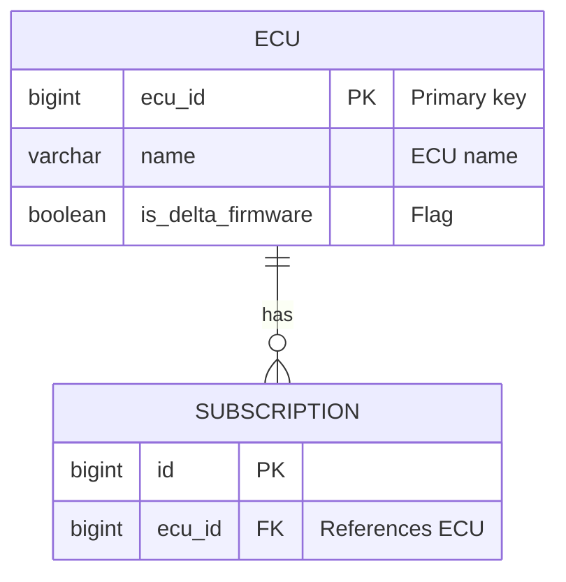

# Data Model Documentation - HowTo Guide

**Last Updated:** December 18, 2025  
**Purpose:** Guide for creating, reviewing, and maintaining database schema documentation with ERD diagrams

## Overview

4 specialized agents work together using **Zero-Hallucination Protocol** (verified against SQL files) and **Iterative Quality Loop**:

**Agents**: doc-create-dataModel, doc-review-dataModel, doc-fix-dataModel, doc-update-dataModel

**Quality Loop**: `CREATE → REVIEW → FIX → REVIEW → ... → PASSED`
- **PASSED**: Zero findings
- **FAILED**: Any findings (Critical/Major/Minor)
- **Goal**: Iterate until PASSED (2-4 cycles)

**Note**: No discovery needed - SQL migrations scanned automatically.

## Process

### 1. Create
```bash
@doc-create-dataModel Create ERD documentation for the database schema
```
Discovers/parses SQL migrations (`**/db/migration/**/*.sql`), excludes INT_* tables, generates table descriptions (alphabetical), creates validated Mermaid ERD, saves to `doc/DataModel.md`.

**Prerequisites**: Flyway migrations in `/src/main/resources/db/migration/`, named `V{version}__{description}.sql`

### 2. Review
```bash
@doc-review-dataModel Review doc/DataModel.md
```
Verifies every table, column, data type, PK/FK marker, relationship, cardinality against SQL. Confirms NO INT_* tables. Validates Mermaid syntax. Appends "Review Findings" (PASSED/FAILED).

### 3. Fix
```bash
@doc-fix-dataModel Fix findings in doc/DataModel.md
```
Validates findings against SQL, applies corrections, validates ERD, removes findings section.

### 4. Iterate
```bash
@doc-review-dataModel Review doc/DataModel.md
@doc-fix-dataModel Fix findings in doc/DataModel.md
```
Repeat until PASSED. Typical: Cycle 1 (8-15 findings) → Cycle 2 (2-4) → Cycle 3 (0-1) → PASSED.

### 5. Update
```bash
@doc-update-dataModel Update data model documentation at doc/DataModel.md
```
Analyzes migration changes since last commit. Strategy: Surgical (<50% changed) or Full (≥50%). Updates ERD and descriptions. Always review after.

## Best Practices

- Ensure all Flyway migrations in place before creating
- Verify INT_* tables excluded (Critical if present)
- Keep descriptions simple: 2-3 sentences, no subsections, alphabetical order
- Use doc-update-dataModel after migrations (don't recreate unless >50% changed)
- **ERD**: Use actual SQL types (`bigint`, `varchar`, `uuid`, `timestamp`), mark PK/FK
- **Cardinality**: `||--o{` (one-to-many), `||--o|` (one-to-one), `}o--o{` (many-to-many)
- Iterate until PASSED (typically 2-4 cycles)

## Troubleshooting

**Same issue repeating**: Manually inspect SQL migrations, verify finding validity, consider recreating

**Mermaid validation fails**: Check missing `{}`, invalid cardinality (`||--o{` not `1-to-many`), malformed relationships. Simplify temporarily, fix one table at a time. Consult `.github/mermaid-syntax/mermaid-erd-rules.md`

**INT_* tables in ERD**: Critical. Review flags it, fix removes them (INT_MESSAGE, INT_CHANNEL_MESSAGE, INT_LOCK)

**Many findings (8-15)**: Normal for first cycle. Pattern: 8-15 → 2-4 → 0-1. Keep iterating.

**Missing tables**: Check migration file pattern `**/db/migration/**/*.sql`, verify naming `V1__description.sql`

**Wrong cardinality**: FK without UNIQUE = `||--o{`, FK with UNIQUE = `||--o|`, junction = `}o--o{`

**Very outdated (>50 migrations)**: If >50% changed, recreate; else update and iterate

## Quick Reference

```bash
# Create, Review, Fix Loop
@doc-create-dataModel Create ERD documentation for the database schema
@doc-review-dataModel Review doc/DataModel.md
@doc-fix-dataModel Fix findings in doc/DataModel.md
@doc-review-dataModel Review doc/DataModel.md
# Repeat until PASSED

# Update (after migrations)
@doc-update-dataModel Update data model documentation at doc/DataModel.md
@doc-review-dataModel Review doc/DataModel.md
```

## Example Flow

```
1. Create: 12 migrations → 8 tables (2 INT_* excluded) → 15 relationships
2. Review: FAILED (1 Critical, 4 Major, 2 Minor)
3. Fix: 7 findings corrected
4. Review: FAILED (1 Major)
5. Fix: 1 finding corrected
6. Review: PASSED ✅

Update (later): 8 commits → Surgical strategy → Review → PASSED ✅
```

## Output Structure

```markdown
# Data Model Documentation
**Last Updated/Commit:** [Date/Hash]
**Service:** vsmds-flashware-masterdata-service

## Overview
[Schema description, Flyway location, optional business context]

## Entity-Relationship Diagram
[Validated Mermaid ERD]

## Table Descriptions
### TABLE_NAME
[2-3 sentences, alphabetical order, no subsections]
```

**Forbidden**: Migration History section, Technical Details section, subsections in descriptions

## ERD Example



**Migration Pattern**: `src/main/resources/db/migration/V{version}__{description}.sql`

**Execution Time**: 8-12 minutes (including iterations)
