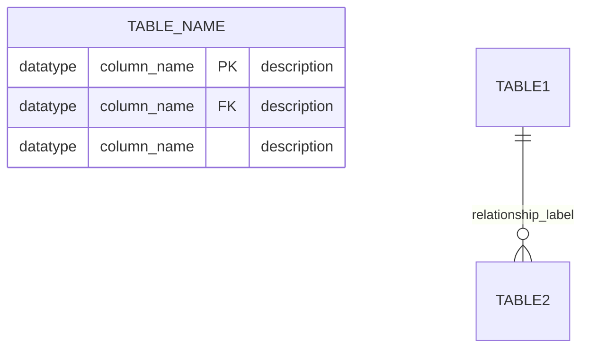

## Purpose
Generates comprehensive Entity Relationship Diagrams (ERD) from SQL migration files in Spring Boot microservices. Analyzes database schema, extracts relationships, and enriches documentation with Azure DevOps context.

## Input Format
```
Create ERD documentation for the database schema
```

## Execution Steps

### Step 1: Plan with Sequential Thinking
Use `@sequential-thinking` to plan: migration file discovery, SQL parsing strategy, table/relationship extraction (excluding INT_ tables), diagram generation, validation, git commit retrieval, and final assembly.

### Step 2: Discover Migration Files

**Locate Files:** Use `@file_search` to find all SQL migration files at path: `**/src/main/resources/db/migration/**/*.sql`

**Sort Files:** Parse version numbers from filenames (V1, V2, V3.1, etc.) and process in chronological order to track schema evolution

### Step 3: Parse SQL Migration Files

**Read Files:** Use `@read_file` to read each migration file completely

**Extract Schema Elements:**
- **Tables:** `CREATE TABLE` statements (table name, full column list)
- **Columns:** Column names, data types (VARCHAR, BIGINT, UUID, TIMESTAMP, BOOLEAN, etc.), nullability
- **Primary Keys:** `PRIMARY KEY`, `CONSTRAINT ... PRIMARY KEY (...)`, inline `id BIGINT PRIMARY KEY`
- **Foreign Keys:** `FOREIGN KEY (...) REFERENCES table(column)`, `CONSTRAINT ... FOREIGN KEY`
- **Constraints:** `UNIQUE`, `CHECK`, `NOT NULL`, `DEFAULT`
- **Indexes:** `CREATE INDEX`, `CREATE UNIQUE INDEX`

**Filter Logic:** 
- **EXCLUDE** any table whose name starts with `INT_` (case-insensitive)
- Examples to ignore: `INT_MESSAGE`, `INT_CHANNEL_MESSAGE`, `INT_LOCK`
- Keep all other tables for diagram generation

**Track Relationships:**
- Map each foreign key to its referenced table
- Determine cardinality based on constraints:
  - One-to-many: FK without UNIQUE constraint
  - One-to-one: FK with UNIQUE constraint
  - Many-to-many: Junction table with composite FK

### Step 4: Generate Table Descriptions

**Create Descriptions:** For each non-INT_ table:
- Infer business purpose from table name, columns, and relationships
- Add technical details: primary entity type, key relationships
- Keep **2-3 sentences maximum**
- **NO subsections** - just the description paragraph
- Format: `### TABLE_NAME\n\n[Description paragraph]`

**Example Format:**
```markdown
### ECU

Represents Electronic Control Units with configuration flags for delta firmware and SAR relevance. Tracks creation and modification timestamps for audit purposes.

### SUBSCRIPTION

Manages user email subscriptions for ECU notifications including flashware state changes and access policy updates. Links users to ECUs with a unique constraint on (ecu_id, username).
```

**Important:** 
- Do NOT include "Key Constraints:", "Business Rules:", or "Related Work Items:" subsections
- Present descriptions in **alphabetical order** by table name
- Keep it simple and concise

### Step 5: Generate Mermaid ER Diagram

**Reference:** Consult [mermaid-erd-rules.md](.github/mermaid-syntax/mermaid-erd-rules.md) for complete Mermaid ERD syntax guidelines.

**Structure:**


**Rules:**
- Use actual SQL data types: `bigint`, `varchar`, `uuid`, `timestamp`, `boolean`, `text`
- Mark primary keys with `PK`
- Mark foreign keys with `FK`
- Add brief column descriptions in quotes (optional but recommended)
- Use proper cardinality notation:
  - `||--||`: one-to-one (required)
  - `||--o|`: one-to-one (optional)
  - `||--o{`: one-to-many (optional)
  - `||--|{`: one-to-many (required)
  - `}o--o{`: many-to-many
- Relationship labels describe the relationship from first entity's perspective
- Use `direction LR` or `direction TB` for better layout if needed

**Include:**
- All tables (except INT_* tables)
- All columns with data types
- All primary keys explicitly marked
- All foreign key relationships with proper cardinality
- Clear relationship labels

**Exclude:**
- Tables starting with `INT_`
- Spring Integration framework tables
- Audit/logging tables (unless business-critical)

### Step 6: Validate Diagram (MANDATORY - WITH RETRY LOOP)

**Validation Loop:** Use `mcp_mermaid-valid_validateMermaid` with automatic retry until diagram is valid:

1. **Initial Validation:** Call `mcp_mermaid-valid_validateMermaid`:
   - Parameters: `diagram: [mermaid_code]`, `format: "png"`
   - Check validation result

2. **If Validation Fails:**
   - Analyze error message carefully
   - Fix the identified issue
   - Call `mcp_mermaid-valid_validateMermaid` again with corrected diagram
   - Repeat until validation succeeds

3. **Maximum Retries:** Allow up to 10 validation attempts
   - If still failing after 5 attempts, simplify diagram (remove descriptions, simplify relationships)
   - Validate simplified version

**DO NOT PROCEED** to Step 7 until diagram validates successfully (returns image data without errors).

### Step 7: Get Git Commit

Run terminal command: `git log -1 --format="%h" --abbrev-commit`
- Capture short commit hash for documentation header
- If git fails, use "N/A"

### Step 8: Assemble Final Documentation

**Location:** `doc/DataModel.md`

**Template (STRICT - NOTHING ELSE):**
```markdown
# Data Model Documentation

**Last Updated:** [Month DD, YYYY]  
**Last Commit:** [git_hash]  
**Service:** vsmds-flashware-masterdata-service

## Overview

This document describes the database schema and entity relationships for the Flashware Master Data Service. The schema is managed through Flyway migrations located in `/fwomd-app/src/main/resources/db/migration/`.

## Entity-Relationship Diagram

```mermaid
erDiagram
    [validated ERD diagram - must be valid!]
```

## Table Descriptions

[Table descriptions in ALPHABETICAL ORDER - simple paragraphs only]

### TABLE_NAME_1

[2-3 sentence description]

### TABLE_NAME_2

[2-3 sentence description]

**CRITICAL RULES:**
- **NO** "Migration History" section
- **NO** "Technical Details" section
- **NO** subsections within table descriptions (no "Key Constraints:", "Business Rules:", "Related Work Items:")
- **NO** additional sections beyond: Overview, ERD, Table Descriptions
- Table descriptions must be in **alphabetical order**
- Keep it clean and simple - just the three main sections

### Step 10: Save and Confirm

Use `@create_file` to create `doc/DataModel.md` or `@replace_string_in_file` to update existing documentation

**Verify Before Saving:**
- [ ] Mermaid diagram validated successfully
- [ ] No Migration History section
- [ ] No Technical Details section
- [ ] Table descriptions are simple paragraphs (no subsections)
- [ ] Table descriptions in alphabetical order
- [ ] Only three sections: Overview, ERD, Table Descriptions

**Response Format:**
```
Created data model documentation at doc/DataModel.md

Summary:
- Tables documented: X (Y INT_ tables excluded)
- Relationships: Z foreign key constraints
- Mermaid diagram: Validated successfully
- Related work items: [AB-XXXXXX], [AB-YYYYYY]
```

## Quality Checklist

- [ ] All migration files analyzed (sorted by version)
- [ ] INT_* tables excluded from diagram
- [ ] All tables have descriptions (2-3 sentences, no subsections)
- [ ] Table descriptions in alphabetical order
- [ ] All foreign keys shown as relationships
- [ ] Primary keys marked with PK
- [ ] Cardinality notation is correct
- [ ] **Diagram validates successfully with mermaid-validator (with retry until valid)**
- [ ] Git commit hash included
- [ ] Clean markdown formatting
- [ ] **NO Migration History section**
- [ ] **NO Technical Details section**
- [ ] **NO subsections in table descriptions**
- [ ] File saved at `doc/DataModel.md`

