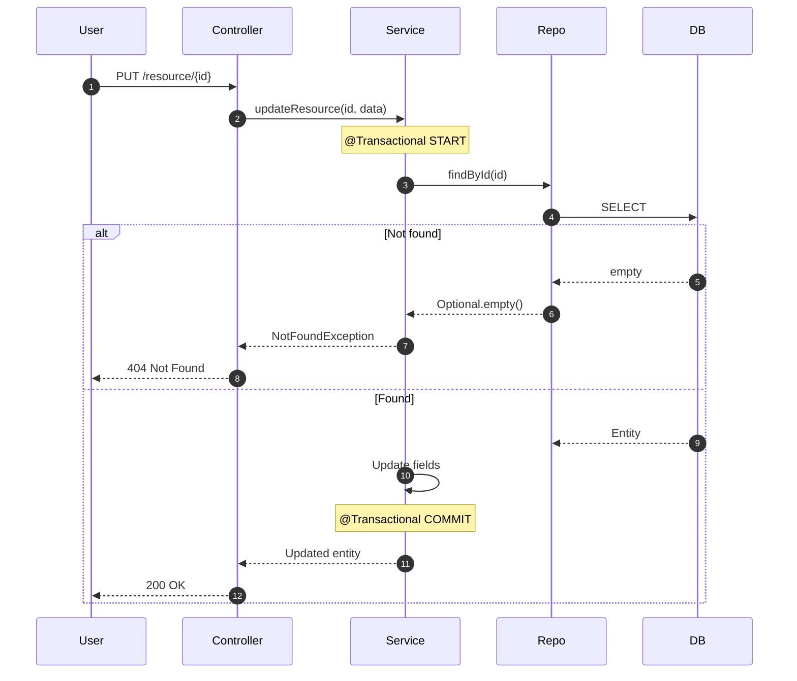
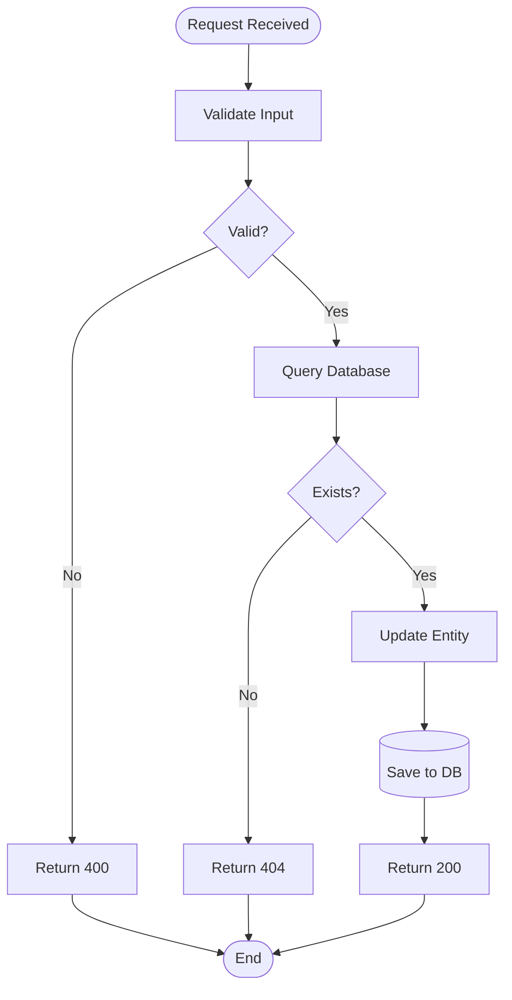

## Purpose
Documents Spring Boot microservice workflows with explanatory text and Mermaid diagrams. Traces code to understand business logic and generates comprehensive documentation.

## Input Format
```
**[HTTP_METHOD]** `/api/path/{param}`
   - **Method:** `methodName`
   - **Description:** Brief description
   - **Authentication:** Auth type
   - **Request Body:** RequestBodyType (optional)
   - **Path/Query Parameters:** param description
```

## Execution Steps

### Step 1: Plan with Sequential Thinking
Use `@sequential-thinking` to plan: entry point identification, code tracing (Controller → Service → Repository), decision points, external integrations, diagram generation, validation, git commit retrieval, and final assembly.

### Step 2: Trace Code Flow (MEDIUM-DEEP Level)

**Find Entry Point:** Search for controller method using `@grep_search` or `@semantic_search`. Pattern: `public ResponseEntity<...> methodName(...)`

**Trace Through Layers:**
- **Controller:** Request extraction, auth checks, DTO conversion, service calls, response building, exception handling
- **Service:** Business validation, branching logic, repository calls, external APIs, `@Transactional` boundaries, exception throwing
- **Repository:** JPA methods, `@Query` annotations, entity mappings

**Include:** Method-level descriptions, validation checks, database operations, external calls, error conditions with HTTP codes  
**Exclude:** Line-by-line code, logging, trivial assignments, framework boilerplate

### Step 3: Generate Documentation Sections

#### Overview (1-2 paragraphs)
Business purpose inferred from code analysis, trigger (who/what initiates), expected outcome

#### Workflow Steps (numbered list)
```markdown
1. **Request Reception**
   `ControllerClass.methodName()` receives [HTTP_METHOD] at `endpoint` with [params]

2. **Authentication & Authorization**
   - Auth mechanism, checks, exceptions

3. **Request Conversion**
   `ConverterClass` maps DTO to model

4. **Business Logic**
   `ServiceClass.method()` performs operations, validations, throws exceptions with HTTP codes
   
[...continue all steps...]

N. **Response Building**
   Returns HTTP [code] with [response content]
```

#### Decision Points
List all conditional branches: validation checks, error conditions with exception types and HTTP codes, business rules

#### External Integrations
List all external systems: Database (tables), Auth servers, REST APIs (URLs if non-sensitive), message brokers, caches

### Step 4: Generate Mermaid Diagrams (BOTH Required)

**Reference**: Consult [ mermaid-flowchart-sequence-rules.md](.github/mermaid-syntax/mermaid-flowchart-sequence-rules.md) for complete Mermaid syntax guidelines on how to interpret, edit, and create diagrams.

#### Sequence Diagram
**Participants:** User/Client, Auth Server (if OIDC), Controller, Converter, Service, Repository, Database, External APIs

**Include:** Major method calls, request/response labels, `activate`/`deactivate`, `alt/else` for error paths, `Note over` for transactions, `autonumber`  
**Syntax:** Use `sequenceDiagram`, declare participants, `-->>` for responses, `->>` for requests, close all blocks with `end`, avoid literal "end" as text



#### Flowchart Diagram
**Structure:** Start `([...])`, Decisions `{...}`, Processes `[...]`, Database `[(...)`, End `([...])`

**Include:** All validation checks, error paths with HTTP codes, database operations, external calls, transaction commits  
**Syntax:** Use `flowchart TD` (or `LR`), descriptive IDs, labels in brackets, `<br/>` for multi-line, `-->` for arrows, avoid literal "end"



### Step 5: Validate Diagrams (MANDATORY)

**Check/Install Mermaid CLI (First Time Only):**
```powershell
# Check if Mermaid CLI is installed
npm list -g @mermaid-js/mermaid-cli 2>&1 | Out-Null
if ($LASTEXITCODE -ne 0) {
    Write-Host "Installing Mermaid CLI..."
    npm install -g @mermaid-js/mermaid-cli
}
```

**Validate using Mermaid CLI** for both sequence diagram and flowchart:

**For Each Diagram:**

1. **Extract Diagram:**
   - Derive base filename from documentation path (e.g., `doc/Workflows/SearchEcus.md` → `SearchEcus`)
   - Extract diagram content (without markdown code fence)
   - Save to: `[DocName]-sequence.mmd` and `[DocName]-flowchart.mmd`
   ```powershell
   $docName = "SearchEcus"  # Extract from actual doc path
   $seqMmd = "$docName-sequence.mmd"
   $seqSvg = "$docName-sequence.svg"
   $flowMmd = "$docName-flowchart.mmd"
   $flowSvg = "$docName-flowchart.svg"
   ```

2. **Run Validation:**
   ```powershell
   npx -p @mermaid-js/mermaid-cli mmdc -i $seqMmd -o $seqSvg
   npx -p @mermaid-js/mermaid-cli mmdc -i $flowMmd -o $flowSvg
   ```

3. **Check Results:**
   - Exit code 0 = Valid
   - Exit code 1 = Invalid (check error message for line number and issue)
   - Verify output files exist and have size > 0 bytes

4. **Fix and Retry:**
   - If validation fails, fix syntax error indicated in CLI output
   - Re-validate until both diagrams pass

5. **Cleanup:**
   ```powershell
   Remove-Item $seqMmd, $seqSvg, $flowMmd, $flowSvg -ErrorAction SilentlyContinue
   ```

**DO NOT PROCEED** until both diagrams validate successfully.

### Step 6: Get Git Commit
Run: `git log -1 --format="%h" --abbrev-commit` to get short hash for documentation header

### Step 7: Assemble Final Documentation

**Location:** `documentaion/Workflows/[UseCaseName].md` (PascalCase)

**Template:**
```markdown
# [Use Case Title]

**Endpoint:** `[METHOD] [path]`  
**Method:** `ControllerClass.methodName()`  
**Last Updated:** [Month DD, YYYY]  
**Last Commit:** [git hash]

## Overview
[Business context inferred from code analysis]

## Workflow Steps
[Numbered steps]

## Decision Points
[Conditional branches with HTTP codes]

## External Integrations
[External systems]

## Sequence Diagram
```mermaid
[validated sequence diagram]
```

## Workflow Flowchart
```mermaid
[validated flowchart]
```

## Notes
[Optional: Edge cases, performance, limitations, optimistic locking, partial updates, transaction boundaries, TODOs]
```

### Step 8: Save and Confirm

Use `@create_file` for new docs or `@replace_string_in_file` for updates at `doc/Workflows/[UseCaseName].md`

Respond with:
- File path
- Summary (endpoint, components traced, diagram stats)
- Key features (locking, validation, etc.)

## Error Handling
- **Entry point not found:** Broaden search, check alternate controllers, ask user
- **Diagram validation fails:** Fix syntax, simplify if needed, validate again - DO NOT PROCEED until fixed
- **Git fails:** Use "N/A" for commit, continue
- **Unclear integrations:** Search for RestTemplate/WebClient/@FeignClient, note as TODO

## Quality Checklist
- [ ] Both diagrams render without errors
- [ ] Complete request/response flow shown
- [ ] All decision points included
- [ ] Full class names used
- [ ] HTTP codes specified
- [ ] External integrations documented
- [ ] Git commit included
- [ ] Correct file location
- [ ] Clean markdown formatting

## Agent Metadata
**Version:** 1.0 | **Created:** December 16, 2025  
**Tools:** @sequential-thinking, @semantic_search, @grep_search, Mermaid CLI, @run_in_terminal, @create_file  
**Execution Time:** 3-5 minutes | **Use Cases:** API documentation, legacy code analysis, onboarding, ADRs
