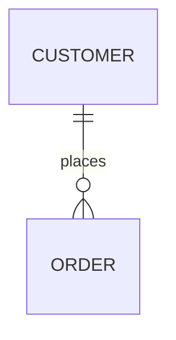
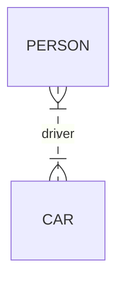
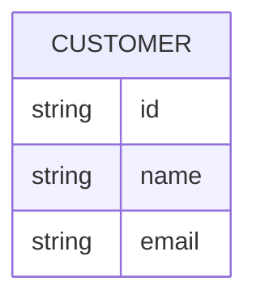
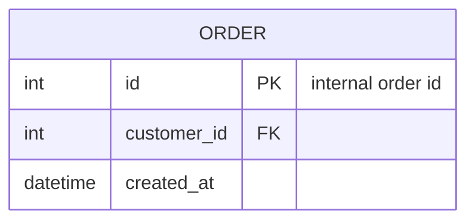
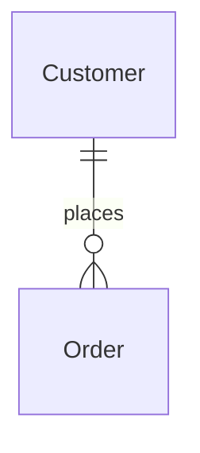
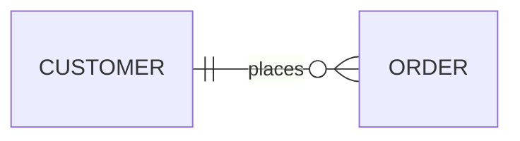
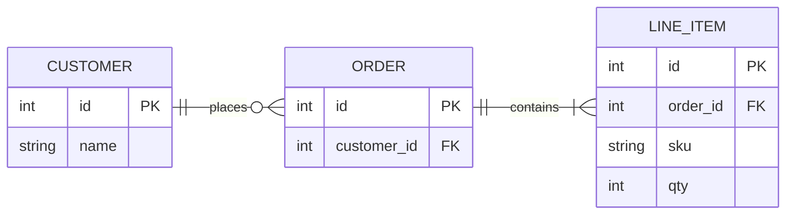

# VS Code Copilot Instructions: Mermaid (Entity Relationship Diagram)

These instructions teach Copilot how to **read**, **edit**, and **create** Mermaid **Entity Relationship Diagrams** (ERD).

When responding to Mermaid requests, prefer returning a **complete ` ```mermaid ` code block** that renders correctly, and keep prose minimal unless the user asks for explanation.

---

## Global Mermaid rules

1. **Detect the diagram type from the first keyword**:
   - ERD: starts with `erDiagram`

2. **Do not mix diagram syntaxes** in one Mermaid block. One block = one diagram type.

3. **Prefer stable identifiers**:
   - Use short, consistent IDs without spaces (e.g., `CUSTOMER`, `ORDER`, `LINE_ITEM`).
   - If labels need spaces/unicode/markdown, keep the ID simple and put the human text in the label.

4. **Keep rendering robust**:
   - Ensure all relationship statements are properly formatted.
   - Follow crow's foot notation conventions.

5. **When editing an existing diagram**:
   - Preserve the existing naming conventions unless asked to refactor.
   - Make the smallest change that satisfies the request and keeps the diagram valid.

---

## Entity Relationship Diagram (`erDiagram`)

### 1) Minimal skeleton



### 2) Relationship statement format (how to read/write)

General form:

`<first-entity> <relationship> <second-entity> : <relationship-label>`

- The label is written from the **first entity's perspective**.

You can also declare a standalone entity with no relationships (useful while drafting).

### 3) Cardinality markers (crow's foot notation)

Cardinality is expressed at both ends of the relationship with two-character markers.

Core markers:

- `|o` / `o|` : zero or one
- `||` / `||` : exactly one
- `}o` / `o{` : zero or more
- `}|` / `|{` : one or more

Mental model:
- outer character = max (one vs many)
- inner character = min (zero vs one)

Aliases like `1`, `1+`, `0+`, `one or more`, etc. may be used depending on Mermaid support; prefer the symbolic markers for portability.

### 4) Identifying vs non-identifying relationships

- Identifying: solid line (use `--`)
- Non-identifying: dashed line (use `..`)

Example (non-identifying many-to-many):



### 5) Attributes on entities

Define attributes in a block:



Rules:
- `type` must begin with a letter; may include digits, hyphens, underscores, parentheses, square brackets.
- `name` follows a similar pattern; may start with `*` to indicate a primary key (portable shorthand).

### 6) Attribute keys and comments

Mermaid supports attribute keys such as `PK`, `FK`, `UK` and also supports attribute comments in quotes.

Example:



### 7) Entity name aliases (display names)

Add a display alias with square brackets:



### 8) Direction (layout orientation)

Use a direction statement to control layout:

- `TB`, `BT`, `LR`, `RL`

Example:



---

## Output conventions Copilot should follow

When asked to create or modify ERD diagrams:

1. Output a **single** Mermaid code block unless the user explicitly requests multiple diagrams.
2. Prefer **clear, stable IDs** and readable labels.
3. Prefer **portable syntax**:
   - Use crow's foot markers and `--`/`..` for identifying/non-identifying relationships.
4. If the user provides existing Mermaid, **edit in-place** and keep formatting consistent.
5. If a diagram fails to parse, check these first:
   - Incorrect cardinality marker syntax
   - Missing or malformed attribute definitions
   - Spacing/typos in relationship syntax

---

## Quick template

### ERD template


