# VS Code Copilot Instructions: Mermaid (Flowchart & Sequence Diagram)

These instructions teach Copilot how to **read**, **edit**, and **create** Mermaid diagrams of these types:

- **Flowchart** (`flowchart` / `graph`)
- **Sequence Diagram** (`sequenceDiagram`)

When responding to Mermaid requests, prefer returning a **complete ` ```mermaid ` code block** that renders correctly, and keep prose minimal unless the user asks for explanation.

---

## Global Mermaid rules

1. **Detect the diagram type from the first keyword**:
   - Flowchart: starts with `flowchart <DIR>` or `graph <DIR>`
   - Sequence: starts with `sequenceDiagram`

2. **Do not mix diagram syntaxes** in one Mermaid block. One block = one diagram type.

3. **Prefer stable identifiers**:
   - Use short, consistent IDs without spaces (e.g., `A`, `svc_api`, `DB`).
   - If labels need spaces/unicode/markdown, keep the ID simple and put the human text in the label.

4. **Keep rendering robust**:
   - Close all block structures (e.g., `subgraph ... end`, `alt ... end`, `loop ... end`).
   - Avoid using reserved/breaking tokens as raw labels (see Flowchart and Sequence "end" warnings below).

5. **When editing an existing diagram**:
   - Preserve the existing direction/orientation and naming conventions unless asked to refactor.
   - Make the smallest change that satisfies the request and keeps the diagram valid.

---

## Flowchart (`flowchart` / `graph`)

### 1) Minimal skeleton


- `flowchart` and `graph` are interchangeable keywords.
- Direction/orientation is part of the header (see below).

### 2) Direction (layout orientation)

Use one of: `TB`, `TD`, `BT`, `RL`, `LR`.

Example:

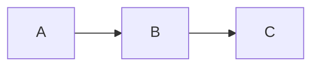

### 3) Node IDs vs labels

- **ID-only node**: the ID is what displays.
- **Labeled node**: the label is what displays; the ID stays stable.

Common pattern:

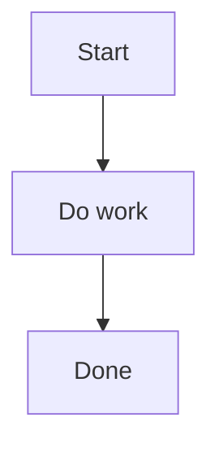

**Unicode text**: put the label in quotes.
**Markdown formatting**: Mermaid flowcharts support "Markdown Strings" for labels and edge labels; prefer markdown strings when text needs formatting or wrapping.

### 4) Important "gotchas" (prevent broken diagrams)

- The literal lowercase word `end` can break flowcharts if used as a node label. Prefer `End`, `END`, or wrap/escape it.
- If you intend a normal connection and your target node begins with `o` or `x`, ensure you don't accidentally trigger special "circle/cross edge" parsing. Use spacing or capitalization when needed.

### 5) Links (edges) between nodes

Use these as your default edge patterns:

- Normal line: `A --- B`
- Arrow: `A --> B`
- Dotted: `A -.-> B`
- Thick: `A ==> B`

**Text on links** (two common forms; prefer the `|label|` form):

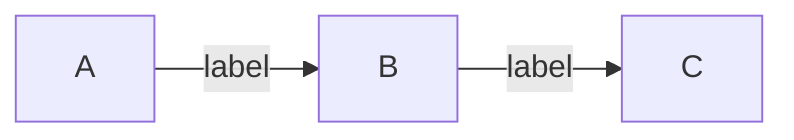

**Make a link longer** by adding extra `-`, `=`, or `.` characters (useful to force spacing/ranks).

### 6) Chaining and multi-links (readability tradeoff)

Allowed:

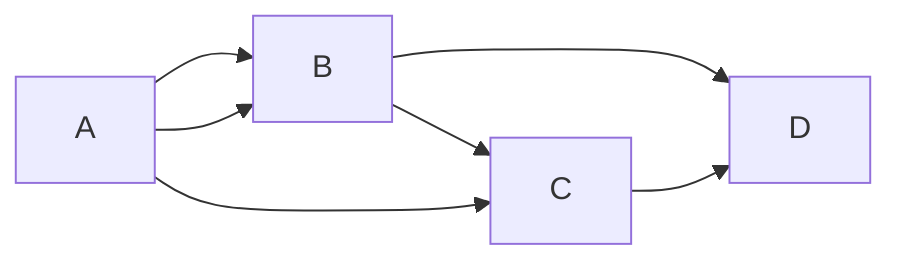

Use chaining sparingly if it harms readability.

### 7) Subgraphs (grouping)

Subgraph block:

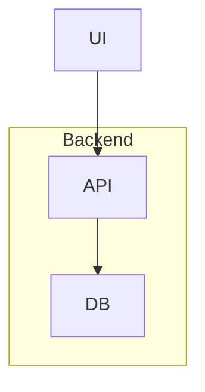

- Subgraphs can have a title and can also have an explicit ID (useful for styling).
- You can set a direction *inside* a subgraph, but if subgraph nodes connect outside, the subgraph may inherit the parent direction.

### 8) Comments

Comments must be on their own line and start with `%%`:


### 9) Styling and classes (when requested)

- Node style: `style <nodeId> ...`
- Define classes: `classDef <name> ...`
- Apply class: `class <nodeId> <className>`
- Style links by index: `linkStyle <n> ...` (0-based index)
- Edge IDs can be attached (for advanced styling/animation) by prefixing an edge with `<edgeId>@`.

Only include styling if the user asks for colors/styles or if required to satisfy "highlight/mark" tasks.

### 10) Interaction (click/tooltip/URL)

Flowcharts can attach click actions/tooltips/URLs:

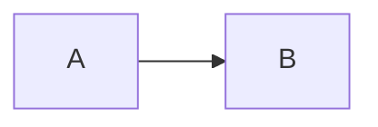

Note: click behavior depends on Mermaid security settings in the renderer environment.

---

## Sequence Diagram (`sequenceDiagram`)

### 1) Minimal skeleton

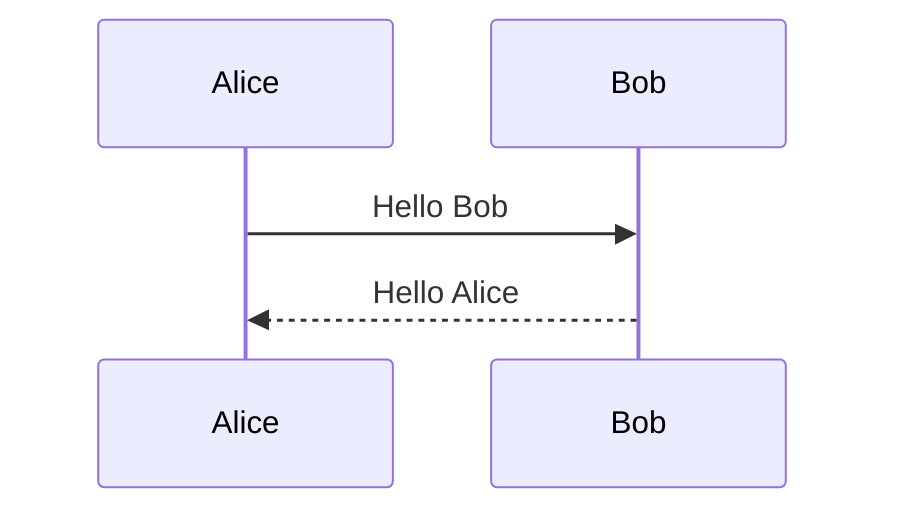

### 2) Participants and order

- Participants can be implicit (first time they appear) or declared explicitly.
- The render order is typically the appearance order; declare participants first if you need a specific order.

Example:

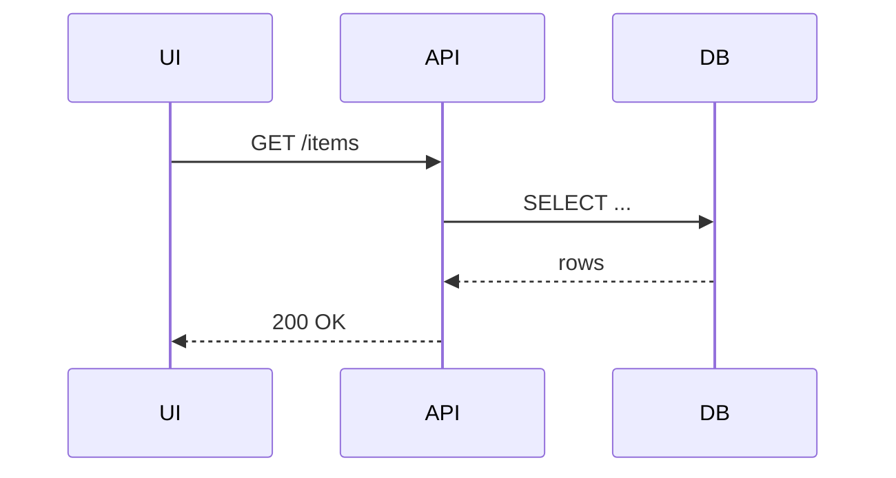

Aliases are supported; use them to keep IDs short and labels friendly.

### 3) Critical "gotcha": the word `end`

In sequence diagrams, the word `end` can break parsing if used as raw text. If unavoidable, wrap it in parentheses or brackets like `(end)` or `[end]`.

### 4) Message arrow types (use correctly)

Pick arrow types based on meaning:

- Solid line message: `->` / `->>`
- Dotted line message: `-->` / `-->>`
- Activating message variants: `-x`, `--x`, `-)`, `--)`
- Bidirectional: `<<->>` / `<<-->>`
- Bidirectional activating: `<<-x`, `x->>`, etc.

When unsure, default to:
- `->>` for request/call
- `-->>` for return/async response

### 5) Activations

Use `activate`/`deactivate` to show lifeline activation bars. Some syntaxes also allow `+`/`-` suffixes on messages depending on renderer support; prefer explicit `activate`/`deactivate` for clarity.

Example:

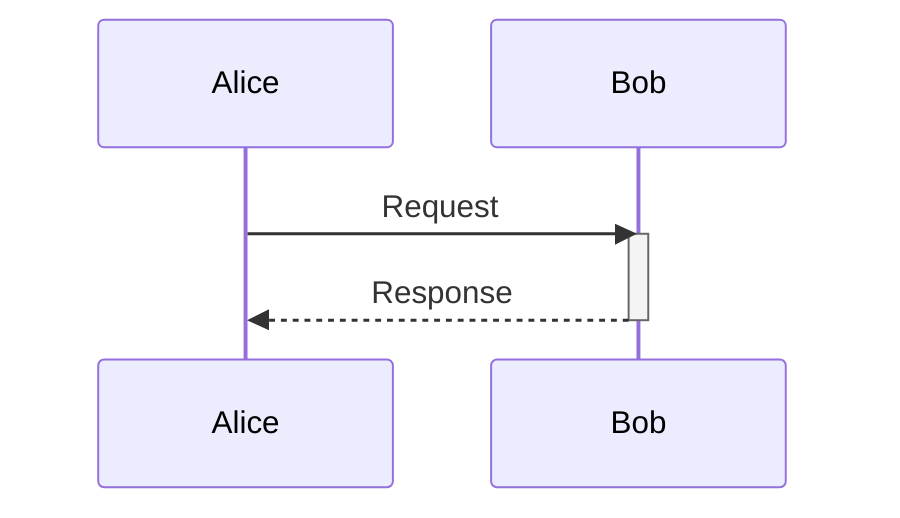

### 6) Notes

Use notes to annotate interactions:

- `Note right of <actor>: ...`
- `Note left of <actor>: ...`
- `Note over <actor1>,<actor2>: ...`

Example:

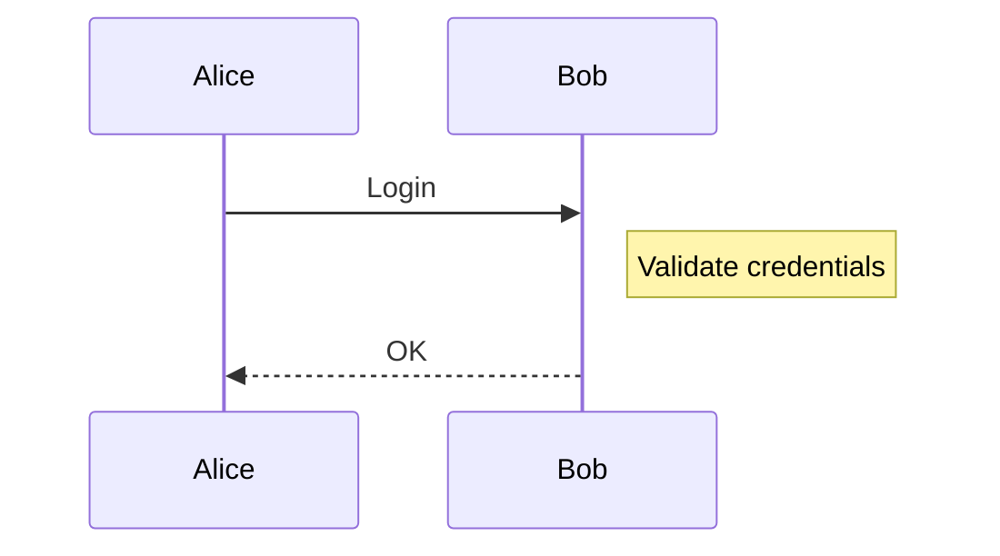

### 7) Control structures (blocks)

Use these blocks to express branching, looping, and parallelism:

**loop**
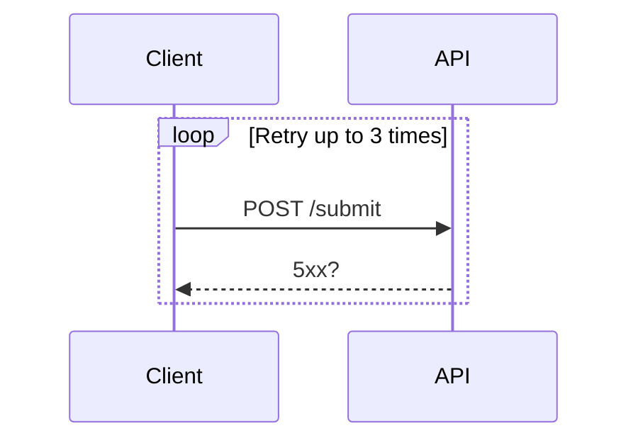

**alt / else**
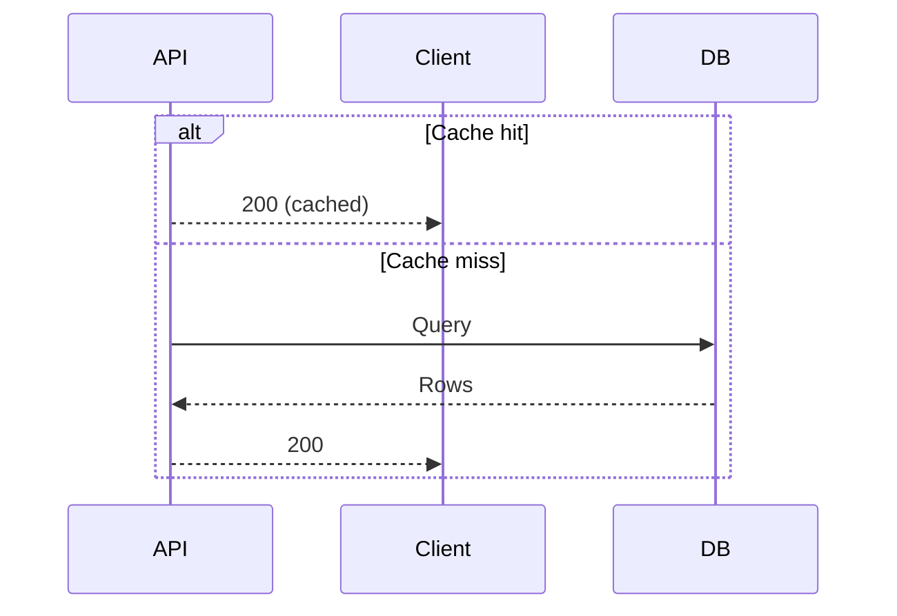

**opt**
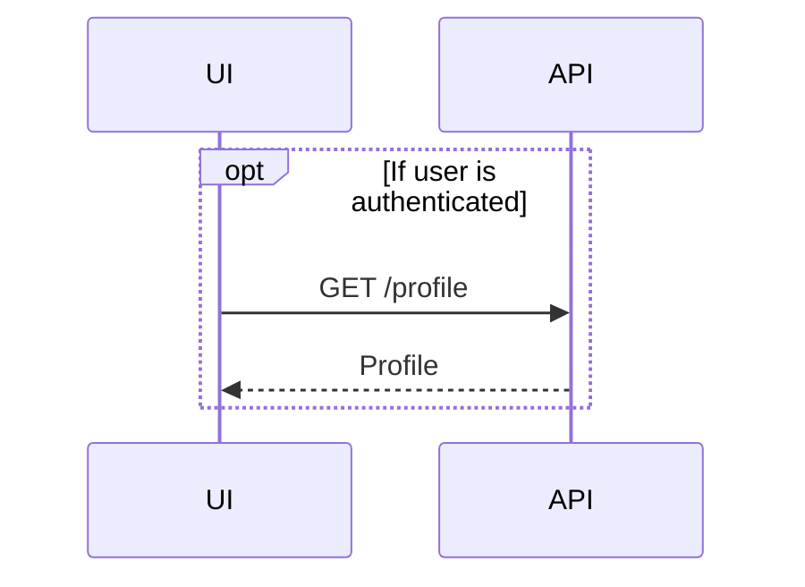

**par / and**
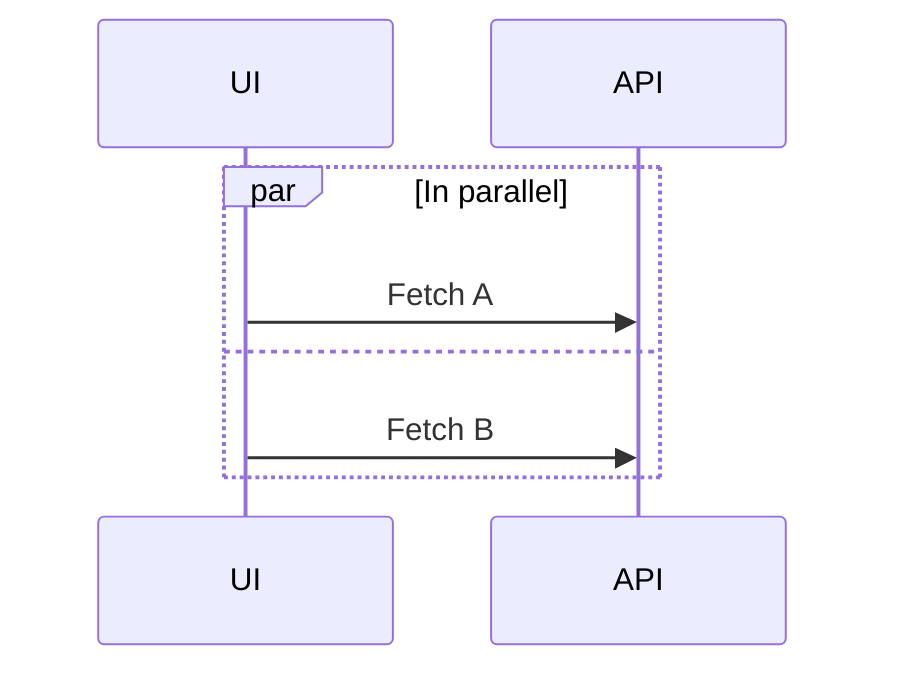

**critical / option**
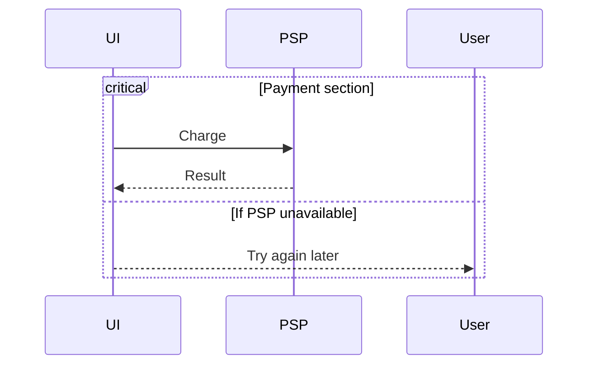

### 8) Actor creation and destruction

Actors can be created/destroyed by directives.

Example:

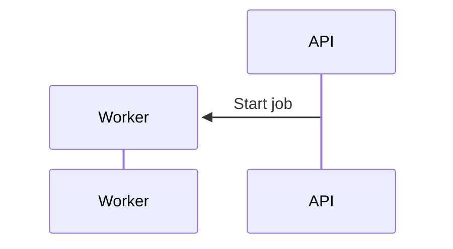

Use this when modeling dynamic lifecycles (workers, temp sessions, etc.).

---

## Output conventions Copilot should follow

When asked to create or modify diagrams:

1. Output a **single** Mermaid code block unless the user explicitly requests multiple diagrams.
2. Prefer **clear, stable IDs** and readable labels.
3. Prefer **portable syntax**:
   - Flowchart: standard brackets/edges; avoid exotic features unless requested.
   - Sequence: use common arrows (`->>`, `-->>`) and explicitly close blocks with `end`.
4. If the user provides existing Mermaid, **edit in-place** and keep formatting consistent.
5. If a diagram fails to parse, check these first:
   - Missing `end` for blocks (`subgraph`, `loop`, `alt`, etc.)
   - Unescaped problematic token `end` used as raw label
   - Spacing/typos in arrow/link syntax
   - Mixed diagram types in one block

---

## Quick templates

### Flowchart template

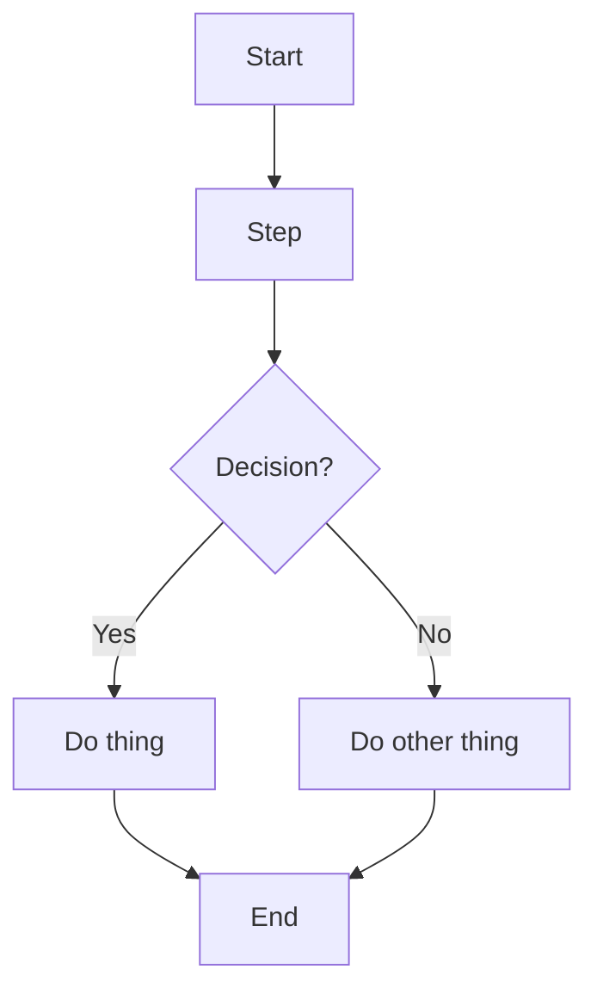

### Sequence template

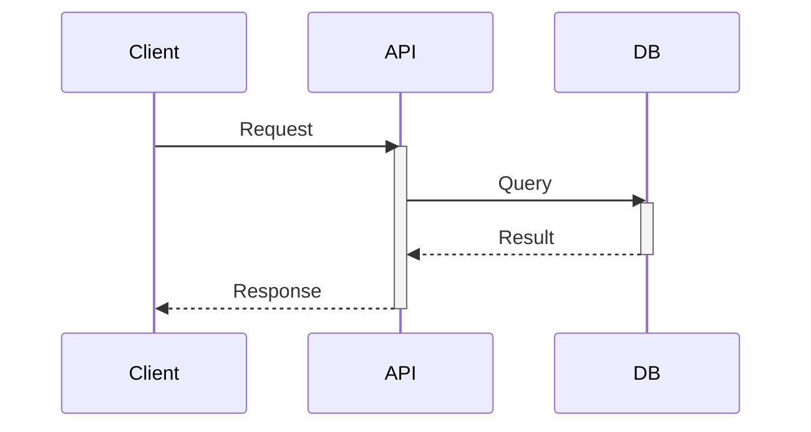
