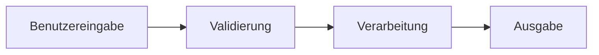
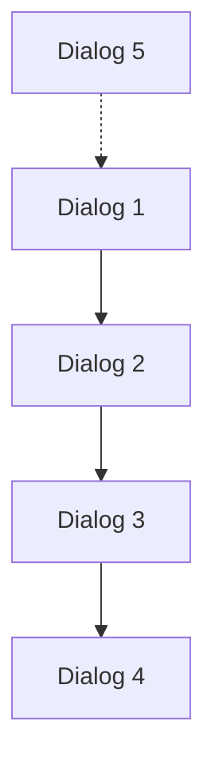

# Prompt: Identifiziere wichtigste Dialoge und erstelle Mockup-Übersicht

## Ziel
Analysiere die ABAP-Anwendung und identifiziere die 5 wichtigsten Dialoge/Transaktionen. Erstelle eine strukturierte Mockup-Übersicht in `docs/Überblick-Mockup.md`, die als Basis für die spätere Mockup-Erstellung dient.

Nutze den sequential-thinking-MCP-Server, um die Analyse systematisch durchzuführen und die wichtigsten User-Interfaces zu identifizieren.

## Kontext
- Analysiere ABAP-Dialoge im `src/` Verzeichnis (Dynpro-Screens, Programme)
- Nutze vorhandene Dokumentation aus `docs/` als Referenz
- Fokussiere auf die meistgenutzten und wichtigsten Transaktionen

## Auswahlkriterien für wichtigste Dialoge

### Priorisierung nach:
1. **Nutzungshäufigkeit**: Welche Dialoge werden täglich verwendet?
2. **Geschäftskritikalität**: Welche sind essenziell für den Kernprozess?
3. **Komplexität**: Welche sind am komplexesten und benötigen Visualisierung?
4. **Benutzergruppen**: Welche decken die meisten Zielgruppen ab?
5. **Repräsentativität**: Welche zeigen die Systemfunktionalität am besten?

## Analyseschritte

### 1. Transaktions-Inventur
Durchsuche `src/` nach:
- **Transaktion-Definitionen** (*.tran.xml)
- **Dynpro-Screens** (screen_*.abap)
- **Module-Pool-Programme** mit UI
- **ALV-Reports** mit Listenausgaben

### 2. Kategorisierung
Gruppiere gefundene Dialoge nach:
- **User Management** (YSU01, YSUR, etc.)
- **Audit & Compliance** (YAUDCHECK, etc.)
- **Master Data** (YROLEBKREF, etc.)
- **Mass Operations** (YSUD, YSUL, etc.)
- **Reporting** (YBCA1234QUERY, etc.)

### 3. Bewertung
Bewerte jeden Dialog nach Kriterien:
- Nutzungshäufigkeit: 1-5 Punkte
- Kritikalität: 1-5 Punkte
- UI-Komplexität: 1-5 Punkte
- Abdeckung Zielgruppen: 1-5 Punkte

### 4. Top-5-Auswahl
Wähle die 5 höchstbewerteten Dialoge aus

## Anforderungen für Überblick-Mockup.md

### Struktur der Datei

```markdown
# UI-Mockup-Übersicht: ZBK - Zentrale Berechtigungskontrolle

## 1. Executive Summary
- Zweck dieses Dokuments
- Übersicht über die 5 wichtigsten Dialoge
- Lesehinweise

## 2. Dialog-Übersicht

### Übersichtstabelle
| Rang | Transaktion | Name | Kategorie | Zielgruppe | Priorität |
|------|-------------|------|-----------|------------|-----------|
| 1    | ...         | ...  | ...       | ...        | ⭐⭐⭐⭐⭐ |

## 3. Detailbeschreibungen

### Dialog 1: [Transaktionscode] - [Name]

#### 3.1.1 Geschäftlicher Kontext
- **Zweck**: Was macht dieser Dialog?
- **Nutzer**: Wer verwendet ihn?
- **Häufigkeit**: Wie oft wird er genutzt?
- **Im Prozess**: Wo im Workflow?

#### 3.1.2 Technische Details
- **Programm**: Hauptprogramm (z.B. YBCA1234_YSU01)
- **Screen-Nummern**: Liste der Dynpro-Screens (z.B. 0100, 0110)
- **Funktionsgruppe**: Zugehörige Function Group
- **Aufruf**: Wie wird der Dialog gestartet?

#### 3.1.3 UI-Komponenten
Liste der Haupt-UI-Elemente:
- Selection-Screen / Parameter
- Tabellen-Controls (ALV, Table Control)
- Input-Felder
- Buttons / Menüs
- Subscreens / Tab-Strips

#### 3.1.4 Datenfluss


#### 3.1.5 Screenshots-Platzhalter
- [ ] **Screenshot 1**: Hauptbildschirm (Selection-Screen)
- [ ] **Screenshot 2**: Detailansicht
- [ ] **Screenshot 3**: Ergebnisliste

#### 3.1.6 Mockup-Anforderungen
**Was soll im Mockup dargestellt werden?**
- Hauptelemente: ...
- Beispieldaten: ...
- Status/Zustände: ...
- Fehlermeldungen: ...

---

[Wiederhole Struktur für Dialog 2-5]

## 4. Dialog-Beziehungen

### Workflow-Zusammenhänge


## 5. Mockup-Erstellungsplan

### Phase 1: Vorbereitung
- [ ] Screen-Definitionen analysieren
- [ ] Beispieldaten sammeln
- [ ] UI-Guidelines definieren

### Phase 2: Mockup-Erstellung (Prompt 01.04)
- [ ] Dialog 1: [Name]
- [ ] Dialog 2: [Name]
- [ ] Dialog 3: [Name]
- [ ] Dialog 4: [Name]
- [ ] Dialog 5: [Name]

### Phase 3: Review
- [ ] Fachliche Korrektheit
- [ ] Technische Genauigkeit
- [ ] Vollständigkeit

## 6. Technische Referenzen

### Screen-Dateien
- Dialog 1: `src/.../screen_0100.abap`
- Dialog 2: ...

### Programme
- Dialog 1: `src/.../ybca1234_xxx.prog.abap`
- Dialog 2: ...

---
*Dokumentation erstellt am: [Datum]*
*Basis: ABAP-Code-Analyse*
*Status: Vorbereitet für Mockup-Erstellung*
```

## Analysehinweise

### Wo finde ich Screen-Informationen?

1. **Transaktion-Definitionen**: `src/**/*.tran.xml`
   ```xml
   <TCODE>YSU01</TCODE>
   <PGMNA>SAPMYBCA1234_YSU01</PGMNA>
   ```

2. **Screen-Definitionen**: `src/**/*.fugr.screen_*.abap`
   - Feldlisten
   - Flow-Logic (PBO/PAI)
   - Layout-Informationen

3. **Programme**: `src/**/*.prog.abap`
   - Selection-Screens
   - ALV-Definitionen
   - Felddefinitionen

4. **Funktionsgruppen**: `src/**/*.fugr.sapl*.abap`
   - Module-Pool-Logik
   - Bildschirm-Module

### Code-Analyse-Pattern

Suche nach:
- `SCREEN` / `DYNPRO` → Bildschirm-Definitionen
- `SELECTION-SCREEN` → Eingabemasken
- `ALV` / `GRID` → Listen-Ausgaben
- `CALL SCREEN` → Screen-Aufrufe
- `MODULE.*PBO` / `MODULE.*PAI` → Bildschirm-Logik

## Beispiel-Identifikation

### Beispiel: YSU01 analysieren

1. Finde Transaktion:
   ```bash
   Suche: ysu01.tran.xml
   ```

2. Finde zugehöriges Programm:
   ```bash
   Suche in ysu01.tran.xml: <PGMNA>
   ```

3. Finde Screens:
   ```bash
   Suche: screen_*.abap im gleichen Package
   ```

4. Analysiere Screen-Struktur:
   - Welche Felder?
   - Welche Buttons?
   - Welche Tabellen?

5. Bewerte:
   - Häufigkeit: 5/5 (täglich)
   - Kritikalität: 5/5 (Kernfunktion)
   - Komplexität: 4/5 (mehrere Tabs)
   - Zielgruppen: 4/5 (alle Admins)
   - **Gesamt: 18/20** → Top-Kandidat!

## Qualitätskriterien

- ✅ Alle 5 Dialoge sind klar identifiziert
- ✅ Technische Details sind vollständig (Programm, Screens)
- ✅ Geschäftlicher Kontext ist beschrieben
- ✅ UI-Komponenten sind aufgelistet
- ✅ Mockup-Anforderungen sind spezifiziert
- ✅ Platzhalter für Screenshots sind vorbereitet
- ✅ Datei ist strukturiert und gut lesbar

## Ausgabe

Erstelle die Datei `docs/Überblick-Mockup.md` mit:
1. **Executive Summary** mit Top-5-Übersicht
2. **Detailbeschreibungen** aller 5 Dialoge
3. **Workflow-Diagramm** der Dialog-Beziehungen
4. **Mockup-Erstellungsplan** für Prompt 01.04
5. **Technische Referenzen** zu Source-Files

Die Datei dient als Grundlage für Prompt 01.04, der dann die tatsächlichen Mockups erstellt.
