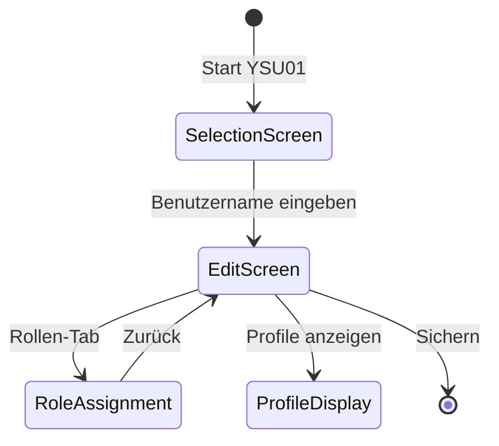
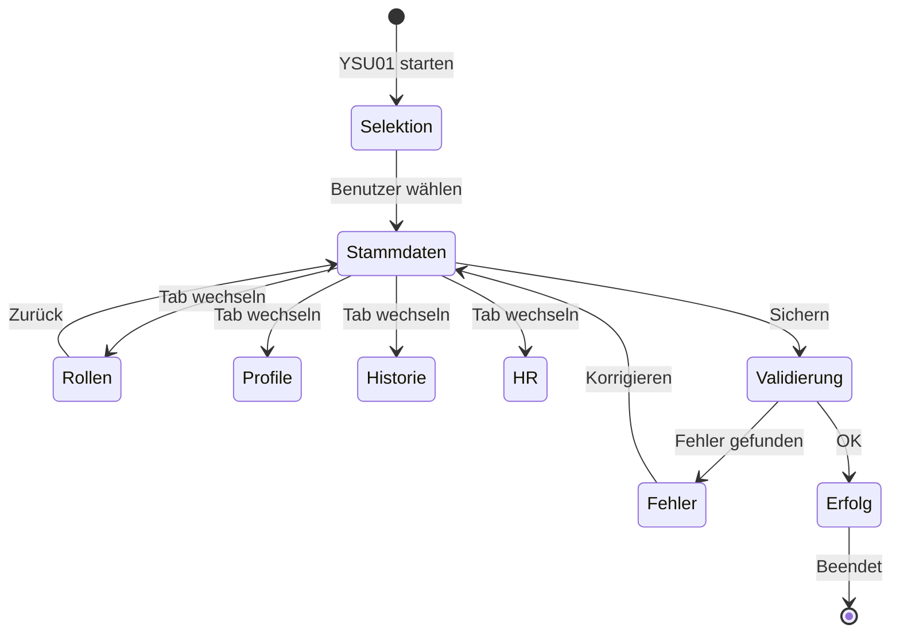

# Prompt: Erstelle UI-Mockups für identifizierte Dialoge

## Ziel
Erstelle detaillierte UI-Mockups für die 5 wichtigsten Dialoge, die in `docs/Überblick-Mockup.md` identifiziert wurden. Reichere die Datei mit visuellen Mockups an, die die SAP GUI Dynpro-Oberflächen realitätsnah darstellen.

Nutze den sequential-thinking-MCP-Server, um systematisch für jeden Dialog ein aussagekräftiges Mockup zu erstellen.

## Kontext
- Basisdatei: `docs/Überblick-Mockup.md` (erstellt durch Prompt 01.03)
- Zielformat: ASCII-Art / Mermaid / Markdown-Tabellen für SAP GUI
- Stil: SAP Dynpro-ähnlich, realistisch aber in Markdown darstellbar

## Mockup-Erstellungsprinzipien

### SAP GUI Dynpro-Charakteristika

1. **Typische Elemente**:
   - Menüleiste (System, Edit, Goto, etc.)
   - Toolbar mit Icons
   - Selection-Screens mit Parametern
   - Table Controls / ALV Grids
   - Tab-Strips
   - OK-Code-Feld
   - Statusleiste

2. **Layout-Konventionen**:
   - Felder linksbündig mit Labels
   - Buttons rechtsbündig
   - Pflichtfelder mit Markierung (*)
   - Gruppierungen mit Rahmen

3. **Farbschema** (für Beschreibungen):
   - Eingabefelder: Weiß/Hellgrau
   - Ausgabefelder: Grau (disabled)
   - Buttons: Standard SAP-Grau
   - Fehler: Rot
   - Erfolg: Grün

## Mockup-Techniken in Markdown

### Technik 1: ASCII-Art für Simple Screens

```
┌─────────────────────────────────────────────────────────────────────┐
│ YSU01 - Benutzer pflegen                                    ⊠ □ ×  │
├─────────────────────────────────────────────────────────────────────┤
│ System  Edit  Goto  Utilities  Environment  System  Help          │
├─────────────────────────────────────────────────────────────────────┤
│ 📄 💾 🖨️ 📧 ✂️ 📋 ↩️ ↪️ 🔍 🔧 ❓                                      │
├─────────────────────────────────────────────────────────────────────┤
│                                                                     │
│  Benutzername *: [________]  🔍                                     │
│                                                                     │
│  ┌─ Stammdaten ──────────────────────────────────────────────────┐ │
│  │                                                                │ │
│  │  Nachname *:      [___________________________]               │ │
│  │  Vorname *:       [___________________________]               │ │
│  │  Personalnummer:  [________]                                  │ │
│  │  E-Mail:          [___________________________]               │ │
│  │                                                                │ │
│  └────────────────────────────────────────────────────────────────┘ │
│                                                                     │
│  [Sichern] [Zurück] [Abbrechen]                                    │
│                                                                     │
├─────────────────────────────────────────────────────────────────────┤
│ ► Daten erfolgreich gespeichert                                    │
└─────────────────────────────────────────────────────────────────────┘
```

### Technik 2: Mermaid State Diagrams für Screen Flow



### Technik 3: HTML-Tabellen für ALV-Grids

```markdown
| ☑️ | Benutzername | Name, Vorname      | Personalnr. | Gültig bis | Status  | Rollen |
|----|--------------|-------------------|-------------|------------|---------|--------|
| ☑️ | MUELLER01    | Müller, Hans      | 12345       | 31.12.2025 | 🟢 Aktiv | 5      |
| ☐  | SCHMIDT02    | Schmidt, Anna     | 12346       | 31.12.2025 | 🟢 Aktiv | 3      |
| ☐  | WEBER03      | Weber, Peter      | 12347       | 30.06.2024 | 🔴 Abgelaufen | 2 |
```

### Technik 4: Kombinierte Box-Layouts

```
╔═══════════════════════════════════════════════════════════════════╗
║ YAUDCHECK - Audit-Prüfung durchführen                            ║
╠═══════════════════════════════════════════════════════════════════╣
║                                                                   ║
║  Selektionsparameter                                              ║
║  ─────────────────────────────────────────────────────────────── ║
║  Prüfungszeitraum                                                 ║
║    Von Datum: [01.11.2025] 📅    Bis Datum: [14.11.2025] 📅      ║
║                                                                   ║
║  Prüfungsart                                                      ║
║    ( ) Benutzerprüfung     (•) Rollenprüfung     ( ) Vollprüfung ║
║                                                                   ║
║  ☑️ Nur kritische Abweichungen                                    ║
║  ☐ E-Mail-Benachrichtigung senden                                ║
║                                                                   ║
║  [▶️ Ausführen]  [💾 Variante speichern]  [🚫 Abbrechen]          ║
║                                                                   ║
╚═══════════════════════════════════════════════════════════════════╝
```

## Struktur der Mockup-Erweiterung

Für jeden Dialog in `docs/Überblick-Mockup.md`:

### Ersetze Abschnitt "3.X.5 Screenshots-Platzhalter"

**Alt:**
```markdown
#### 3.1.5 Screenshots-Platzhalter
- [ ] **Screenshot 1**: Hauptbildschirm (Selection-Screen)
- [ ] **Screenshot 2**: Detailansicht
- [ ] **Screenshot 3**: Ergebnisliste
```

**Neu:**
```markdown
#### 3.1.5 UI-Mockups

##### Mockup 1: Hauptbildschirm (Selection-Screen)

[ASCII-Art oder Diagramm des Hauptbildschirms]

**Beschreibung:**
- Zeigt den Einstiegsbildschirm mit Selektionsparametern
- Beispieldaten: [konkrete Beispiele]
- Interaktionselemente: [Buttons, Felder]

##### Mockup 2: Detailansicht

[ASCII-Art oder Diagramm der Detailansicht]

**Beschreibung:**
- Zeigt die Hauptarbeitsoberfläche
- Tab-Struktur: [Tabs auflisten]
- Datenfelder: [wichtigste Felder]

##### Mockup 3: Ergebnisliste (ALV)

[Tabellen-Darstellung der Ergebnisliste]

**Beschreibung:**
- ALV-Grid mit typischen Ergebnissen
- Spalten: [Spaltennamen]
- Aktionen: [verfügbare Aktionen]

##### Mockup 4: Fehlerzustand (optional)

[Darstellung eines Fehlerfalls]

**Beschreibung:**
- Zeigt typische Fehlermeldungen
- Validierungsfehler
- Benutzerführung
```

## Anforderungen pro Dialog-Mockup

### Mindestanforderungen

Jedes Dialog-Mockup MUSS enthalten:

1. **Hauptscreen** (Selection-Screen oder Einstiegsmaske)
   - Vollständige Feldliste
   - Beispieldaten (realistisch)
   - Buttons/Aktionen

2. **Detailansicht** (falls vorhanden)
   - Wichtigste Arbeitsbereich
   - Tab-Strips (wenn vorhanden)
   - Eingabe- und Ausgabefelder

3. **Ergebnisliste** (bei Reports/Queries)
   - ALV-Grid mit Spalten
   - Mind. 3 Beispieldatensätze
   - Summenzeile (falls relevant)

4. **Zusätzliche Screens** (optional aber empfohlen)
   - Popup-Dialoge
   - Fehlermeldungen
   - Bestätigungsdialoge

### Qualitätskriterien für Mockups

- ✅ **Realitätsnähe**: Sieht aus wie echtes SAP GUI
- ✅ **Vollständigkeit**: Alle wichtigen Felder sind dargestellt
- ✅ **Beispieldaten**: Aussagekräftige, realistische Testdaten
- ✅ **Interaktivität**: Buttons, Checkboxen, etc. sind erkennbar
- ✅ **Lesbarkeit**: In Markdown gut darstellbar
- ✅ **Konsistenz**: Einheitlicher Stil über alle Dialoge

## Mockup-Erstellung: Schritt-für-Schritt

### Schritt 1: Analyse des ABAP-Codes

Für jeden Dialog:

1. **Öffne Screen-Definition**: `src/**/*.fugr.screen_XXXX.abap`
   ```abap
   FIELD USERNAME.
   FIELD LASTNAME.
   ...
   ```

2. **Identifiziere Felder**:
   - Name des Feldes
   - Label/Text
   - Typ (Input, Output, Checkbox)
   - Pflichtfeld-Markierung

3. **Finde Flow-Logic** (PBO/PAI):
   - Welche Module werden aufgerufen?
   - Validierungen?
   - Datenfluss?

4. **Analysiere zugehöriges Programm**:
   - Selection-Screen-Definitionen
   - ALV-Feldkataloge
   - Dynpro-Texte

### Schritt 2: Mockup-Design

1. **Wähle geeignete Darstellungstechnik**:
   - Simple Eingabemaske → ASCII-Art
   - Komplexe Liste → HTML-Tabelle
   - Workflow → Mermaid Diagram

2. **Sammle Beispieldaten**:
   - Realistische Benutzernamen, Daten
   - Typische Wertebereiche
   - Verschiedene Status

3. **Erstelle Layout**:
   - Skizziere Struktur
   - Gruppiere Felder logisch
   - Platziere Buttons konsistent

### Schritt 3: Mockup-Implementierung

1. **Erstelle ASCII-Art-Rahmen**
2. **Füge Felder mit Labels hinzu**
3. **Ergänze Beispieldaten**
4. **Füge Buttons/Icons hinzu**
5. **Teste Lesbarkeit**

### Schritt 4: Dokumentation

Für jedes Mockup:
- **Titel**: Welcher Screen?
- **Beschreibung**: Was zeigt das Mockup?
- **Daten**: Welche Beispieldaten?
- **Hinweise**: Besonderheiten, Validierungen

## Beispiel: Vollständiges Dialog-Mockup

### Dialog 1: YSU01 - Erweiterte Benutzerverwaltung

#### 3.1.5 UI-Mockups

##### Mockup 1: Hauptbildschirm - Benutzersuche

```
╔════════════════════════════════════════════════════════════════════════╗
║ YSU01 - Benutzer pflegen (Zentrale Berechtigungsverwaltung)          ║
╠════════════════════════════════════════════════════════════════════════╣
║ System  Edit  Goto  User  Role  Profile  Utilities  Help             ║
╠════════════════════════════════════════════════════════════════════════╣
║ 💾 📂 🖨️ ✂️ 📋 🔍 ⬅️ ➡️ ❌ ℹ️ 📧                                           ║
╠════════════════════════════════════════════════════════════════════════╣
║                                                                        ║
║  ┌─ Benutzerselektion ─────────────────────────────────────────────┐  ║
║  │                                                                  │  ║
║  │  Benutzername *: [MUELLER01___] 🔍                               │  ║
║  │                                                                  │  ║
║  │  (•) Anlegen     ( ) Ändern     ( ) Anzeigen                    │  ║
║  │                                                                  │  ║
║  └──────────────────────────────────────────────────────────────────┘  ║
║                                                                        ║
║  [▶️ Anlegen/Ändern]  [📋 Kopieren von...]  [🗑️ Löschen]  [❌ Zurück]  ║
║                                                                        ║
╠════════════════════════════════════════════════════════════════════════╣
║ ℹ️ Benutzername muss eindeutig sein (max. 12 Zeichen)                 ║
╚════════════════════════════════════════════════════════════════════════╝
```

**Beschreibung:**
- **Zweck**: Einstiegsbildschirm zur Benutzerauswahl
- **Hauptaktion**: Benutzername eingeben und Modus wählen
- **Validierung**: Benutzername max. 12 Zeichen, alphanumerisch
- **Navigation**: Nach Enter → Detailbildschirm

##### Mockup 2: Detailansicht - Benutzerstammdaten (Tab: Stammdaten)

```
╔════════════════════════════════════════════════════════════════════════╗
║ YSU01 - Benutzer MUELLER01 ändern                            [Tab 1/5] ║
╠════════════════════════════════════════════════════════════════════════╣
║ Tabs: [▪️ Stammdaten] [ Rollen ] [ Profile ] [ Historie ] [ HR-Daten ]  ║
╠════════════════════════════════════════════════════════════════════════╣
║                                                                        ║
║  ┌─ Persönliche Daten ──────────────────────────────────────────────┐ ║
║  │                                                                   │ ║
║  │  Benutzername:      MUELLER01                    (nicht änderbar)│ ║
║  │  Nachname *:        [Müller_____________________]                │ ║
║  │  Vorname *:         [Hans________________________]                │ ║
║  │  Titel:             [Dr._________________________]                │ ║
║  │  E-Mail *:          [hans.mueller@porsche.de_____]                │ ║
║  │  Telefon:           [+49 711 911-12345___________]                │ ║
║  │                                                                   │ ║
║  └───────────────────────────────────────────────────────────────────┘ ║
║                                                                        ║
║  ┌─ HR-Zuordnung ────────────────────────────────────────────────────┐ ║
║  │                                                                   │ ║
║  │  Personalnummer *:  [00012345] 🔍  → Automatisch aus HR          │ ║
║  │  Kostenstelle:      4711-0100                                     │ ║
║  │  Abteilung:         IT-Security & Compliance                      │ ║
║  │  Vorgesetzter:      SCHMIDT02 (Schmidt, Anna)                    │ ║
║  │                                                                   │ ║
║  └───────────────────────────────────────────────────────────────────┘ ║
║                                                                        ║
║  ┌─ Gültigkeit ──────────────────────────────────────────────────────┐ ║
║  │                                                                   │ ║
║  │  Gültig von: [01.11.2025] 📅    Gültig bis: [31.12.2025] 📅      │ ║
║  │  Status:     🟢 Aktiv                                             │ ║
║  │                                                                   │ ║
║  │  ☑️ Benutzer ist gesperrt (Login nicht möglich)                  │ ║
║  │  ☐ Passwort bei nächstem Login ändern                            │ ║
║  │                                                                   │ ║
║  └───────────────────────────────────────────────────────────────────┘ ║
║                                                                        ║
║  [💾 Sichern]  [↩️ Prüfen]  [🔄 Zurücksetzen]  [❌ Abbrechen]          ║
║                                                                        ║
╠════════════════════════════════════════════════════════════════════════╣
║ ℹ️ Letzte Änderung: 14.11.2025 14:30 durch ADMIN01                    ║
╚════════════════════════════════════════════════════════════════════════╝
```

**Beschreibung:**
- **Tab-Position**: 1 von 5 (Stammdaten)
- **Pflichtfelder**: Markiert mit *
- **HR-Integration**: Personalnummer triggert automatisches Mapping
- **Validierungen**: E-Mail-Format, Datumslogik (Von < Bis)

##### Mockup 3: Detailansicht - Rollenzuordnung (Tab: Rollen)

```
╔════════════════════════════════════════════════════════════════════════╗
║ YSU01 - Benutzer MUELLER01 ändern                            [Tab 2/5] ║
╠════════════════════════════════════════════════════════════════════════╣
║ Tabs: [ Stammdaten ] [▪️ Rollen ] [ Profile ] [ Historie ] [ HR-Daten ] ║
╠════════════════════════════════════════════════════════════════════════╣
║                                                                        ║
║  ┌─ Zugeordnete Rollen ──────────────────────────────────────────────┐ ║
║  │  [➕ Rolle hinzufügen]  [➖ Rolle entfernen]  [🔄 Sync]  [📄 Export] │ ║
║  ├────────────────────────────────────────────────────────────────────┤ ║
║  │ ☑️│ Rolle        │ Bezeichnung            │ BK-Ref │ Von       │Bis│ ║
║  │ ☑️│ Z_FI_BUCHER  │ Finanzbuchhalter      │ BPA100 │01.11.2025│∞  │ ║
║  │ ☐│ Z_FI_APPROVER│ Freigabeberechtigter  │ BPA100 │01.11.2025│∞  │ ║
║  │ ☐│ Z_HR_VIEWER  │ Personalinfo (Lesen)  │ AMA200 │01.11.2025│∞  │ ║
║  │ ☑️│ Z_SEC_ADMIN  │ Security-Administrator│ BKA999 │01.11.2025│∞  │ ║
║  │ ☐│ Z_AUDIT_READ │ Audit-Leseberechtigung│ BKN500 │15.10.2025│31.12│ ║
║  ├────────────────────────────────────────────────────────────────────┤ ║
║  │ Summe: 5 Rollen (3 aktiv, 2 gesperrt)                             │ ║
║  └────────────────────────────────────────────────────────────────────┘ ║
║                                                                        ║
║  ┌─ Berechtigungskreis-Validierung ─────────────────────────────────┐ ║
║  │                                                                   │ ║
║  │  Status: 🟢 Alle Rollen sind BK-konform                          │ ║
║  │                                                                   │ ║
║  │  ⚠️ Warnung: Rolle Z_SEC_ADMIN ist kritisch (Genehmigung nötig)  │ ║
║  │     → Exception-Request ID: EXC-2025-001234                      │ ║
║  │                                                                   │ ║
║  └───────────────────────────────────────────────────────────────────┘ ║
║                                                                        ║
║  [💾 Sichern]  [📧 Genehmigung anfordern]  [❌ Abbrechen]              ║
║                                                                        ║
╠════════════════════════════════════════════════════════════════════════╣
║ ⚠️ ACHTUNG: Änderungen werden sofort wirksam nach Speichern!          ║
╚════════════════════════════════════════════════════════════════════════╝
```

**Beschreibung:**
- **Tab-Position**: 2 von 5 (Rollen)
- **ALV-Grid**: Zugeordnete Rollen mit Checkboxen
- **BK-Validierung**: Automatische Prüfung der Berechtigungskreis-Konformität
- **Exception Handling**: Warnung bei kritischen Rollen
- **Datum-Logik**: ∞ = unbefristet

##### Mockup 4: Fehlerzustand - Validierungsfehler

```
╔════════════════════════════════════════════════════════════════════════╗
║ YSU01 - Benutzer MUELLER01 ändern                                     ║
╠════════════════════════════════════════════════════════════════════════╣
║                                                                        ║
║  ┌─ ❌ Fehler beim Speichern ─────────────────────────────────────────┐ ║
║  │                                                                   │ ║
║  │  Folgende Fehler müssen behoben werden:                          │ ║
║  │                                                                   │ ║
║  │  🔴 E-Mail-Adresse ist ungültig (@ fehlt)                        │ ║
║  │  🔴 Gültig-bis-Datum liegt vor Gültig-von-Datum                  │ ║
║  │  🟠 Personalnummer nicht in HR-System gefunden                   │ ║
║  │  🔴 Rolle Z_SEC_ADMIN erfordert Genehmigung                      │ ║
║  │                                                                   │ ║
║  │  [🔧 Fehler korrigieren]  [ℹ️ Details anzeigen]  [❌ Abbrechen]  │ ║
║  │                                                                   │ ║
║  └───────────────────────────────────────────────────────────────────┘ ║
║                                                                        ║
╚════════════════════════════════════════════════════════════════════════╝
```

**Beschreibung:**
- **Fehlertypen**: 🔴 = Kritisch, 🟠 = Warnung
- **Benutzerführung**: Klare Fehlerbeschreibungen
- **Aktionen**: Zurück zur Korrektur oder Abbruch

---

[Dieses Muster für alle 5 Dialoge wiederholen]

## Zusätzliche Diagramme

### Screen-Flow-Diagramm pro Dialog

Für jeden Dialog ein Mermaid State Diagram:



## Qualitätssicherung

### Checkliste pro Dialog

Vor Finalisierung prüfen:

- [ ] **Vollständigkeit**: Alle Screens sind mockiert
- [ ] **Konsistenz**: Einheitlicher Stil
- [ ] **Beispieldaten**: Realistische Testdaten
- [ ] **Lesbarkeit**: Gut in Markdown dargestellt
- [ ] **Technische Korrektheit**: Felder stimmen mit Code überein
- [ ] **Beschreibungen**: Jedes Mockup ist dokumentiert
- [ ] **Diagramme**: Screen-Flow ist visualisiert
- [ ] **Icons**: Emojis für bessere Erkennbarkeit
- [ ] **Validierungen**: Fehlerszenarien sind dargestellt
- [ ] **Benutzerführung**: Buttons und Aktionen sind klar

## Ausgabe

**Aktualisiere** die Datei `docs/Überblick-Mockup.md`:

1. **Ersetze alle Platzhalter** (3.X.5) durch vollständige Mockups
2. **Füge Screen-Flow-Diagramme** hinzu
3. **Ergänze Beschreibungen** zu jedem Mockup
4. **Aktualisiere Status** im Mockup-Erstellungsplan

Die fertige Datei enthält:
- ✅ 5 vollständig mockierte Dialoge
- ✅ Mind. 3 Mockups pro Dialog
- ✅ Screen-Flow-Diagramme
- ✅ Realistische Beispieldaten
- ✅ Fehlerzustände
- ✅ Vollständige Dokumentation

---

*Diese Mockups dienen als visuelle Referenz für Entwickler, Tester und Business-Anwender zur Dokumentation der ZBK-Benutzeroberflächen.*
