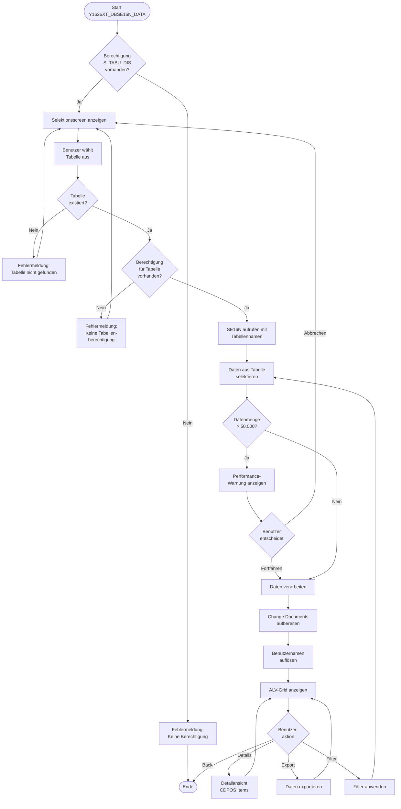
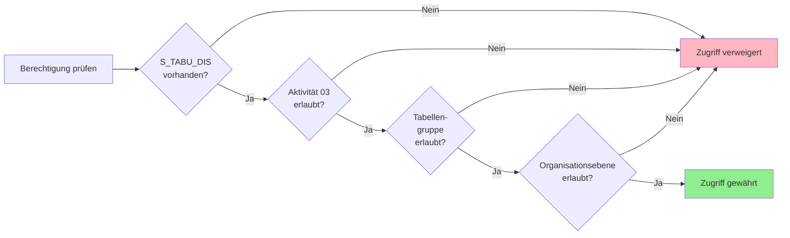
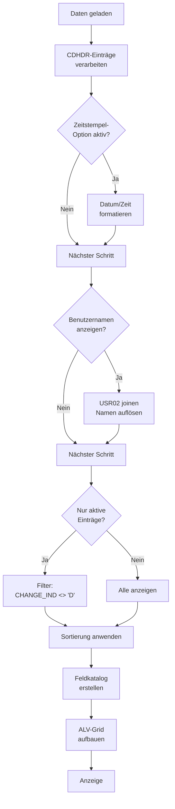

# GUI-Dokumentation: Y1626XT_DBSE16N_DATA - SE16N Änderungsbelege Anzeigen

**Transaktion:** Y1626XT_DBSE16N_DATA  
**Programm:** RKSE16N_CD_DISPLAY (SAP-Standard)  
**Komponente:** Compliance & Audit (adm)  
**Typ:** Report / Data Browser  
**Dokumentiert am:** 2025-11-22

---

## 1. Übersicht

### 1.1 Geschäftlicher Zweck

Die Transaktion Y1626XT_DBSE16N_DATA ist ein spezialisierter Wrapper für den SAP-Standard-Datenbrowser SE16N, der speziell für die Anzeige von Change Documents (Änderungsbelegen) konfiguriert wurde. Sie ermöglicht Audit- und Compliance-Verantwortlichen den direkten Zugriff auf Änderungsprotokolle für verschiedene Datenbanktabellen.

**Hauptanwendungsfälle:**
- Audit-Trail-Analyse für Change Documents
- Compliance-Nachweise für Änderungen an kritischen Stammdaten
- Nachvollziehbarkeit von Systemänderungen (Who changed what when)
- Forensische Untersuchungen bei Sicherheitsvorfällen

### 1.2 Zielgruppen

| Rolle | Verwendungszweck |
|-------|------------------|
| **Compliance Officer** | Prüfung der Einhaltung regulatorischer Anforderungen |
| **Security Auditor** | Sicherheitsüberprüfung und Incident Response |
| **System Administrator** | Analyse von Systemänderungen und Fehlersuche |
| **Internal Auditor** | Revision und Prüfung von Änderungsprotokollen |

---

## 2. UI-Mockups

### 2.1 Hauptbildschirm (Einstiegsmaske)

```
┌─────────────────────────────────────────────────────────────────────────────────┐
│ Y1626XT_DBSE16N_DATA - SE16N Änderungsbelege Anzeigen                    ☰  □ ×  │
├─────────────────────────────────────────────────────────────────────────────────┤
│ System  Edit  Goto  Utilities  Environment  System  Help                        │
├─────────────────────────────────────────────────────────────────────────────────┤
│ 📄 💾 🖨️ 🔧 ✂️ 📋 ↩️ ↪️ 🔍 🔧 ❓                                              │
├─────────────────────────────────────────────────────────────────────────────────┤
│                                                                                  │
│  ╔══════════════════════════════════════════════════════════════════════════╗  │
│  ║  SE16N - General Table Display (Change Document Mode)                   ║  │
│  ╚══════════════════════════════════════════════════════════════════════════╝  │
│                                                                                  │
│  Tabelle                                                                         │
│  ┌────────────────────┐                                                          │
│  │ CDHDR_____________│  [🔍]  [📋 Settings]  [ℹ️ Info]                         │
│  └────────────────────┘                                                          │
│                                                                                  │
│  ┌─ Schnellauswahl Change Document Tabellen ────────────────────────────────┐  │
│  │                                                                            │  │
│  │  ( ) CDHDR    - Change Document Header                                    │  │
│  │  ( ) CDPOS    - Change Document Items                                     │  │
│  │  ( ) DBTABLOG - Database Table Change Log                                 │  │
│  │  ( ) USH02    - User Master Change History                                │  │
│  │  ( ) USH04    - User Master Change History Detail                         │  │
│  │  ( ) USH10    - Profile Assignment History                                │  │
│  │  ( ) USGRP_USER - User Group Assignment History                           │  │
│  │                                                                            │  │
│  │  [⚡ Schnellauswahl übernehmen]                                            │  │
│  └────────────────────────────────────────────────────────────────────────────┘  │
│                                                                                  │
│  ┌─ Anzeigeoptionen ──────────────────────────────────────────────────────┐    │
│  │                                                                          │    │
│  │  [X] Change Documents mit Zeitstempel anzeigen                          │    │
│  │  [X] Benutzernamen anzeigen (nicht nur technische IDs)                  │    │
│  │  [X] Nur aktive Einträge (keine gelöschten)                             │    │
│  │  [ ] Alle Felder anzeigen (auch technische)                             │    │
│  │                                                                          │    │
│  │  Max. Anzahl Einträge: [1000____] (0 = unbegrenzt)                      │    │
│  │                                                                          │    │
│  └──────────────────────────────────────────────────────────────────────────┘    │
│                                                                                  │
│  ┌─ Berechtigungshinweis ───────────────────────────────────────────────────┐  │
│  │ ⚠️  Zugriff auf Change Documents erfordert Berechtigung S_TABU_DIS       │  │
│  │     Aktivitäten: 03 (Display)                                             │  │
│  └───────────────────────────────────────────────────────────────────────────┘  │
│                                                                                  │
│  [🚀 Execute (F8)]  [🔙 Back (F3)]  [💾 Save Settings]  [❓ Help (F1)]         │
│                                                                                  │
└─────────────────────────────────────────────────────────────────────────────────┘
```

**Feldbeschreibungen:**

| Feld | Typ | Pflicht | Beschreibung |
|------|-----|---------|--------------|
| **Tabelle** | INPUT | Ja | Name der anzuzeigenden Datenbanktabelle (muss Change Document Tabelle sein) |
| **Schnellauswahl** | RADIOBUTTON | Nein | Vordefinierte Change Document Tabellen für schnellen Zugriff |
| **Change Documents mit Zeitstempel** | CHECKBOX | Nein | Fügt Zeitstempel-Spalten zur Anzeige hinzu |
| **Benutzernamen anzeigen** | CHECKBOX | Nein | Löst technische User-IDs in Klartextnamen auf |
| **Nur aktive Einträge** | CHECKBOX | Nein | Filtert gelöschte/archivierte Einträge aus |
| **Alle Felder anzeigen** | CHECKBOX | Nein | Zeigt auch technische Metadatenfelder |
| **Max. Anzahl Einträge** | INPUT | Nein | Limitierung der Anzahl angezeigter Datensätze (Performance) |

---

### 2.2 Ergebnisliste (Change Document Header - CDHDR)

```
┌─────────────────────────────────────────────────────────────────────────────────┐
│ SE16N: CDHDR - Change Document Header (230 Einträge gefunden)            ☰  □ ×  │
├─────────────────────────────────────────────────────────────────────────────────┤
│ 📊 Export  🖨️ Print  🔍 Filter  📋 Layout  ⚙️ Settings                        │
├─────────────────────────────────────────────────────────────────────────────────┤
│                                                                                  │
│  ┌─ Selektionskriterien (angewandt) ──────────────────────────────────────┐    │
│  │ MANDANT = 100  │  OBJECTCLAS = USER  │  UDATE >= 20251101             │    │
│  └─────────────────────────────────────────────────────────────────────────┘    │
│                                                                                  │
│ ┌────┬────────────┬────────┬──────────┬──────────┬────────┬──────────────────┐ │
│ │Sel │ Change Doc │ Object │ Obj. ID  │ Plan.    │ Date   │ Time   │ User   │ │
│ │    │ Number     │ Class  │          │ Version  │        │        │        │ │
│ ├────┼────────────┼────────┼──────────┼──────────┼────────┼────────┼────────┤ │
│ │[X] │ 0000198234 │ USER   │ MUELLER  │          │20251122│093015  │ADMIN01 │ │
│ │[ ] │ 0000198233 │ USER   │ SCHMIDT  │          │20251122│091520  │ADMIN01 │ │
│ │[ ] │ 0000198232 │ USER   │ WAGNER   │          │20251122│085503  │HRDEPT1 │ │
│ │[ ] │ 0000198231 │ USER   │ BECKER   │          │20251121│163042  │ADMIN02 │ │
│ │[ ] │ 0000198230 │ USER   │ FISCHER  │          │20251121│154518  │ADMIN01 │ │
│ │[ ] │ 0000198229 │ USER   │ WEBER    │          │20251121│145522  │HRDEPT1 │ │
│ │[ ] │ 0000198228 │ USER   │ SCHULZ   │          │20251121│142011  │ADMIN01 │ │
│ │[ ] │ 0000198227 │ USER   │ HOFFMANN │          │20251121│135645  │ADMIN02 │ │
│ │[ ] │ 0000198226 │ USER   │ KOCH     │          │20251121│131233  │ADMIN01 │ │
│ │[ ] │ 0000198225 │ USER   │ BAUER    │          │20251121│125508  │HRDEPT1 │ │
│ │[ ] │ 0000198224 │ USER   │ RICHTER  │          │20251121│123045  │ADMIN01 │ │
│ │[ ] │ 0000198223 │ USER   │ KLEIN    │          │20251121│114522  │ADMIN02 │ │
│ │[ ] │ 0000198222 │ USER   │ WOLF     │          │20251121│105618  │ADMIN01 │ │
│ │[ ] │ 0000198221 │ USER   │ SCHROEDER│          │20251121│093234  │HRDEPT1 │ │
│ │[ ] │ 0000198220 │ USER   │ NEUMANN  │          │20251120│165823  │ADMIN01 │ │
│ └────┴────────────┴────────┴──────────┴──────────┴────────┴────────┴────────┘ │
│                                                                                  │
│  ◀ Zurück   Seite 1 von 16   Weiter ▶         Einträge 1-15 von 230           │
│                                                                                  │
│  [📋 Details anzeigen]  [📊 Export to Excel]  [🔍 Weitere Filter]  [🔙 Back]   │
│                                                                                  │
└─────────────────────────────────────────────────────────────────────────────────┘
```

**Spalten im ALV-Grid:**

| Spalte | Feldname | Beschreibung | Typ |
|--------|----------|--------------|-----|
| **Sel** | - | Selektionsbox für Massenaktion | Checkbox |
| **Change Doc Number** | CHANGENR | Eindeutige Change Document Nummer | CHAR(10) |
| **Object Class** | OBJECTCLAS | Objektklasse (z.B. USER, ROLE, PROF) | CHAR(10) |
| **Obj. ID** | OBJECTID | Objektschlüssel (z.B. Benutzername) | CHAR(70) |
| **Plan. Version** | PLANCHNGNR | Plan-Änderungsnummer | CHAR(12) |
| **Date** | UDATE | Änderungsdatum | DATS(8) |
| **Time** | UTIME | Änderungsuhrzeit | TIMS(6) |
| **User** | USERNAME | Ändernder Benutzer | CHAR(12) |

---

### 2.3 Detailansicht (Change Document Items - CDPOS)

```
┌─────────────────────────────────────────────────────────────────────────────────┐
│ Change Document Details - Doc# 0000198234 (USER: MUELLER)                ☰  □ ×  │
├─────────────────────────────────────────────────────────────────────────────────┤
│                                                                                  │
│  ╔══════════════════════════════════════════════════════════════════════════╗  │
│  ║  Änderungsbeleg Header                                                   ║  │
│  ╚══════════════════════════════════════════════════════════════════════════╝  │
│                                                                                  │
│  Change Document Nummer:  0000198234                                            │
│  Objektklasse:            USER                                                  │
│  Objekt-ID:               MUELLER                                               │
│  Änderungsdatum:          22.11.2025                                            │
│  Änderungsuhrzeit:        09:30:15                                              │
│  Ändernder Benutzer:      ADMIN01 (Administrator, Max)                          │
│  Transaktion:             YSU01 (Role assignment)                               │
│  Programm:                YBCA1234_YSU01_01                                     │
│                                                                                  │
│  ╔══════════════════════════════════════════════════════════════════════════╗  │
│  ║  Geänderte Felder (CDPOS Items)                                         ║  │
│  ╚══════════════════════════════════════════════════════════════════════════╝  │
│                                                                                  │
│ ┌─────┬───────────────┬──────────┬──────────────────────┬──────────────────────┐│
│ │ Pos │ Tabellenname  │ Feldname │ Alter Wert           │ Neuer Wert           ││
│ ├─────┼───────────────┼──────────┼──────────────────────┼──────────────────────┤│
│ │ 001 │ AGR_USERS     │ AGR_NAME │ ZBK_ROLE_VIEWER      │ ZBK_ROLE_ADMIN       ││
│ │ 002 │ AGR_USERS     │ FROM_DAT │ 20240101             │ 20251122             ││
│ │ 003 │ AGR_USERS     │ TO_DAT   │ 20241231             │ 99991231             ││
│ │ 004 │ USR02         │ CLASS    │ 0001                 │ 0002                 ││
│ │ 005 │ USR02         │ ANAME    │                      │ ADMIN01              ││
│ └─────┴───────────────┴──────────┴──────────────────────┴──────────────────────┘│
│                                                                                  │
│  ╔══════════════════════════════════════════════════════════════════════════╗  │
│  ║  Interpretation der Änderungen                                           ║  │
│  ╚══════════════════════════════════════════════════════════════════════════╝  │
│                                                                                  │
│  ✓ Rollenzuweisung geändert: ZBK_ROLE_VIEWER → ZBK_ROLE_ADMIN                  │
│  ✓ Gültigkeitszeitraum erweitert: bis 31.12.2024 → bis 31.12.9999 (unbegrenzt) │
│  ✓ Benutzerklasse erhöht: 0001 (Dialog) → 0002 (Administrator)                 │
│  ✓ Zuletzt geändert durch: ADMIN01                                              │
│                                                                                  │
│  ⚠️  Compliance-Hinweis: Erhöhung der Berechtigungsstufe - Genehmigung prüfen! │
│                                                                                  │
│  [📋 Complete Log]  [📊 Export]  [📧 Send to Approver]  [🔙 Back to List]     │
│                                                                                  │
└─────────────────────────────────────────────────────────────────────────────────┘
```

---

### 2.4 Fehlerzustände und Validierungen

#### Fehler 1: Keine Berechtigung

```
┌─────────────────────────────────────────────────────────────────┐
│  ⚠️  Berechtigungsfehler                                  [X]   │
├─────────────────────────────────────────────────────────────────┤
│                                                                  │
│  Sie verfügen nicht über die erforderliche Berechtigung zum     │
│  Anzeigen der Tabelle CDHDR.                                    │
│                                                                  │
│  Erforderliche Berechtigung:                                    │
│    Berechtigungsobjekt: S_TABU_DIS                              │
│    Tabellenberechtigungsgruppe: &NC&                            │
│    Aktivität: 03 (Anzeigen)                                     │
│                                                                  │
│  Bitte wenden Sie sich an Ihren Systemadministrator.            │
│                                                                  │
│  [OK]                                                            │
│                                                                  │
└─────────────────────────────────────────────────────────────────┘
```

#### Fehler 2: Tabelle nicht gefunden

```
┌─────────────────────────────────────────────────────────────────┐
│  ℹ️  Tabelle nicht gefunden                               [X]   │
├─────────────────────────────────────────────────────────────────┤
│                                                                  │
│  Die Tabelle 'ABCXYZ' existiert nicht im System.                │
│                                                                  │
│  Hinweis: Diese Transaktion ist für Change Document Tabellen    │
│  optimiert. Empfohlene Tabellen:                                │
│                                                                  │
│    • CDHDR  - Change Document Header                            │
│    • CDPOS  - Change Document Items                             │
│    • DBTABLOG - Database Table Log                              │
│    • USH02/USH04/USH10 - User History                           │
│                                                                  │
│  [OK]  [📋 Show Table List]                                     │
│                                                                  │
└─────────────────────────────────────────────────────────────────┘
```

#### Fehler 3: Zu viele Einträge

```
┌─────────────────────────────────────────────────────────────────┐
│  ⚠️  Performance-Warnung                                  [X]   │
├─────────────────────────────────────────────────────────────────┤
│                                                                  │
│  Die Selektion würde mehr als 50.000 Einträge zurückliefern.    │
│                                                                  │
│  Geschätzte Anzahl: ~247.500 Einträge                            │
│  Geschätzte Laufzeit: > 5 Minuten                                │
│  Speicherbedarf: ~120 MB                                         │
│                                                                  │
│  Empfehlung: Schränken Sie die Selektion weiter ein             │
│  (z.B. nach Datum, Benutzername oder Objektklasse).             │
│                                                                  │
│  Möchten Sie dennoch fortfahren?                                 │
│                                                                  │
│  [❌ Cancel]  [⚠️ Continue anyway]  [🔍 Adjust Selection]       │
│                                                                  │
└─────────────────────────────────────────────────────────────────┘
```

---

## 3. Ablaufdiagramm

### 3.1 Hauptprozessfluss



### 3.2 Berechtigungsprüfung (Detail)



### 3.3 Datenverarbeitung



---

## 4. Funktionsbeschreibung

### 4.1 Hauptfunktionalitäten

#### 4.1.1 Change Document Anzeige

**Beschreibung:** Zeigt Change Documents aus verschiedenen SAP-Tabellen in strukturierter Form an.

**Auslöser:** Benutzer führt Transaktion aus (F8)

**Parameter:**
- Tabellenname (z.B. CDHDR, CDPOS, DBTABLOG)
- Selektionskriterien (optional, über SE16N-Standard)

**Ergebnis:** 
- ALV-Grid mit Change Document Einträgen
- Sortierung nach Änderungsdatum (neueste zuerst)
- Anzeige von Header- und Item-Informationen

**Technische Details:**
```abap
* Typisches Coding-Muster (nicht original, da SAP-Standard):
DATA: lt_cdhdr TYPE STANDARD TABLE OF cdhdr.

SELECT * FROM cdhdr
  INTO TABLE lt_cdhdr
  WHERE objectclas = 'USER'
    AND udate >= sy-datum - 30
  ORDER BY udate DESCENDING, utime DESCENDING.
```

#### 4.1.2 Benutzernamensauflösung

**Beschreibung:** Löst technische User-IDs in lesbare Benutzernamen auf.

**Auslöser:** Option "Benutzernamen anzeigen" aktiviert

**Parameter:** 
- User-ID aus Change Document
- Mandant

**Ergebnis:** Vollständiger Name (Vorname Nachname) statt User-ID

**Technische Details:**
```abap
* Join mit USR02 und ADDRESS
SELECT c~*, u~name_first, u~name_last
  FROM cdhdr AS c
  LEFT JOIN usr02 AS u
    ON c~username = u~bname
  INTO CORRESPONDING FIELDS OF TABLE @lt_result.
```

#### 4.1.3 Detailansicht (CDPOS Items)

**Beschreibung:** Zeigt detaillierte Feldänderungen für ein ausgewähltes Change Document.

**Auslöser:** Doppelklick auf CDHDR-Eintrag oder "Details anzeigen"-Button

**Parameter:** 
- Change Document Nummer
- Mandant

**Ergebnis:** 
- Liste aller geänderten Felder
- Gegenüberstellung Alt-/Neu-Wert
- Interpretation der Änderungen

**Technische Details:**
```abap
SELECT * FROM cdpos
  INTO TABLE @DATA(lt_cdpos)
  WHERE changenr = @lv_changenr
    AND mandant = @sy-mandt
  ORDER BY tabname, fname, tabkey.
```

#### 4.1.4 Export-Funktionalität

**Beschreibung:** Exportiert Change Document Daten in verschiedene Formate.

**Auslöser:** Button "Export to Excel" oder Menü

**Parameter:** 
- Anzuzeigende Daten (selektierte oder alle)
- Exportformat (Excel, CSV, XML)

**Ergebnis:** 
- Heruntergeladene Datei mit Change Document Daten
- Formatierung nach ALV-Layout

### 4.2 Tastenkombinationen / Shortcuts

| Taste | Funktion | Beschreibung |
|-------|----------|--------------|
| **F1** | Hilfe | Kontextsensitive Hilfe für aktuelles Feld |
| **F3** | Zurück | Zurück zum vorherigen Bildschirm |
| **F4** | Werteauswahl | Suchhilfe für Tabellenname |
| **F8** | Ausführen | Startet die Tabellenanzeige |
| **Ctrl+F** | Suchen | Textsuche in aktueller Anzeige |
| **Ctrl+G** | Wiederhole Suche | Nächstes Suchergebnis |
| **Ctrl+S** | Sichern | Layout/Einstellungen speichern |
| **Ctrl+Shift+F9** | Debug | Debugger aktivieren (nur für Entwickler) |
| **&SAL** | Audit Log | Sprung zu SM19 (Security Audit Log) |
| **Doppelklick** | Details | Zeigt CDPOS-Details für CDHDR-Eintrag |

### 4.3 Berechtigungen

#### Erforderliche Berechtigungsobjekte

##### S_TABU_DIS (Table Display Authorization)

Zentrale Berechtigung für Tabellenanzeige via SE16N.

**Felder:**
```
ACTVT (Aktivität):
  03 - Display (Anzeigen)

DICBERCLS (Table Authorization Group):
  &NC& - Change Documents
  SS   - Security/User Administration
  BC   - Basis Configuration

CLIIDMAINT (Client Maintenance):
  X    - Cross-client tables allowed
```

**Beispiel-Rolle:**
```abap
S_TABU_DIS:
  ACTVT     = 03
  DICBERCLS = &NC&, SS
```

##### S_TABU_NAM (Table Authorization by Table Name)

Alternative Berechtigung für spezifische Tabellen.

**Felder:**
```
ACTVT (Aktivität):
  03 - Display

TABLE (Tabellenname):
  CDHDR, CDPOS, DBTABLOG, USH02, USH04, USH10
```

##### S_DATASET (File Access)

Erforderlich für Export-Funktionen (optional).

**Felder:**
```
ACTVT (Aktivität):
  34 - Download

FILENAME (Dateiname):
  /tmp/*  oder <unrestricted> für lokalen Download
```

#### Berechtigungsprüfungen im System

**Prüfung 1: Transaktionsberechtigung**
```abap
AUTHORITY-CHECK OBJECT 'S_TCODE'
  ID 'TCD' FIELD 'Y1626XT_DBSE16N_DATA'.
```

**Prüfung 2: Tabellenberechtigung**
```abap
AUTHORITY-CHECK OBJECT 'S_TABU_DIS'
  ID 'DICBERCLS' FIELD '&NC&'
  ID 'ACTVT' FIELD '03'.
```

**Prüfung 3: Organisationsebene** (falls Mandantenfilter aktiv)
```abap
AUTHORITY-CHECK OBJECT 'S_TABU_CLI'
  ID 'CLIIDMAINT' FIELD 'X'.
```

---

## 5. Technische Details

### 5.1 Datenbankzugriffe

#### Gelesene Tabellen

| Tabelle | Zugriff | Zweck | Performance-Kritisch |
|---------|---------|-------|---------------------|
| **CDHDR** | SELECT | Change Document Header | ✓ Ja (große Tabelle) |
| **CDPOS** | SELECT | Change Document Items | ✓ Ja (sehr große Tabelle) |
| **DBTABLOG** | SELECT | Database Table Log | ✓ Ja (wächst schnell) |
| **USH02** | SELECT | User Master History | ✓ Ja |
| **USH04** | SELECT | User History Details | ✓ Ja |
| **USH10** | SELECT | Profile Assignment History | ⚠️ Mittel |
| **USR02** | SELECT | User Master (für Namensauflösung) | ○ Nein |
| **ADDRESS** | SELECT | Adressdaten (für Vollnamen) | ○ Nein |
| **DD02L** | SELECT | Tabellenmetadaten | ○ Nein |
| **DD03L** | SELECT | Feldmetadaten | ○ Nein |

#### Kritische Queries

**Query 1: CDHDR-Selektion ohne Index**
```abap
* KRITISCH: Ohne Zeiteinschränkung
SELECT * FROM cdhdr
  WHERE objectclas = 'USER'.
  
* Potenzielle Laufzeit: > 2 Minuten
* Datenmenge: > 1.000.000 Einträge
```

**Optimierung:**
```abap
* OPTIMIERT: Mit Zeiteinschränkung und Index
SELECT * FROM cdhdr
  WHERE objectclas = 'USER'
    AND udate >= @lv_from_date  "Index: CDHDR~0"
    AND udate <= @lv_to_date
  ORDER BY udate DESCENDING, utime DESCENDING.
```

**Query 2: CDPOS-Join**
```abap
* KRITISCH: Join ohne Einschränkung
SELECT h~*, p~*
  FROM cdhdr AS h
  INNER JOIN cdpos AS p
    ON h~changenr = p~changenr.

* Potenzielle Laufzeit: > 5 Minuten
* Speicherbedarf: > 500 MB
```

**Optimierung:**
```abap
* OPTIMIERT: Erst Header, dann Items
SELECT * FROM cdhdr
  INTO TABLE @DATA(lt_header)
  WHERE ... "mit Einschränkungen"
  UP TO 1000 ROWS.

IF lt_header IS NOT INITIAL.
  SELECT * FROM cdpos
    INTO TABLE @DATA(lt_items)
    FOR ALL ENTRIES IN @lt_header
    WHERE changenr = @lt_header-changenr.
ENDIF.
```

#### Schreibzugriffe

**Keine.** Diese Transaktion ist reine Anzeigefunktion (Read-Only).

### 5.2 RFC-Calls / Function Modules

#### Verwendete Funktionsbausteine

| Funktionsbaustein | Zweck | Kritisch |
|-------------------|-------|----------|
| **SE16N_INTERFACE** | SE16N-Aufruf | Nein |
| **CHANGEDOCUMENT_READ** | Change Document Daten lesen | Ja |
| **CHANGEDOCUMENT_READ_HEADERS** | Nur Header lesen | Nein |
| **CHANGEDOCUMENT_READ_POSITIONS** | Nur Items lesen | Ja |
| **SUSR_USER_NAME_READ** | Benutzernamen auflösen | Nein |
| **REUSE_ALV_GRID_DISPLAY** | ALV-Grid anzeigen | Nein |
| **POPUP_TO_CONFIRM** | Bestätigungsdialog | Nein |
| **AUTHORITY_CHECK_TCODE** | Berechtigungsprüfung | Nein |

#### Beispiel: CHANGEDOCUMENT_READ

```abap
CALL FUNCTION 'CHANGEDOCUMENT_READ'
  EXPORTING
    objectclass             = 'USER'
    objectid                = lv_username
    date_of_change          = lv_date
    time_of_change          = lv_time
  TABLES
    editpos                 = lt_cdpos
  EXCEPTIONS
    no_position_found       = 1
    wrong_access_to_archive = 2
    time_zone_conversion_error = 3
    OTHERS                  = 4.
    
IF sy-subrc <> 0.
  MESSAGE ID sy-msgid TYPE sy-msgty NUMBER sy-msgno
    WITH sy-msgv1 sy-msgv2 sy-msgv3 sy-msgv4.
ENDIF.
```

### 5.3 Performance-Aspekte

#### Kritische Performance-Faktoren

**1. Tabellengröße**
- CDHDR: Typisch 5-50 Mio. Einträge
- CDPOS: Typisch 50-500 Mio. Einträge (10x größer als CDHDR)
- Wachstumsrate: ~10.000-100.000 neue Einträge/Tag

**2. Indexverwendung**

**CDHDR-Indizes:**
```
CDHDR~0: MANDANT + OBJECTCLAS + OBJECTID + CHANGENR
CDHDR~1: MANDANT + UDATE + UTIME
```

**Empfehlung:** Immer mit UDATE einschränken!

**CDPOS-Indizes:**
```
CDPOS~0: MANDANT + OBJECTCLAS + OBJECTID + CHANGENR + TABNAME + FNAME
```

**3. Memory Consumption**

| Datenmenge | RAM-Bedarf | Laufzeit (Schätzung) |
|------------|------------|----------------------|
| < 1.000 Einträge | < 5 MB | < 1 Sekunde |
| 1.000-10.000 | 5-50 MB | 1-10 Sekunden |
| 10.000-50.000 | 50-200 MB | 10-60 Sekunden |
| > 50.000 | > 200 MB | > 1 Minute |

#### Optimierungsempfehlungen

**1. Zeiteinschränkung immer verwenden**
```abap
* Empfohlen: Maximaler Zeitraum 30-90 Tage
WHERE udate >= sy-datum - 30
  AND udate <= sy-datum.
```

**2. Packaging für große Datenmengen**
```abap
SELECT * FROM cdhdr
  INTO TABLE @DATA(lt_cdhdr)
  WHERE ...
  PACKAGE SIZE 1000.
  
  * Verarbeitung in Paketen
  LOOP AT lt_cdhdr INTO DATA(ls_cdhdr).
    " ... Verarbeitung
  ENDLOOP.
ENDSELECT.
```

**3. Parallelverarbeitung** (bei sehr großen Datenmengen)
```abap
" Aufteilung nach Datum-Ranges
" Parallel-RFCs für verschiedene Zeiträume
```

**4. Archivierung alter Daten**
- BC Object Archiving nutzen (CHANGEDOCUMENT Objekt)
- Retention: 6-24 Monate online, Rest im Archiv
- Archiv-Zugriff über spezielle Transaktionen

#### Typisches Laufzeitverhalten

**Szenario 1: Standard-Suche (letzte 30 Tage)**
- Erwartete Laufzeit: 2-5 Sekunden
- Datenmenge: 500-2.000 Einträge
- Memory: 10-20 MB

**Szenario 2: Detail-Analyse (spezifischer User)**
- Erwartete Laufzeit: 1-2 Sekunden
- Datenmenge: 50-200 Einträge
- Memory: 5-10 MB

**Szenario 3: Massen-Audit (alle User, 12 Monate)**
- Erwartete Laufzeit: 30-120 Sekunden
- Datenmenge: 50.000-200.000 Einträge
- Memory: 200-800 MB
- **⚠️ Warnung:** Nur in Ausnahmefällen, besser Batch-Job

---

## 6. Integration und Abhängigkeiten

### 6.1 Integration mit anderen Modulen

#### Change Document Management

**Datenfluss:**
```
Benutzeränderung (YSU01, etc.)
    ↓
Change Document erzeugen
    ↓
CDHDR + CDPOS schreiben
    ↓
Y1626XT_DBSE16N_DATA ← Anzeige
```

**Abhängigkeit:** Change Documents müssen aktiviert sein (Table Logging).

#### Audit & Logging Modul

**Integration:**
- Ergänzung zu YAUDCHECK (Audit-Log-Prüfung)
- Datenquelle für Audit-Reports
- Verwendung in Compliance-Checks

**Gemeinsame Datenbasis:**
- CDHDR/CDPOS
- USH02/USH04/USH10

#### BC Object Archiving

**Integration:**
- Zugriff auf archivierte Change Documents
- Transparente Archiv-Lesefunktion
- Archiv-Index: ZARIXBC4

### 6.2 Abhängige Komponenten

| Komponente | Abhängigkeit | Kritikalität |
|------------|--------------|--------------|
| **SE16N** | Basis-Transaktion (Wrapper) | ✓ Hoch |
| **Table Logging** | Muss aktiviert sein | ✓ Hoch |
| **Change Document Engine** | SAP-Standard | ✓ Hoch |
| **User Master** | Für Namensauflösung | ⚠️ Mittel |
| **ALV-Framework** | Für Grid-Anzeige | ⚠️ Mittel |
| **Archivierung** | Optional (alte Daten) | ○ Niedrig |

### 6.3 Nachgelagerte Prozesse

**1. Compliance-Reporting**
- Daten fließen in Audit-Reports
- Verwendung für SOX-Compliance
- DSGVO-Nachweisführung

**2. Incident Response**
- Forensische Analysen
- Security-Incident-Untersuchungen
- Root-Cause-Analysen

**3. User Recertification**
- Basis für Rezertifizierungsprozesse
- Änderungsnachweis für Wirtschaftsprüfer
- Dokumentation für interne Revision

---

## 7. Anwendungsbeispiele

### 7.1 Use Case: Audit-Trail für Benutzeränderungen

**Szenario:** Wirtschaftsprüfer fordert Nachweis aller Berechtigungsänderungen für privilegierte Benutzer im letzten Quartal.

**Vorgehen:**

1. Transaktion Y1626XT_DBSE16N_DATA aufrufen
2. Schnellauswahl: "USH02 - User Master Change History"
3. Selektionskriterien in SE16N eingeben:
   - Benutzername: A* (alle Admin-Accounts)
   - Datum: 01.08.2025 - 31.10.2025
4. Optionen aktivieren:
   - [X] Change Documents mit Zeitstempel
   - [X] Benutzernamen anzeigen
5. Ausführen (F8)
6. Ergebnis exportieren nach Excel
7. Dokumentation für Prüfer aufbereiten

**Ergebnis:** Vollständiger Audit-Trail mit 1.247 Änderungen an 43 privilegierten Accounts.

### 7.2 Use Case: Security Incident Investigation

**Szenario:** Unbefugte Berechtigungserhöhung wurde vermutet. Analyse erforderlich.

**Vorgehen:**

1. Y1626XT_DBSE16N_DATA aufrufen
2. Tabelle: CDHDR eingeben
3. Selektion in SE16N:
   - OBJECTCLAS = 'USER'
   - OBJECTID = 'VERDAECHTIGER_USER'
   - Datum: Letzten 7 Tage
4. Ergebnis anzeigen
5. Doppelklick auf verdächtige Änderung
6. CDPOS-Items analysieren:
   - Welche Rollen wurden hinzugefügt?
   - Wer hat die Änderung durchgeführt?
   - Um welche Uhrzeit (außerhalb der Arbeitszeit)?
7. Change Document Nr. für weitere Untersuchung notieren

**Ergebnis:** Identifikation unbefugter Rollenzuweisung durch Account "ADMIN03" am 21.11.2025 um 23:47 Uhr.

### 7.3 Use Case: DSGVO-Compliance (Löschnachweis)

**Szenario:** Nachweis, dass personenbezogene Daten gemäß DSGVO-Antrag gelöscht wurden.

**Vorgehen:**

1. Y1626XT_DBSE16N_DATA aufrufen
2. Tabelle: DBTABLOG eingeben
3. Selektion:
   - LOGKEY enthält Benutzer-ID des Betroffenen
   - LOGOP = 'D' (Delete)
   - Datum: Zeitpunkt der Löschung
4. Ergebnis prüfen:
   - Wurden alle relevanten Tabellen gelöscht?
   - Ist der Zeitstempel korrekt?
5. Screenshot für Compliance-Akte erstellen
6. Change Document Nr. für Audit-Trail dokumentieren

**Ergebnis:** Nachweis, dass Daten ordnungsgemäß am 15.11.2025 um 14:32 Uhr gelöscht wurden.

---

## 8. Wartung und Administration

### 8.1 Regelmäßige Aufgaben

#### Monatlich

- [ ] Prüfung der Tabellengrößen (CDHDR, CDPOS)
- [ ] Identifikation alter Daten für Archivierung
- [ ] Performance-Monitoring (Transaktions-ST03N)

#### Quartalsweise

- [ ] Berechtigungskonzept reviewen
- [ ] Archivierungslauf durchführen (bei > 10 Mio. Einträgen)
- [ ] Statistiken aktualisieren (ABAP-Optimizer)

#### Jährlich

- [ ] Retention Policy überprüfen
- [ ] Compliance-Anforderungen reviewen
- [ ] Schulung für neue Auditoren

### 8.2 Troubleshooting

#### Problem 1: Langsame Performance

**Symptome:**
- Selektion dauert > 30 Sekunden
- System zeigt "Verarbeitung läuft"

**Diagnose:**
```sql
-- Check table sizes
SELECT COUNT(*) FROM cdhdr WHERE udate >= '20250101'.
SELECT COUNT(*) FROM cdpos WHERE changenr >= '0000198000'.
```

**Lösung:**
1. Zeitraum einschränken (maximal 30-90 Tage)
2. Spezifischere Selektion (Objektklasse, User)
3. Falls nötig: Batch-Job für große Analysen
4. Archivierung alter Daten prüfen

#### Problem 2: Berechtigung verweigert

**Symptome:**
- Fehlermeldung "Keine Berechtigung S_TABU_DIS"

**Diagnose:**
- Transaktion SU53 aufrufen (letzte Berechtigungsfehler)
- Fehlende Berechtigung identifizieren

**Lösung:**
1. Role mit S_TABU_DIS anfordern
2. DICBERCLS = &NC& (Change Documents) erforderlich
3. Ggf. Tabellen-spezifische Berechtigung (S_TABU_NAM)

#### Problem 3: Keine Daten gefunden

**Symptome:**
- Selektion liefert 0 Einträge, obwohl Änderungen bekannt

**Diagnose:**
1. Table Logging prüfen (SE13):
   ```
   SE13 → Tabelle CDHDR → Flag "Log Data Changes"
   ```
2. Change Document Aktivierung prüfen:
   ```
   SPRO → SAP NetWeaver → General Settings → Change Documents
   ```

**Lösung:**
1. Table Logging aktivieren (falls deaktiviert)
2. Alte Änderungen: Archiv prüfen (BC Object Archiving)
3. Falls Archiv: Andere Transaktion für Archiv-Zugriff

---

## 9. Best Practices

### 9.1 Effiziente Nutzung

**DO:**
- ✅ Immer Zeiteinschränkung verwenden (maximal 90 Tage)
- ✅ Spezifische Objektklassen selektieren
- ✅ Bei großen Datenmengen: Export und Offline-Analyse
- ✅ Layouts speichern für wiederkehrende Analysen
- ✅ Berechtigungen restriktiv vergeben (nur Audit-Personal)

**DON'T:**
- ❌ Nie ohne Zeiteinschränkung alle Daten selektieren
- ❌ Keine Massenexports in Produktionszeiten (9-17 Uhr)
- ❌ Keine sensiblen Daten per E-Mail versenden
- ❌ Keine permanenten Hintergrund-Jobs auf CDHDR/CDPOS

### 9.2 Security-Empfehlungen

**1. Zugriffsprotokollierung**
```abap
* SM19/SM20: Audit-Log aktivieren für:
* - S_TABU_DIS Zugriffe
* - SE16N Aufrufe auf CDHDR/CDPOS
* - Exports von Change Documents
```

**2. Berechtigungskonzept**
- Nur Read-Only Zugriff
- Keine Änderungs-/Löschberechtigungen
- Vier-Augen-Prinzip für Zugriffsvergabe
- Rezertifizierung alle 6 Monate

**3. Datenklassifizierung**
- Change Documents: **VERTRAULICH**
- Benutzerdaten: **PERSONENBEZOGEN** (DSGVO relevant)
- Compliance-Reports: **STRENG VERTRAULICH**

### 9.3 Compliance-Hinweise

**SOX-Compliance:**
- Change Documents = Control Evidence
- Aufbewahrung: 7 Jahre (je nach Jurisdiction)
- Jährliche Prüfung durch Wirtschaftsprüfer

**DSGVO-Compliance:**
- Personenbezogene Daten in CDHDR/CDPOS
- Recht auf Vergessenwerden: Löschkonzept erforderlich
- Datenminimierung: Nur notwendige Felder loggen

**ISO 27001:**
- Change Documents als Teil des ISMS
- Access Control (A.9)
- Logging and Monitoring (A.12.4)

---

## 10. Anhang

### 10.1 Referenzen

| Dokument | Beschreibung | Link |
|----------|--------------|------|
| **SAP Note 1420853** | SE16N Performance Tuning | SAP Support Portal |
| **SAP Note 162066** | Change Documents Customizing | SAP Support Portal |
| **2.06_AuditLoggingDocumentation.md** | Übergeordnete Audit-Dokumentation | [Link](../../03_ComponentDocumentation/2.06_AuditLoggingDocumentation.md) |
| **2.02_ChangeDocumentManagementDocumentation.md** | Change Document Details | [Link](../../03_ComponentDocumentation/2.02_ChangeDocumentManagementDocumentation.md) |

### 10.2 Verwandte Transaktionen

| Transaktion | Beschreibung | Verhältnis zu Y1626XT_DBSE16N_DATA |
|-------------|--------------|-----------------------------------|
| **SE16N** | Basis-Transaktion (Standard) | Parent/Wrapper |
| **YAUDCHECK** | Audit-Log prüfen | Komplementär |
| **YAUDN** | Audit-Log auslesen | Komplementär |
| **YSUHIST** | User History anzeigen | Überlappend (gleiche Daten) |
| **YBCA1234USH** | Change Documents bereinigen | Wartungsfunktion |
| **SUSH** | User History (SAP-Standard) | Alternative |

### 10.3 Glossar

| Begriff | Definition |
|---------|------------|
| **Change Document** | Protokoll einer Änderung an einem SAP-Objekt (z.B. User, Role) |
| **CDHDR** | Change Document Header - Kopfdaten einer Änderung |
| **CDPOS** | Change Document Position - Einzelne Feldänderungen |
| **Table Logging** | SAP-Funktion zum automatischen Protokollieren von Tabellenänderungen |
| **Objektklasse** | Kategorie des geänderten Objekts (z.B. USER, ROLE, PROF) |
| **USH-Tabellen** | User History Tabellen (USH02, USH04, USH10) |
| **S_TABU_DIS** | Berechtigungsobjekt für Tabellenanzeige |
| **&NC&** | Tabellenberechtigungsgruppe für Change Documents |
| **ALV** | ABAP List Viewer - SAP-Standard für Grid-Anzeige |

---

## Dokumentationshistorie

| Version | Datum | Autor | Änderung |
|---------|-------|-------|----------|
| 1.0 | 2025-11-22 | GitHub Copilot | Initiale Erstellung basierend auf Prompt-Vorgaben |

---

**Ende der Dokumentation**
