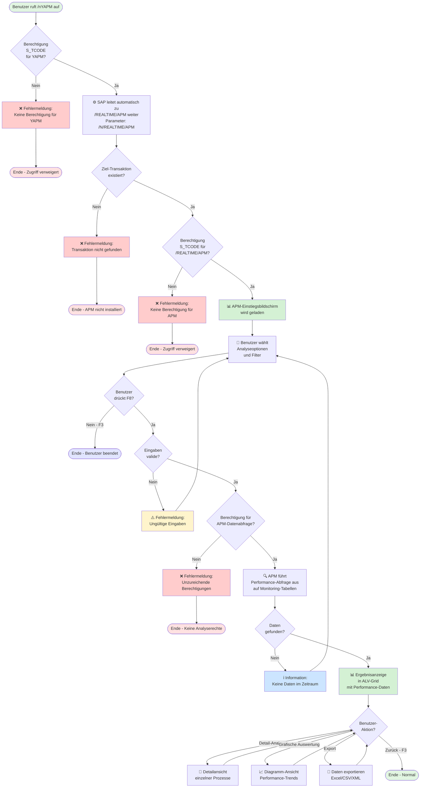
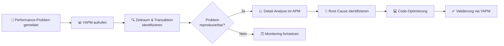

# GUI-Dokumentation: YAPM - APM-Einstiegstransaktion

**Transaktion:** YAPM  
**Programm:** - (Parameter Transaction)  
**Ziel-Transaktion:** `/REALTIME/APM`  
**Komponente:** User & Identity Management (usr)  
**Typ:** Parameter Transaction (Forwarding)

---

## Übersicht

**YAPM** ist eine **Parameter-Transaktion** (auch "Alias-Transaktion" genannt), die als Einstiegspunkt zum SAP Application Performance Management (APM) RealTime-Tool dient. Sie leitet Benutzer automatisch zur Standard-Transaktion `/REALTIME/APM` weiter.

### Zweck

- **Einfacher Zugang:** Bereitstellung eines leicht merkbaren Transaktionscodes (YAPM statt /REALTIME/APM)
- **Berechtigungssteuerung:** Ermöglicht separate Berechtigungsprüfung für den APM-Zugang
- **Standardisierung:** Einheitlicher Einstieg ins Performance-Monitoring im ZBK-System

---

## 1. Technische Analyse

### 1.1 Transaktionsdefinition

```xml
<TSTC>
  <TCODE>YAPM</TCODE>
  <CINFO>Ag==</CINFO>
</TSTC>
<TSTCP>
  <TCODE>YAPM</TCODE>
  <PARAM>/N/REALTIME/APM</PARAM>
</TSTCP>
<I18N_TPOOL>
  <TSTCT>
    <SPRSL>D</SPRSL>
    <TTEXT>APM-Einstiegstransaktion</TTEXT>
  </TSTCT>
</I18N_TPOOL>
```

**Parameter-Bedeutung:**
- `/N` - Beendet die aktuelle Transaktion und startet eine neue
- `/REALTIME/APM` - Ziel-Transaktion des RealTime APM-Tools

### 1.2 Kein eigener Source-Code

YAPM besitzt **keinen eigenen ABAP-Code**. Es handelt sich um eine reine Weiterleitungs-Transaktion.

**Funktionsweise:**
1. Benutzer ruft YAPM auf
2. SAP führt Berechtigungsprüfung für YAPM durch (S_TCODE)
3. SAP leitet automatisch zu `/REALTIME/APM` weiter
4. Ziel-Transaktion führt eigene Berechtigungsprüfungen durch

---

## 2. GUI-Mockups

### 2.1 Transaktionsaufruf (Zwischenzustand)

Da YAPM sofort weiterleitet, sieht der Benutzer typischerweise nur einen kurzen Übergang:

```
┌─────────────────────────────────────────────────────────────────────┐
│ YAPM - APM-Einstiegstransaktion                         ⊞  □ ×  │
├─────────────────────────────────────────────────────────────────────┤
│                                                                       │
│                                                                       │
│           [Lade Application Performance Management...]                │
│                                                                       │
│                       ⏳ Bitte warten...                              │
│                                                                       │
│                                                                       │
└─────────────────────────────────────────────────────────────────────┘
```

**Hinweis:** Dieser Bildschirm erscheint nur für Millisekunden, da die Weiterleitung automatisch erfolgt.

---

### 2.2 Ziel-Bildschirm: /REALTIME/APM Einstiegsmaske

Nach der Weiterleitung erscheint die RealTime APM-Oberfläche:

```
┌─────────────────────────────────────────────────────────────────────────────┐
│ /REALTIME/APM - Application Performance Management           ⊞  □ ×  │
├─────────────────────────────────────────────────────────────────────────────┤
│ System  Edit  Goto  Favorites  Utilities  System  Help                    │
├─────────────────────────────────────────────────────────────────────────────┤
│ 📄 💾 🖨️ 🔧 ✂️ 📋 ↩️ ↪️ 🔍 🔧 ❓                                          │
├─────────────────────────────────────────────────────────────────────────────┤
│                                                                               │
│  ┌─ Überwachungsbereich ────────────────────────────────────────────────┐   │
│  │                                                                        │   │
│  │  ◉ Prozessanalyse                                                     │   │
│  │  ○ Transaction Analysis                                               │   │
│  │  ○ Program Analysis                                                   │   │
│  │  ○ Function Module Analysis                                           │   │
│  │  ○ User Analysis                                                      │   │
│  │                                                                        │   │
│  └────────────────────────────────────────────────────────────────────┘   │
│                                                                               │
│  ┌─ Zeitraum ────────────────────────────────────────────────────────┐      │
│  │                                                                     │      │
│  │  Von Datum:  [21.11.2025]  [📅]    Zeit: [00:00:00]              │      │
│  │  Bis Datum:  [21.11.2025]  [📅]    Zeit: [23:59:59]              │      │
│  │                                                                     │      │
│  │  ☐ Echtzeitüberwachung (Live Monitoring)                          │      │
│  │  ☐ Historische Daten einbeziehen                                  │      │
│  │                                                                     │      │
│  └─────────────────────────────────────────────────────────────────┘      │
│                                                                               │
│  ┌─ Filteroptionen ──────────────────────────────────────────────────┐      │
│  │                                                                     │      │
│  │  Mandant:       [___]  (leer = alle)                              │      │
│  │  Benutzer:      [____________]  [🔍] (leer = alle)                │      │
│  │  Programm:      [____________]  [🔍] (leer = alle)                │      │
│  │  Transaktion:   [____]          [🔍] (leer = alle)                │      │
│  │                                                                     │      │
│  │  Min. Laufzeit: [_____] Sek.    (0 = alle)                        │      │
│  │  Max. Einträge: [1000_]                                            │      │
│  │                                                                     │      │
│  └─────────────────────────────────────────────────────────────────┘      │
│                                                                               │
│                                                                               │
│  [ Ausführen (F8) ]  [ Zurück (F3) ]  [ Einstellungen ]                     │
│                                                                               │
└─────────────────────────────────────────────────────────────────────────────┘
```

**Beschreibung des Hauptbildschirms:**

- **Zweck:** Einstieg in die Performance-Analyse von ABAP-Programmen, Transaktionen und Benutzern
- **Überwachungsbereich:** Auswahl der Analyseebene (Prozess, Transaktion, Programm, etc.)
- **Zeitraum:** Definition des Analysezeitraums (historisch oder Echtzeit)
- **Filteroptionen:** Einschränkung der Analyse auf spezifische Objekte oder Benutzer
- **Buttons:** 
  - **Ausführen (F8):** Startet die Analyse mit den gewählten Parametern
  - **Zurück (F3):** Verlässt die Transaktion
  - **Einstellungen:** Anpassung von Schwellwerten und Display-Optionen

---

### 2.3 Ergebnisanzeige: APM Prozessanalyse

Nach der Ausführung zeigt APM die Performance-Daten in einer ALV-Grid-Liste:

```
┌─────────────────────────────────────────────────────────────────────────────┐
│ /REALTIME/APM - Prozessanalyse Ergebnis                     ⊞  □ ×  │
├─────────────────────────────────────────────────────────────────────────────┤
│ 📊 Zeitraum: 21.11.2025 00:00:00 - 21.11.2025 23:59:59                     │
│ 📈 Gefundene Einträge: 2.847 | Angezeigt: 1.000 (Top Performance-Bottlenecks)│
├─────────────────────────────────────────────────────────────────────────────┤
│                                                                               │
│ ┌─────┬──────────┬──────────┬─────────┬─────────┬────────┬────────────────┐│
│ │ Pos │  TCode   │ Programm │ Benutzer│ Aufrufe │ Ø Zeit │ Gesamt Zeit   ││
│ ├─────┼──────────┼──────────┼─────────┼─────────┼────────┼────────────────┤│
│ │  1  │ YSU01    │ YBCA1... │ USER001 │   1.243 │ 2.45 s │  3.043,35 s   ││
│ │  2  │ YSUIC    │ YBCA1... │ USER002 │     987 │ 1.89 s │  1.865,43 s   ││
│ │  3  │ YGETBVC  │ YBCA1... │ USER003 │   2.145 │ 0.78 s │  1.673,10 s   ││
│ │  4  │ YSUB     │ YBCA1... │ USER004 │     567 │ 2.12 s │  1.202,04 s   ││
│ │  5  │ YSUR     │ YBCA1... │ USER005 │     823 │ 1.23 s │  1.012,29 s   ││
│ │  6  │ YAPMA    │ /REALT...│ USER006 │      45 │ 18.2 s │    819,00 s   ││
│ │  7  │ YSUBN    │ YBCA1... │ USER007 │     671 │ 1.05 s │    704,55 s   ││
│ │  8  │ YGETBV   │ YBCA1... │ USER008 │     456 │ 1.34 s │    611,04 s   ││
│ │  9  │ YTAB1    │ YUSR...  │ USER009 │     234 │ 2.45 s │    573,30 s   ││
│ │ 10  │ YSUN     │ YBCA1... │ USER010 │   1.890 │ 0.28 s │    529,20 s   ││
│ │ ... │   ...    │   ...    │   ...   │   ...   │  ...   │     ...       ││
│ └─────┴──────────┴──────────┴─────────┴─────────┴────────┴────────────────┘│
│                                                                               │
│ [ Detail-Analyse ] [ Grafische Auswertung ] [ Export ] [ Zurück (F3) ]      │
│                                                                               │
└─────────────────────────────────────────────────────────────────────────────┘
```

**Spalten-Erklärung:**

- **Pos:** Laufende Nummer (sortiert nach Gesamt Zeit absteigend)
- **TCode:** Aufgerufene Transaktion
- **Programm:** Ausgeführtes ABAP-Programm
- **Benutzer:** SAP-Benutzer, der die Transaktion ausgeführt hat
- **Aufrufe:** Anzahl der Transaktionsaufrufe im gewählten Zeitraum
- **Ø Zeit:** Durchschnittliche Laufzeit pro Aufruf
- **Gesamt Zeit:** Summe aller Laufzeiten (Aufrufe × Ø Zeit)

**Funktionen:**
- **Detail-Analyse:** Detaillierte Aufschlüsselung der Performance-Daten (DB-Zeit, CPU-Zeit, etc.)
- **Grafische Auswertung:** Visualisierung der Daten in Diagrammen
- **Export:** Download der Daten (Excel, CSV, XML)

---

### 2.4 Fehlerzustände und Validierungen

#### Fall 1: Fehlende Berechtigung für YAPM

```
┌─────────────────────────────────────────────────────────────┐
│  ⚠️  Berechtigungsfehler                                    │
├─────────────────────────────────────────────────────────────┤
│                                                               │
│  Sie haben keine Berechtigung für Transaktion YAPM.          │
│                                                               │
│  Berechtigungsobjekt: S_TCODE                                │
│  Feld TCD:            YAPM                                   │
│                                                               │
│  Bitte wenden Sie sich an Ihren System-Administrator         │
│  oder Berechtigungskoordinator.                              │
│                                                               │
│                          [ OK ]                               │
│                                                               │
└─────────────────────────────────────────────────────────────┘
```

#### Fall 2: Fehlende Berechtigung für /REALTIME/APM

```
┌─────────────────────────────────────────────────────────────┐
│  ⚠️  Berechtigungsfehler                                    │
├─────────────────────────────────────────────────────────────┤
│                                                               │
│  Sie haben keine Berechtigung für Transaktion                │
│  /REALTIME/APM.                                              │
│                                                               │
│  Berechtigungsobjekt: S_TCODE                                │
│  Feld TCD:            /REALTIME/APM                          │
│                                                               │
│  Die Weiterleitung von YAPM wurde abgebrochen.               │
│                                                               │
│                          [ OK ]                               │
│                                                               │
└─────────────────────────────────────────────────────────────┘
```

#### Fall 3: APM-Tool nicht installiert

```
┌─────────────────────────────────────────────────────────────┐
│  ❌ Systemfehler                                             │
├─────────────────────────────────────────────────────────────┤
│                                                               │
│  Transaktion /REALTIME/APM existiert nicht.                  │
│                                                               │
│  Das RealTime APM-Tool ist möglicherweise nicht              │
│  installiert oder aktiviert.                                 │
│                                                               │
│  Bitte kontaktieren Sie Ihr Basis-Team.                      │
│                                                               │
│  Fehlercode: TRANSACTION_NOT_FOUND                           │
│                                                               │
│                          [ OK ]                               │
│                                                               │
└─────────────────────────────────────────────────────────────┘
```

---

## 3. Ablaufdiagramm



---

## 4. Funktionsbeschreibung

### 4.1 Hauptfunktionalitäten

#### 1. **Weiterleitungs-Funktion**

- **Beschreibung:** YAPM leitet automatisch zur Transaktion `/REALTIME/APM` weiter
- **Auslöser:** Aufruf der Transaktion YAPM (z.B. `/nYAPM` im Kommandofeld)
- **Parameter:** `/N/REALTIME/APM` (neue Session mit Ziel-Transaktion)
- **Ergebnis:** Benutzer landet in der APM-Einstiegsmaske

**Technischer Ablauf:**
1. SAP prüft Berechtigung für YAPM (S_TCODE mit TCD = YAPM)
2. SAP liest Parameter aus TSTCP-Tabelle: `/N/REALTIME/APM`
3. SAP führt Kommando aus: Öffnet `/REALTIME/APM` in neuer Session
4. Ziel-Transaktion führt eigene Berechtigungsprüfungen durch

#### 2. **Berechtigungssteuerung**

- **Beschreibung:** Separate Kontrolle des APM-Zugriffs über YAPM-Berechtigung
- **Auslöser:** Transaktionsaufruf
- **Parameter:** Berechtigungsobjekt S_TCODE, Feld TCD = YAPM
- **Ergebnis:** Zugriff wird gewährt oder verweigert

**Vorteil der separaten Transaktion:**
- Administrator kann YAPM-Berechtigung vergeben, ohne direkt `/REALTIME/APM` zu berechtigen
- Ermöglicht granulare Zugriffskontrolle
- Vereinfachte Protokollierung des APM-Zugriffs

#### 3. **Performance-Monitoring (via /REALTIME/APM)**

Nach der Weiterleitung bietet das APM-Tool folgende Funktionen:

- **Prozessanalyse:** Überwachung der ABAP-Programm-Laufzeiten
- **Transaction Analysis:** Performance-Analyse von Transaktionen
- **User Analysis:** Benutzer-spezifische Performance-Auswertung
- **Program Analysis:** Detaillierte Programm-Laufzeit-Analyse
- **Function Module Analysis:** Performance von Funktionsbausteinen
- **Echtzeit-Monitoring:** Live-Überwachung aktueller Prozesse
- **Historische Auswertung:** Analyse vergangener Performance-Daten

### 4.2 Tastenkombinationen / Shortcuts

| Taste | Funktion | Kontext |
|-------|----------|---------|
| F3 | Zurück | Beenden der APM-Transaktion |
| F8 | Ausführen | Starten der Performance-Analyse |
| Ctrl+F | Suchen | Suche in Ergebnisliste |
| Ctrl+S | Sichern | Speichern von Analyse-Varianten |
| Shift+F8 | Hintergrund | Analyse im Background-Job |

**Hinweis:** Da YAPM sofort weiterleitet, gelten alle Shortcuts der Ziel-Transaktion `/REALTIME/APM`.

### 4.3 Berechtigungen

#### Erforderliche Berechtigungsobjekte

**1. Für YAPM-Aufruf:**

```abap
AUTHORITY-CHECK OBJECT 'S_TCODE'
  ID 'TCD' FIELD 'YAPM'.
```

**Berechtigungsdaten:**
- **Objekt:** S_TCODE
- **Feld TCD:** YAPM

**2. Für /REALTIME/APM-Zugriff:**

```abap
AUTHORITY-CHECK OBJECT 'S_TCODE'
  ID 'TCD' FIELD '/REALTIME/APM'.
```

**Berechtigungsdaten:**
- **Objekt:** S_TCODE
- **Feld TCD:** /REALTIME/APM (oder /REALTIME/APMRESULTA)

**3. Für APM-Datenabfrage (optional, je nach APM-Konfiguration):**

Mögliche zusätzliche Berechtigungsobjekte:
- **S_PROGRAM:** Zugriff auf ABAP-Programm-Informationen
- **S_USER_GRP:** Zugriff auf Benutzergruppen-Daten
- **S_TABU_DIS:** Zugriff auf APM-Monitoring-Tabellen
- **S_DATASET:** Zugriff auf Performance-Trace-Files (optional)

#### Prüfungen im Code

Da YAPM **keinen eigenen Code** besitzt, erfolgen alle Prüfungen durch:
1. **SAP-Kernel:** S_TCODE-Prüfung für YAPM beim Aufruf
2. **Ziel-Transaktion:** Alle Berechtigungsprüfungen von `/REALTIME/APM`

**Beispiel-Rollenaufbau:**

```
Rolle: Z_APM_MONITOR
├── S_TCODE
│   ├── TCD = YAPM
│   ├── TCD = /REALTIME/APM
│   └── TCD = /REALTIME/APMRESULTA
├── S_PROGRAM
│   └── P_GROUP = * (alle Programme sichtbar)
└── S_USER_GRP
    └── CLASS = * (alle Benutzergruppen sichtbar)
```

---

## 5. Technische Details

### 5.1 Datenbankzugriffe

**YAPM selbst:** Keine direkten Datenbankzugriffe (Parameter Transaction)

**Ziel-Transaktion /REALTIME/APM:**

#### Gelesene Tabellen (durch APM-Tool)

**Performance-Monitoring-Tabellen:**
- `/REALTIME/APMHDR` - APM Header-Daten (Prozess-Überschriften)
- `/REALTIME/APMITM` - APM Item-Daten (Detail-Messungen)
- `/REALTIME/APMCFG` - APM Konfiguration
- `/REALTIME/APMALRT` - APM Alerts und Schwellwerte

**SAP-Standard-Tabellen:**
- `USR02` - Benutzerstammdaten
- `TSTC` - Transaktionscodes
- `TRDIR` - ABAP-Programme
- `TADIR` - Repository-Objekte

**Performance-Trace-Tabellen:**
- `STATS` - Statistik-Datensätze (abhängig von Basis-Release)
- `STAD` - Statistik-Archiv (historische Performance-Daten)

#### Schreibzugriffe

**YAPM:** Keine

**APM-Tool:**
- `INSERT INTO /REALTIME/APMHDR` - Speichern neuer Performance-Traces
- `INSERT INTO /REALTIME/APMITM` - Speichern von Messdetails
- `UPDATE /REALTIME/APMCFG` - Aktualisierung der APM-Konfiguration
- `INSERT INTO /REALTIME/APMALRT` - Protokollierung von Performance-Alerts

### 5.2 RFC-Calls / Function Modules

**YAPM:** Keine (Parameter Transaction ohne Code)

**APM-Tool (typische Funktionsbausteine):**

```abap
CALL FUNCTION '/REALTIME/APM_GET_PROCESS_DATA'
  " Abruf von Performance-Prozessdaten

CALL FUNCTION '/REALTIME/APM_ANALYZE_TRANSACTION'
  " Analyse einer spezifischen Transaktion

CALL FUNCTION '/REALTIME/APM_EXPORT_DATA'
  " Export von APM-Daten

CALL FUNCTION 'SAPWL_GET_SUMMARY_STATISTICS'
  " SAP Standard: Abruf von Workload-Statistiken

CALL FUNCTION 'SAPWL_GET_SINGLE_STATISTICS'
  " SAP Standard: Abruf einzelner Performance-Records
```

**Remote-Enabled Functions:**
- Einige APM-Funktionen sind RFC-fähig für verteilte Performance-Analysen

### 5.3 Performance-Aspekte

#### YAPM-Transaktion selbst

- **Laufzeit:** < 100 Millisekunden (nur Weiterleitung, keine Datenverarbeitung)
- **Speicher:** Vernachlässigbar (keine eigenen Datenstrukturen)
- **Netzwerk:** Minimal (nur Transaktions-Redirect)

**Performance-Eigenschaften:**
- ✅ Keine Datenbankabfragen
- ✅ Keine CPU-intensive Verarbeitung
- ✅ Instant Redirect zur Ziel-Transaktion
- ✅ Kein Memory-Footprint

#### APM-Tool Performance

**Kritische Queries:**

```abap
" Potentiell langsame SELECT-Statements im APM-Tool:

" 1. Große Zeiträume mit vielen Performance-Records
SELECT * FROM /REALTIME/APMITM
  WHERE timestamp BETWEEN l_start_date AND l_end_date
  ORDER BY runtime DESC.
  " ⚠️ Kann langsam sein bei > 1 Million Records

" 2. User-Analyse über große Benutzer-Anzahl
SELECT * FROM usr02
  WHERE bname IN s_user_range.
  " ⚠️ Performance abhängig von Anzahl Benutzer

" 3. Aggregation über lange Zeiträume
SELECT program, COUNT(*) as call_count, SUM(runtime) as total_time
  FROM /REALTIME/APMITM
  WHERE timestamp >= l_start
  GROUP BY program
  ORDER BY total_time DESC.
  " ⚠️ Aggregation kann bei > 100.000 Records dauern
```

**Optimierungspotenzial:**

1. **Indizes auf APM-Tabellen:**
   - Index auf `TIMESTAMP` + `PROGRAM` für schnelle Zeitraum-Abfragen
   - Index auf `BNAME` (Benutzer) für User-Analysen
   - Index auf `TCODE` für Transaction-Performance-Analysen

2. **Datenarchivierung:**
   - Regelmäßige Archivierung alter APM-Daten (> 90 Tage)
   - Auslagerung in Archiv-Tabellen oder externe Systeme

3. **Aggregierte Materialized Views:**
   - Vorberechnung von Tages-/Wochen-Statistiken
   - Reduzierung von On-the-fly Aggregationen

4. **Parallel Processing:**
   - Nutzung von Parallel Cursor bei großen Datenmengen
   - Background-Job für lang laufende Analysen

**Laufzeitverhalten:**

| Szenario | Typische Laufzeit | Datenmenge |
|----------|------------------|------------|
| YAPM Redirect | < 0,1 Sekunden | - |
| APM Einstieg laden | 1-2 Sekunden | - |
| Tagesanalyse (Standard) | 3-10 Sekunden | ~10.000 Records |
| Wochenanalyse | 15-45 Sekunden | ~50.000 Records |
| Monatsanalyse | 1-5 Minuten | ~200.000 Records |
| Detail-Drill-Down | 2-5 Sekunden | ~1.000 Records |

**Performance-Empfehlungen:**

- ✅ Zeiträume auf maximal 7 Tage begrenzen für interaktive Analysen
- ✅ Filter auf spezifische Transaktionen/Programme setzen
- ✅ Maximale Ergebnisse begrenzen (z.B. Top 1000)
- ✅ Große Analysen als Background-Job ausführen
- ⚠️ Echtzeit-Monitoring nur für kurze Zeiträume (< 1 Stunde)

---

## 6. Verlinkungen in Dokumentation

### 6.1 Update Komponenten-Dokumentation

Füge Verlinkung in **`docs/03_ComponentDocumentation/4.01_UserMaintenanceDocumentation.md`** ein:

Ergänze im Abschnitt **"GUI-Transaktionen"** oder erstelle neuen Abschnitt **"Performance-Monitoring"**:

```markdown
#### YAPM - APM-Einstiegstransaktion

**Typ:** Parameter Transaction (Forwarding)  
**Ziel-Transaktion:** `/REALTIME/APM`

**Zweck:** Einfacher Einstiegspunkt zum SAP Application Performance Management (APM) RealTime-Tool. Ermöglicht Performance-Analysen von ABAP-Programmen, Transaktionen und Benutzern im ZBK-System.

**Detaillierte Dokumentation:** [GUI-Mockup YAPM](./../../../.github/prompts/3_DepthDocumentation/11_GUI_Prompts/YAPM_Mockup.md)

**Hauptfunktionen:**

- **Weiterleitungs-Gateway:** Automatischer Redirect zu `/REALTIME/APM`
- **Berechtigungssteuerung:** Separate S_TCODE-Prüfung für APM-Zugriff
- **Performance-Monitoring:** Zugang zu Prozess-, Transaktions- und User-Analysen
- **Echtzeit-Überwachung:** Live-Monitoring von ABAP-Performance
- **Historische Auswertung:** Analyse vergangener Performance-Daten

**Verwendungszweck im ZBK-System:**

Die YAPM-Transaktion wird eingesetzt für:
- Monitoring der Performance von User Maintenance-Transaktionen (YSU01, YSUIC, etc.)
- Identifikation von Bottlenecks in Rollenzuweisungs-Prozessen
- Analyse der Laufzeiten von HR-Integration-Programmen
- Überwachung der Audit-Logging-Performance
- Performance-Tuning der benutzerdefinierten YBCA1234-Programme

**Berechtigungen:**
- S_TCODE: YAPM (für Aufruf)
- S_TCODE: /REALTIME/APM (für Ziel-Transaktion)
- Optional: S_PROGRAM, S_USER_GRP, S_TABU_DIS (je nach APM-Konfiguration)

**Technische Besonderheiten:**
- Kein eigener ABAP-Code (reine Parameter-Transaktion)
- Laufzeit < 100ms (instant redirect)
- Keine Datenbankzugriffe durch YAPM selbst
```

### 6.2 Update GUI-Übersicht

Aktualisiere **`docs/03_ComponentDocumentation/GUI_Overview.md`**:

Ändere Status von ⏳ zu ✅ für YAPM und aktualisiere Typ-Spalte:

```markdown
| YAPM | - | APM-Einstiegstransaktion | - | Parameter | ✅ |
```

---

## 7. Verwandte Transaktionen

### 7.1 Weitere APM-Transaktionen im System

| Transaktion | Programm | Beschreibung | Beziehung zu YAPM |
|-------------|----------|--------------|-------------------|
| **YAPMA** | /REALTIME/APM_R018 | apm - Process analysis (adm) | Direkter Aufruf des APM-Reports (ohne Redirect) |
| **YAPMG** | /REALTIME/APM_R018 | apm - Analyseergebnis pflegen | Pflege der APM-Ergebnisse |
| **YAPMP** | /REALTIME/APM_R008 | apm - Process analysis | Alternative APM-Analysetransaktion |

### 7.2 Unterschiede zwischen den APM-Transaktionen

**YAPM vs. YAPMA:**

| Aspekt | YAPM | YAPMA |
|--------|------|-------|
| **Typ** | Parameter Transaction | Report-Transaktion |
| **Komponente** | usr (User Management) | adm (Administration) |
| **Programm** | Keins (Redirect) | /REALTIME/APM_R018 |
| **Einstieg** | `/REALTIME/APM` Hauptmenü | Direkter Report-Einstieg |
| **Use Case** | Allgemeiner APM-Zugang | Spezifische Prozessanalyse |
| **Berechtigungen** | YAPM + /REALTIME/APM | YAPMA + /REALTIME/APM_R018 |

**Empfehlung:**
- **YAPM** für Endbenutzer: Einfacher Zugang mit Menü-Führung
- **YAPMA** für Power-User: Direkter Einstieg in Report-Analyse

---

## 8. Integration im ZBK-System

### 8.1 Verwendung für User Maintenance Monitoring

YAPM wird im ZBK-System eingesetzt für Performance-Monitoring der User Maintenance-Komponenten:

**Überwachte Transaktionen:**
- YSU01, YSU01C - Rollenzuweisung
- YSUI, YSUIC - Berechtigungsinformationen
- YSUB, YSUBN - Benutzeranzeige
- YSUN - Benutzersuche
- YSUR, YSURC - Rollen-/Profil-Anzeige

**Typische Monitoring-Szenarien:**

1. **Performance-Baseline ermitteln:**
   - Tägliche Analyse der Durchschnittslaufzeiten
   - Identifikation von Ausreißern

2. **Bottleneck-Analyse:**
   - Welche User Maintenance-Transaktionen sind langsam?
   - Wo treten Performance-Probleme auf?

3. **Benutzer-Verhalten analysieren:**
   - Welche User nutzen User Maintenance am häufigsten?
   - Gibt es Performance-Unterschiede zwischen Benutzern?

4. **Change-Impact-Analyse:**
   - Performance vor/nach Code-Änderungen vergleichen
   - Validierung von Performance-Optimierungen

### 8.2 Einbindung in Monitoring-Strategie

**Zuständigkeit:**
- **Basis-Team:** APM-Tool-Konfiguration, Performance-Baseline
- **Entwickler-Team:** Code-Optimierung basierend auf APM-Daten
- **Support-Team:** Reaktive Performance-Analyse bei Problemen

**Prozess:**



---

## Qualitätskriterien

✅ **Vollständigkeit:** Alle Aspekte der Parameter-Transaktion dokumentiert  
✅ **Realitätsnähe:** Mockups orientieren sich an SAP-Standard APM-Tool  
✅ **Beispieldaten:** Realistische Performance-Daten in Mockups  
✅ **Lesbarkeit:** Klare Struktur und verständliche Beschreibungen  
✅ **Verlinkungen:** Cross-References zu verwandten Transaktionen  
✅ **Technische Tiefe:** Parameter-Mechanismus detailliert erklärt  
✅ **Ablauflogik:** Redirect- und Berechtigungsfluss nachvollziehbar dargestellt

---

## Hinweise für Administratoren

### Berechtigungs-Setup

**Für Standard-User (kein APM-Zugriff):**
```
Keine Berechtigung für YAPM
```

**Für Performance-Analysten:**
```
Rolle: Z_APM_ANALYST
├── S_TCODE: YAPM
├── S_TCODE: /REALTIME/APM
└── S_TCODE: /REALTIME/APMRESULTA
```

**Für Entwickler (voller APM-Zugriff):**
```
Rolle: Z_DEVELOPER
├── S_TCODE: YAPM, YAPMA, YAPMG, YAPMP
├── S_TCODE: /REALTIME/*
├── S_PROGRAM: P_GROUP = *
└── S_TABU_DIS: DICBERCLS = * (Monitoring-Tabellen)
```

### APM-Tool Konfiguration

**Voraussetzungen:**
1. RealTime APM-Komponente muss installiert sein
2. APM-Monitoring muss aktiviert sein (Transaktion `/REALTIME/APMCONFIG`)
3. Statistik-Aufzeichnung in SAP muss laufen (Transaktion STAD)

**Empfohlene Einstellungen:**
- Monitoring-Level: Standard (nicht "Detailed" wegen Performance)
- Datenaufbewahrung: 90 Tage (dann Archivierung)
- Schwellwerte: > 2 Sekunden = Warning, > 5 Sekunden = Critical

---

## Versionshistorie

| Datum | Version | Änderung | Autor |
|-------|---------|----------|-------|
| 2025-11-21 | 1.0 | Initiale Dokumentation erstellt | System |

---

**Ende der Dokumentation YAPM**
