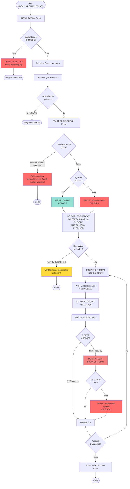
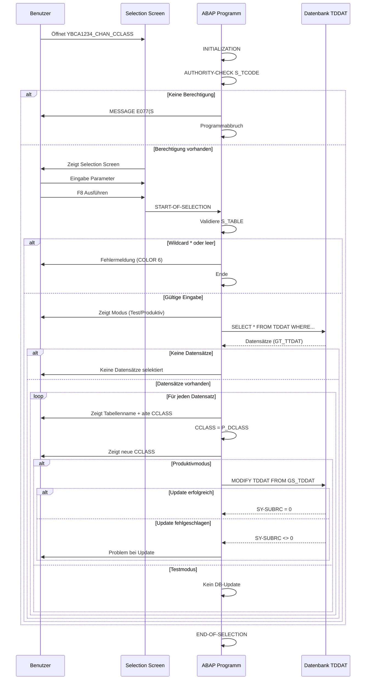
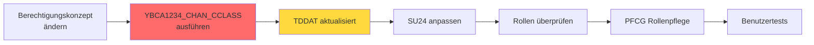

# GUI-Dokumentation: YBCA1234_CHAN_CCLASS

**Transaktion:** YBCA1234_CHAN_CCLASS  
**Programm:** YBCA1234_CHANGE_CCLASS  
**Komponente:** Integration Hub / Role Management (upd)  
**Typ:** Report (Selection Screen)  
**Status:** ✅ Vollständig dokumentiert

---

## Überblick

Die Transaktion **YBCA1234_CHAN_CCLASS** ermöglicht die direkte Änderung von Tabellenberechtigungsgruppen in der SAP-Systemtabelle `TDDAT`. Das Programm erlaubt die Massenänderung von Berechtigungsgruppen für ausgewählte Tabellen durch direkte Modifikation der Datenbank.

### Geschäftlicher Zweck

- **Massenänderung** von Tabellenberechtigungsgruppen ohne manuelle Einzelpflege
- **Migration** von Berechtigungskonzepten (z.B. Umstellung von alten auf neue Berechtigungsgruppen)
- **Konsolidierung** von Berechtigungsgruppen im Rahmen von Reorganisationsprojekten
- **Testmodus** zur Simulation von Änderungen vor produktivem Einsatz

### Sicherheitskontext

⚠️ **ACHTUNG**: Dieses Programm führt direkte Datenbankänderungen durch und umgeht die Standard-SAP-Berechtigungsprüfungen für Tabellenpflege. Die Verwendung erfordert:
- Berechtigung für Transaktion (S_TCODE mit TCD = YBCA1234_CHAN_CCLASS)
- Enge Abstimmung mit der Berechtigungsadministration (PAG/FAP6)
- Sorgfältige Planung und Testing vor produktivem Einsatz

---

## 1. Hauptbildschirm (Selection Screen)

### 1.1 Selection Screen Mockup

```
┌─────────────────────────────────────────────────────────────────────────────┐
│ YBCA1234_CHAN_CCLASS - Änderung der Tabellenberechtigungsgruppe in TDDAT  ☐ □ × │
├─────────────────────────────────────────────────────────────────────────────┤
│ System  Edit  Goto  Utilities  Environment  System  Help                    │
├─────────────────────────────────────────────────────────────────────────────┤
│ 📄 💾 🖨️ 🔧 ✂️ 📋 ↩️ ↪️ 🔍 🔧 ❓                                          │
├─────────────────────────────────────────────────────────────────────────────┤
│                                                                               │
│  ┌──────────────────────────────────────────────────────────────────────┐   │
│  │ Ausführungsoptionen                                                   │   │
│  ├──────────────────────────────────────────────────────────────────────┤   │
│  │                                                                        │   │
│  │  ☑ Testlauf                                              [P_TEST]    │   │
│  │                                                                        │   │
│  └──────────────────────────────────────────────────────────────────────┘   │
│                                                                               │
│  ┌──────────────────────────────────────────────────────────────────────┐   │
│  │ Tabellenauswahl                                                       │   │
│  ├──────────────────────────────────────────────────────────────────────┤   │
│  │                                                                        │   │
│  │  Tabellenname                                            [S_TABLE]    │   │
│  │    [YBCA1234_*        ] bis [YBCA1234_*        ]          🔍         │   │
│  │                                                                        │   │
│  └──────────────────────────────────────────────────────────────────────┘   │
│                                                                               │
│  ┌──────────────────────────────────────────────────────────────────────┐   │
│  │ Berechtigungsgruppen                                                  │   │
│  ├──────────────────────────────────────────────────────────────────────┤   │
│  │                                                                        │   │
│  │  Berechtigungsgruppe (Quelle)     [&&&&      ]          [P_SCLASS]   │   │
│  │                                                                        │   │
│  │  Berechtigungsgruppe (Ziel)       [&NAP      ]          [P_DCLASS]   │   │
│  │                                                                        │   │
│  └──────────────────────────────────────────────────────────────────────┘   │
│                                                                               │
│                                                                               │
│  [F8] Ausführen   [F3] Zurück   [F12] Abbrechen                             │
│                                                                               │
└─────────────────────────────────────────────────────────────────────────────┘
```

### 1.2 Felderbeschreibung

#### Ausführungsoptionen

| Feld | Technischer Name | Typ | Obligatorisch | Beschreibung |
|------|------------------|-----|---------------|--------------|
| **Testlauf** | `P_TEST` | Checkbox | Nein (Default: X) | Wenn aktiviert: Keine Datenbankänderungen, nur Simulation und Anzeige der betroffenen Datensätze |

#### Tabellenauswahl

| Feld | Technischer Name | Typ | Obligatorisch | Beschreibung |
|------|------------------|-----|---------------|--------------|
| **Tabellenname** | `S_TABLE` | SELECT-OPTIONS | Ja | Auswahl der zu ändernden Tabellen. Unterstützt Einzelwerte, Bereiche und Wildcards (*). **WICHTIG:** Wildcard '*' alleine ist nicht erlaubt! |

**Eingabeoptionen:**
- Einzelwert: `YBCA1234_BK_REF`
- Bereich: `YBCA1234_*` bis `YBCA1234_Z*`
- Multiple Selection: 🔍 Button öffnet Mehrfachselektion
- Ausschlüsse möglich (EX-Option)

**Validierung:**
```
✗ S_TABLE-LOW  = '*'  → FEHLER
✗ S_TABLE-HIGH = '*'  → FEHLER
✗ S_TABLE leer        → FEHLER
✓ S_TABLE = 'YBCA1234_BK_REF' → OK
```

#### Berechtigungsgruppen

| Feld | Technischer Name | Typ | Obligatorisch | Beschreibung |
|------|------------------|-----|---------------|--------------|
| **Berechtigungsgruppe (Quelle)** | `P_SCLASS` | Parameter | Nein | Die aktuelle Berechtigungsgruppe, die geändert werden soll (TDDAT-CCLASS) |
| **Berechtigungsgruppe (Ziel)** | `P_DCLASS` | Parameter | Ja | Die neue Berechtigungsgruppe, die zugewiesen werden soll |

**Hinweise zu Berechtigungsgruppen:**
- Format: 4-stellig, z.B. `&&&&`, `&NAP`, `&BCA`
- Quelle-Feld kann leer bleiben (dann alle Tabellen der Selektion)
- Ziel-Feld ist Pflichtfeld

### 1.3 Testmodus vs. Produktivmodus

#### Testmodus (P_TEST = 'X')

```
┌─────────────────────────────────────────────────────────────────────┐
│ Testlauf!                                                            │
│                                                                       │
│ YBCA1234_BK_REF         &&&&           &NAP                          │
│ YBCA1234_ROLEREF        &&&&           &NAP                          │
│ YBCA1234_BK_CUST        &&&&           &NAP                          │
│                                                                       │
│ → Keine Datenbankänderungen                                          │
└─────────────────────────────────────────────────────────────────────┘
```

**Ausgabe im Testmodus:**
- Überschrift: "Testlauf!" (gelb/orange, COLOR 3 INTENSIFIED ON)
- Dreispaltige Liste: Tabellenname | Alte Gruppe | Neue Gruppe
- Kein tatsächliches DB-Update

#### Produktivmodus (P_TEST = ' ')

```
┌─────────────────────────────────────────────────────────────────────┐
│ Datenänderung!                                                       │
│                                                                       │
│ YBCA1234_BK_REF         &&&&           &NAP                          │
│ YBCA1234_ROLEREF        &&&&           &NAP                          │
│ YBCA1234_BK_CUST        &&&&           &NAP                          │
│                                                                       │
│ → Datenbankänderungen durchgeführt                                   │
└─────────────────────────────────────────────────────────────────────┘
```

**Ausgabe im Produktivmodus:**
- Überschrift: "Datenänderung!" (rot, COLOR 6 INTENSIFIED ON)
- Dreispaltige Liste: Tabellenname | Alte Gruppe | Neue Gruppe
- MODIFY TDDAT wird ausgeführt

---

## 2. Fehlerzustände und Validierungen

### 2.1 Berechtigungsprüfung

**Zeitpunkt:** INITIALIZATION (vor Bildschirmanzeige)

**Prüfung:**
```abap
AUTHORITY-CHECK OBJECT 'S_TCODE'
                ID 'TCD' FIELD SY-TCODE.
```

**Fehlermeldung bei fehlender Berechtigung:**
```
┌─────────────────────────────────────────────────────────────────────┐
│ ⚠️ Fehler                                                            │
│                                                                       │
│ Message-ID: S#                                                        │
│ Message-Nr: 077                                                       │
│ Typ: E (Error)                                                        │
│                                                                       │
│ Sie sind nicht berechtigt, diese Transaktion auszuführen.            │
│                                                                       │
│ [Enter] OK                                                            │
└─────────────────────────────────────────────────────────────────────┘
```

**Folge:** Programm bricht ab (MESSAGE E077(S#))

### 2.2 Validierung Tabellenauswahl

**Zeitpunkt:** START-OF-SELECTION

**Fehlerbedingungen:**
1. `S_TABLE-LOW = '*'` 
2. `S_TABLE-HIGH = '*'`
3. `S_TABLE IS INITIAL`

**Fehlermeldung:**
```
┌─────────────────────────────────────────────────────────────────────┐
│                                                                       │
│ Mindestens eine Tabelle explizit angeben!                            │
│                                                                       │
└─────────────────────────────────────────────────────────────────────┘
```

**Ausgabeformat:** Rot intensiv (COLOR 6 INTENSIFIED ON)  
**Folge:** Programmabbruch ohne weitere Verarbeitung

### 2.3 Keine Datensätze gefunden

**Bedingung:** SELECT auf TDDAT liefert keine Treffer

**Meldung:**
```
┌─────────────────────────────────────────────────────────────────────┐
│ Testlauf!                                                            │
│                                                                       │
│ Keine Datensätze selektiert!                                         │
│                                                                       │
└─────────────────────────────────────────────────────────────────────┘
```

**Ursachen:**
- Kombination aus S_TABLE und P_SCLASS findet keine Übereinstimmung
- Tabellen existieren nicht in TDDAT
- Quell-Berechtigungsgruppe stimmt nicht überein

### 2.4 Update-Fehler

**Bedingung:** MODIFY TDDAT schlägt fehl (SY-SUBRC <> 0)

**Fehlermeldung:**
```
┌─────────────────────────────────────────────────────────────────────┐
│ Datenänderung!                                                       │
│                                                                       │
│ YBCA1234_PROBLEM_TAB    &&&&           &NAP                          │
│ Problem bei Update: SY-SUBRC 4                                       │
│                                                                       │
└─────────────────────────────────────────────────────────────────────┘
```

**Mögliche Ursachen:**
- Lock durch anderen Benutzer
- Fehlende Datenbankberechtigung
- Inkonsistente Daten in TDDAT

---

## 3. Ablaufdiagramm

### 3.1 Hauptprogrammfluss



### 3.2 Detailablauf der Datenänderung



---

## 4. Funktionsbeschreibung

### 4.1 Hauptfunktionalitäten

#### 4.1.1 Berechtigungsprüfung

**Beschreibung:** Prüft, ob der Benutzer berechtigt ist, die Transaktion auszuführen.

**Auslöser:** INITIALIZATION Event (vor Bildschirmanzeige)

**Parameter:**
- Berechtigungsobjekt: `S_TCODE`
- Feld TCD: `SY-TCODE` (= 'YBCA1234_CHAN_CCLASS')

**Ergebnis:**
- Bei Erfolg (SY-SUBRC = 0): Programm läuft weiter
- Bei Fehler (SY-SUBRC <> 0): MESSAGE E077(S#), Programmabbruch

**Code:**
```abap
AUTHORITY-CHECK OBJECT 'S_TCODE'
                ID     'TCD'     FIELD SY-TCODE.

IF SY-SUBRC <> 0.
  MESSAGE E077(S#).
ENDIF.
```

#### 4.1.2 Eingabevalidierung

**Beschreibung:** Validiert die Benutzereingaben auf dem Selection Screen.

**Auslöser:** START-OF-SELECTION Event (nach F8-Ausführung)

**Validierungsregeln:**
1. S_TABLE-LOW darf nicht '*' sein
2. S_TABLE-HIGH darf nicht '*' sein
3. S_TABLE darf nicht leer sein

**Ergebnis:**
- Bei ungültiger Eingabe: Fehlermeldung in rot, Programmabbruch
- Bei gültiger Eingabe: Weiter mit Datenverarbeitung

**Code:**
```abap
IF S_TABLE-LOW = '*'  OR
   S_TABLE-HIGH = '*' OR
   S_TABLE IS INITIAL.

  WRITE: 'Mindestens eine Tabelle explizit angeben!'
         COLOR 6 INTENSIFIED ON.
ELSE
  " Weiter mit Verarbeitung
ENDIF.
```

#### 4.1.3 Datenselektion

**Beschreibung:** Liest alle Tabellen aus TDDAT, die den Selektionskriterien entsprechen.

**Auslöser:** Nach erfolgreicher Validierung

**Parameter:**
- `S_TABLE`: Tabellenname-Selektion (Range)
- `P_SCLASS`: Quell-Berechtigungsgruppe (optional)

**SQL-Statement:**
```abap
SELECT *
  INTO TABLE GT_TTDAT
  FROM TDDAT
  WHERE TABNAME IN S_TABLE
    AND CCLASS = P_SCLASS.
```

**Ergebnis:**
- Interne Tabelle `GT_TTDAT` (Type TT_TDDAT) gefüllt mit Datensätzen
- SY-SUBRC = 0: Datensätze gefunden
- SY-SUBRC <> 0: Keine Datensätze gefunden

#### 4.1.4 Testlauf-Simulation

**Beschreibung:** Simuliert die Änderung ohne tatsächliche Datenbankmodifikation.

**Auslöser:** P_TEST = 'X'

**Ablauf:**
1. Überschrift "Testlauf!" in gelb ausgeben
2. Für jeden selektierten Datensatz:
   - Tabellenname ausgeben
   - Alte CCLASS ausgeben
   - Neue CCLASS (P_DCLASS) ausgeben
3. **KEIN** MODIFY TDDAT Statement

**Ausgabeformat:**
```
Testlauf!

YBCA1234_BK_REF         &&&&           &NAP
YBCA1234_ROLEREF        &&&&           &NAP
```

**Zweck:** Risikominimierung durch Vorab-Prüfung der betroffenen Tabellen

#### 4.1.5 Produktive Datenänderung

**Beschreibung:** Führt die tatsächliche Änderung der Berechtigungsgruppen in der Datenbank durch.

**Auslöser:** P_TEST = ' ' (Space/nicht aktiviert)

**Ablauf:**
1. Überschrift "Datenänderung!" in rot ausgeben
2. Für jeden selektierten Datensatz:
   - Tabellenname und alte CCLASS ausgeben
   - CCLASS im Datensatz ändern: `GS_TDDAT-CCLASS = P_DCLASS`
   - Neue CCLASS ausgeben
   - **MODIFY TDDAT** ausführen
   - Bei Fehler: Fehlermeldung mit SY-SUBRC ausgeben

**Code:**
```abap
IF P_TEST = SPACE.

  MODIFY TDDAT FROM GS_TDDAT.

  IF SY-SUBRC <> 0.
    WRITE: 'Problem bei Update: SY-SUBRC', SY-SUBRC.
  ENDIF.

ENDIF.
```

**Ausgabeformat:**
```
Datenänderung!

YBCA1234_BK_REF         &&&&           &NAP
YBCA1234_ROLEREF        &&&&           &NAP
```

**Risiko:** ⚠️ Direkte Datenbankänderung, umgeht SAP-Standard-Berechtigungsprüfungen!

### 4.2 Tastenkombinationen / Shortcuts

| Taste | Funktion | Beschreibung |
|-------|----------|--------------|
| **F3** | Zurück | Verlässt Transaktion ohne Ausführung |
| **F8** | Ausführen | Startet Programmausführung (START-OF-SELECTION) |
| **F12** | Abbrechen | Verlässt Transaktion ohne Ausführung |
| **Ctrl+S** | Sichern | Nicht verfügbar (Report hat keine Speicherfunktion) |
| **Ctrl+F** | Suchen | Nicht verfügbar im Selection Screen |

**Hinweis:** Standard SAP GUI Funktionen (Drucken, Sichern als lokale Datei, etc.) stehen über Menüleiste zur Verfügung.

### 4.3 Berechtigungen

#### Erforderliche Berechtigungsobjekte

| Berechtigungsobjekt | Feld | Wert | Beschreibung |
|---------------------|------|------|--------------|
| **S_TCODE** | TCD | YBCA1234_CHAN_CCLASS | Berechtigung zur Ausführung der Transaktion |

**Prüfungen im Code:**

```abap
* Zeile 95-99 in ybca1234_change_cclass.prog.abap
AUTHORITY-CHECK OBJECT 'S_TCODE'
                ID     'TCD'     FIELD SY-TCODE.

IF SY-SUBRC <> 0.
  MESSAGE E077(S#).
ENDIF.
```

#### Zusätzliche implizite Berechtigungen

Obwohl im Code nicht explizit geprüft, sind folgende Berechtigungen implizit erforderlich:

| Berechtigungsobjekt | Beschreibung |
|---------------------|--------------|
| **S_TABU_DIS** | Berechtigung für Tabellenanzeige (Display) |
| **S_TABU_NAM** | Berechtigung für Tabellenpflege nach Tabellenname |
| **S_PROGRAM** | Berechtigung zur Ausführung von Reports |

**Empfohlene Berechtigungsstrategie:**
- Restriktive Vergabe nur an Berechtigungsadministratoren
- Verwendung in Produktivsystemen nur nach Abstimmung mit PAG/FAP6
- Protokollierung aller Änderungen durch Change Documents
- Vierfach-Augen-Prinzip bei produktiven Änderungen

---

## 5. Technische Details

### 5.1 Datenbankzugriffe

#### Gelesene Tabellen

| Tabelle | Zugriff | Zweck | Code-Zeile |
|---------|---------|-------|------------|
| **TDDAT** | SELECT | Lesen aller Tabellen mit zugehörigen Berechtigungsgruppen | 115-119 |

**SELECT-Statement:**
```abap
SELECT *
  INTO TABLE GT_TTDAT
  FROM TDDAT
  WHERE TABNAME IN S_TABLE
    AND CCLASS = P_SCLASS.
```

**Performance-Hinweise:**
- SELECT * ist nicht optimal, aber akzeptabel bei kleinen Datenmengen
- WHERE-Clause verwendet Index auf TABNAME (Primary Key)
- Filter auf CCLASS reduziert Result Set

#### Schreibzugriffe

| Tabelle | Operation | Zweck | Code-Zeile |
|---------|-----------|-------|------------|
| **TDDAT** | MODIFY | Direkte Änderung der Berechtigungsgruppe | 132 |

**MODIFY-Statement:**
```abap
MODIFY TDDAT FROM GS_TDDAT.
```

**Besonderheiten:**
- Direkte Tabellenänderung ohne Transaction Service
- Kein COMMIT WORK explizit (automatisch am Programmende)
- Umgeht SAP Table Maintenance Framework
- Keine Protokollierung über Change Documents

**Datenbankstruktur TDDAT:**
```abap
TDDAT (SAP-Standardtabelle)
├── TABNAME (CHAR 30) - Tabellenname [Key]
├── CCLASS  (CHAR 4)  - Berechtigungsgruppe
└── ... (weitere Felder)
```

### 5.2 RFC-Calls / Function Modules

**Verwendet:** KEINE

Dieses Programm führt keine RFC-Calls oder Function Module Aufrufe durch.

### 5.3 Performance-Aspekte

#### Kritische Queries

1. **SELECT auf TDDAT:**
   ```abap
   SELECT * FROM TDDAT
     WHERE TABNAME IN S_TABLE
       AND CCLASS = P_SCLASS.
   ```
   
   **Analyse:**
   - Index-Nutzung: ✅ Primary Key auf TABNAME
   - SELECT *: ⚠️ Holt alle Felder (aber TDDAT hat nur wenige Felder)
   - Result Set: Abhängig von S_TABLE Selektion
   
   **Optimierungspotenzial:**
   ```abap
   " Optimiert: Nur benötigte Felder selektieren
   SELECT TABNAME CCLASS
     INTO TABLE GT_TTDAT
     FROM TDDAT
     WHERE TABNAME IN S_TABLE
       AND CCLASS = P_SCLASS.
   ```

2. **MODIFY in Loop:**
   ```abap
   LOOP AT GT_TTDAT INTO GS_TDDAT.
     " ... Ausgabe ...
     MODIFY TDDAT FROM GS_TDDAT.
   ENDLOOP.
   ```
   
   **Analyse:**
   - Einzelne MODIFY-Statements in Loop: ⚠️ Nicht optimal
   - Keine Commit Work Control: ❌ Auto-Commit am Ende
   
   **Optimierungspotenzial:**
   ```abap
   " Optimiert: Bulk-Update
   LOOP AT GT_TTDAT INTO GS_TDDAT.
     GS_TDDAT-CCLASS = P_DCLASS.
     MODIFY GT_TTDAT FROM GS_TDDAT.
   ENDLOOP.
   
   IF P_TEST = SPACE.
     MODIFY TDDAT FROM TABLE GT_TTDAT.
   ENDIF.
   ```

#### Laufzeitverhalten

**Typische Ausführungszeiten (geschätzt):**

| Anzahl Tabellen | Testmodus | Produktivmodus |
|-----------------|-----------|----------------|
| 1-10 | < 1 Sekunde | < 2 Sekunden |
| 11-50 | 1-2 Sekunden | 2-5 Sekunden |
| 51-100 | 2-5 Sekunden | 5-10 Sekunden |
| > 100 | > 5 Sekunden | > 10 Sekunden |

**Faktoren:**
- Datenbankgröße der TDDAT
- Anzahl selektierter Tabellen
- Systemlast
- Netzwerk-Latenz bei Remote-DB

#### Memory-Footprint

**Speicherbedarf:**
```
Interne Tabelle GT_TTDAT:
- Structure Size: ca. 50 Bytes (TDDAT)
- 100 Einträge ≈ 5 KB
- 1000 Einträge ≈ 50 KB
```

**Bewertung:** ✅ Sehr geringer Speicherbedarf, keine Memory-Probleme zu erwarten

#### Optimierungsempfehlungen

1. **Query-Optimierung:**
   - SELECT nur benötigte Felder statt SELECT *
   - Prüfen, ob CCLASS-Filter notwendig ist
   
2. **Bulk-Operations:**
   - MODIFY TABLE statt einzelne MODIFY in Loop
   
3. **Logging:**
   - Change Document Integration hinzufügen
   - Application Log (BAL) für Audit Trail
   
4. **Error Handling:**
   - Detailliertere Fehlerbehandlung
   - Rollback-Mechanismus bei Teilfehlern
   
5. **Progress Indicator:**
   - Bei großen Datenmengen Fortschrittsanzeige einbauen
   ```abap
   CALL FUNCTION 'SAPGUI_PROGRESS_INDICATOR'
     EXPORTING
       PERCENTAGE = 50
       TEXT       = 'Verarbeite Tabellen...'.
   ```

---

## 6. Anwendungsbeispiele

### 6.1 Beispiel 1: Einzelne Tabelle ändern (Testlauf)

**Szenario:** Änderung der Berechtigungsgruppe für eine spezifische Tabelle testen.

**Eingabeparameter:**
```
☑ Testlauf: X
Tabellenname: YBCA1234_BK_REF
Berechtigungsgruppe (Quelle): &&&&
Berechtigungsgruppe (Ziel): &NAP
```

**Erwartete Ausgabe:**
```
Testlauf!

YBCA1234_BK_REF         &&&&           &NAP
```

**Resultat:** Keine Datenbankänderung, nur Anzeige

### 6.2 Beispiel 2: Mehrere Tabellen mit Wildcard (Produktiv)

**Szenario:** Alle YBCA1234-Tabellen von &&& nach &NAP migrieren.

**Eingabeparameter:**
```
☐ Testlauf: (nicht aktiviert)
Tabellenname: YBCA1234_* bis YBCA1234_Z*
Berechtigungsgruppe (Quelle): &&&
Berechtigungsgruppe (Ziel): &NAP
```

**Erwartete Ausgabe:**
```
Datenänderung!

YBCA1234_BK_REF         &&&            &NAP
YBCA1234_ROLEREF        &&&            &NAP
YBCA1234_BK_CUST        &&&            &NAP
YBCA1234_USER_HIST      &&&            &NAP
```

**Resultat:** 4 Tabellen in TDDAT aktualisiert

### 6.3 Beispiel 3: Fehlerfall - Wildcard nicht erlaubt

**Szenario:** Benutzer versucht, alle Tabellen zu ändern.

**Eingabeparameter:**
```
☑ Testlauf: X
Tabellenname: *
Berechtigungsgruppe (Quelle): &&&&
Berechtigungsgruppe (Ziel): &NAP
```

**Erwartete Ausgabe:**
```
Mindestens eine Tabelle explizit angeben!
```

**Resultat:** Programmabbruch, keine Verarbeitung

### 6.4 Beispiel 4: Update-Fehler

**Szenario:** Tabelle ist durch anderen Benutzer gesperrt.

**Eingabeparameter:**
```
☐ Testlauf: (nicht aktiviert)
Tabellenname: YBCA1234_LOCKED_TABLE
Berechtigungsgruppe (Quelle): &&&&
Berechtigungsgruppe (Ziel): &NAP
```

**Erwartete Ausgabe:**
```
Datenänderung!

YBCA1234_LOCKED_TABLE   &&&&           &NAP
Problem bei Update: SY-SUBRC 4
```

**Resultat:** Änderung nicht durchgeführt, Fehler protokolliert

---

## 7. Best Practices und Empfehlungen

### 7.1 Verwendungsrichtlinien

#### ✅ DO's

1. **Immer zuerst Testlauf durchführen**
   - P_TEST aktivieren
   - Ergebnisse prüfen
   - Mit Erwartung abgleichen

2. **Dokumentation vor Ausführung**
   - Change Request Ticket erstellen
   - Zielsystem dokumentieren
   - Betroffene Tabellen auflisten

3. **Backup erstellen**
   ```sql
   SELECT * FROM TDDAT WHERE TABNAME LIKE 'YBCA1234%'
   ```
   - Export vor Änderung
   - Rollback-Plan definieren

4. **Schrittweise Vorgehen**
   - Wenige Tabellen auf einmal
   - Nach jedem Schritt Validierung
   - Bei Problemen sofort stoppen

5. **Abstimmung mit Berechtigungsadministration**
   - Vorabgenehmigung einholen
   - Auswirkungen auf Rollen prüfen
   - Betroffene Benutzer informieren

#### ❌ DONT's

1. **Nie Wildcard '*' alleine verwenden**
   ```
   ❌ S_TABLE = '*'  → Alle Tabellen (nicht erlaubt)
   ✅ S_TABLE = 'YBCA1234_*'  → Nur YBCA1234-Tabellen
   ```

2. **Nicht ohne Testlauf in Produktion**
   - Risiko von Dateninkonsistenzen
   - Berechtigungsprobleme für Benutzer
   - Schwierig rückgängig zu machen

3. **Keine gleichzeitige Änderung durch mehrere Benutzer**
   - Lock-Konflikte möglich
   - Überschreiben von Änderungen

4. **Nicht außerhalb Change Windows**
   - Produktionssysteme nur in Wartungsfenstern
   - Benutzer können betroffen sein

5. **Keine undokumentierten Änderungen**
   - Compliance-Verletzung
   - Audit-Probleme
   - Nachvollziehbarkeit fehlt

### 7.2 Fehlerbehandlung und Recovery

#### Rollback-Strategie

**Manueller Rollback:**
```abap
" Nach Backup-Export durchführen:
MODIFY TDDAT FROM TABLE LT_BACKUP.
COMMIT WORK.
```

**Alternative:** SE16N verwenden
1. Transaktion SE16N aufrufen
2. Tabelle TDDAT öffnen
3. Betroffene Einträge suchen
4. Einzeln zurücksetzen (wenn wenige)

#### Troubleshooting

**Problem 1: Keine Berechtigung**
```
Symptom: MESSAGE E077(S#)
Lösung: Berechtigung S_TCODE für YBCA1234_CHAN_CCLASS anfragen
```

**Problem 2: Update schlägt fehl**
```
Symptom: Problem bei Update: SY-SUBRC 4
Mögliche Ursachen:
- Tabelle gesperrt (SM12 prüfen)
- Keine DB-Berechtigung (DBA kontaktieren)
- Invalide Daten in CCLASS

Lösung:
1. SM12 - Locks prüfen und ggf. löschen
2. Später wiederholen
3. Mit DBA DB-Logs prüfen
```

**Problem 3: Keine Datensätze gefunden**
```
Symptom: Keine Datensätze selektiert!
Mögliche Ursachen:
- Falsche Tabellennamen
- Quell-CCLASS stimmt nicht
- Tabellen nicht in TDDAT

Lösung:
1. SE16N -> TDDAT -> Daten prüfen
2. Tabellenauswahl anpassen
3. P_SCLASS leer lassen (alle CCLASS)
```

### 7.3 Monitoring und Validierung

#### Vor der Ausführung

```sql
-- 1. Anzahl betroffener Tabellen ermitteln
SELECT COUNT(*)
FROM TDDAT
WHERE TABNAME LIKE 'YBCA1234%'
  AND CCLASS = '&&&&';

-- 2. Betroffene Tabellen auflisten
SELECT TABNAME, CCLASS
FROM TDDAT
WHERE TABNAME LIKE 'YBCA1234%'
  AND CCLASS = '&&&&'
ORDER BY TABNAME;
```

#### Nach der Ausführung

```sql
-- 1. Erfolg verifizieren
SELECT TABNAME, CCLASS
FROM TDDAT
WHERE TABNAME LIKE 'YBCA1234%'
  AND CCLASS = '&NAP'
ORDER BY TABNAME;

-- 2. Prüfen, ob noch alte CCLASS vorhanden
SELECT COUNT(*)
FROM TDDAT
WHERE TABNAME LIKE 'YBCA1234%'
  AND CCLASS = '&&&&';
-- Erwartet: 0
```

#### Berechtigungstests durchführen

1. **Transaktion SU53** nach Testbenutzer-Login
2. **SUIM** -> Benutzer nach Berechtigungen suchen
3. **SUIM** -> Tabellen nach Berechtigungsgruppen suchen

### 7.4 Compliance und Audit

#### Change Management

**Erforderliche Dokumentation:**
1. Change Request Ticket mit:
   - Begründung der Änderung
   - Liste betroffener Tabellen
   - Zeitplan (Testlauf + Produktiv)
   - Genehmigung PAG/FAP6

2. Test-Protokoll:
   - Testlauf-Ergebnisse (Screenshot)
   - Validierung der Daten
   - Freigabe durch Fachbereich

3. Produktions-Protokoll:
   - Ausführungszeitpunkt
   - Anzahl geänderter Datensätze
   - Fehlermeldungen (wenn vorhanden)
   - Abnahme durch Berechtigungsadmin

#### Audit Trail

**Empfehlung:** Programm erweitern um Change Document Integration

```abap
" Pseudo-Code für Change Document
CALL FUNCTION 'CHANGEDOCUMENT_OPEN'
  " ...

LOOP AT GT_TTDAT INTO GS_TDDAT.
  CALL FUNCTION 'CHANGEDOCUMENT_SINGLE_ENTRY'
    EXPORTING
      tablename = 'TDDAT'
      f_old     = OLD_VALUE
      f_new     = NEW_VALUE.
ENDLOOP.

CALL FUNCTION 'CHANGEDOCUMENT_CLOSE'.
```

---

## 8. Systemintegration

### 8.1 Abhängigkeiten

#### Voraussetzungen

| Komponente | Erforderlich | Beschreibung |
|------------|--------------|--------------|
| SAP Basis Release | ≥ 7.0 | ABAP Syntax Kompatibilität |
| TDDAT Tabelle | Ja | SAP-Standard, immer vorhanden |
| Berechtigung S_TCODE | Ja | Transaktionsberechtigung |
| PAG/FAP6 Customizing | Nein | Fachliche Abstimmung |

#### Nachgelagerte Systeme

**Betroffene Bereiche nach Änderung:**
1. **Berechtigungsprüfungen** in allen ABAP-Programmen
2. **Table Maintenance** (SM30/SE16N)
3. **SU24** - Berechtigungsvorschlagswerte
4. **SUIM** - User Information System

### 8.2 Verwendung im Prozess



**Prozessschritte:**
1. Neues Berechtigungskonzept definieren
2. **YBCA1234_CHAN_CCLASS** für Tabellengruppen-Migration
3. SU24: Berechtigungsvorschläge aktualisieren
4. PFCG: Rollen überprüfen und anpassen
5. Benutzerberechtigungen testen
6. Deployment in Produktion

### 8.3 Transport-Strategie

**Wichtig:** Das Programm selbst wird transportiert, die **Datenänderungen** NICHT!

#### Programm-Transport

```
Transport-Request Struktur:
├── PROG YBCA1234_CHANGE_CCLASS
├── TRAN YBCA1234_CHAN_CCLASS
└── TEXT Text-Elemente (DE)
```

#### Daten-Migration

**Manuell in jedem System:**
1. Entwicklungssystem (DEV):
   - Testlauf durchführen
   - Konzept validieren
   
2. Qualitätssicherung (QAS):
   - Erneuter Testlauf
   - Integration testen
   
3. Produktionssystem (PRD):
   - Change Request
   - Produktiver Lauf
   - Dokumentation

**Automatisierung (optional):**
```abap
" Remote-Ausführung via Variante
SUBMIT YBCA1234_CHANGE_CCLASS
  WITH P_TEST = ' '
  WITH S_TABLE IN L_RANGE
  WITH P_SCLASS = '&&&&'
  WITH P_DCLASS = '&NAP'
  AND RETURN.
```

---

## 9. Erweiterungsmöglichkeiten

### 9.1 Potenzielle Verbesserungen

#### 1. Change Document Integration

**Zweck:** Audit-Trail für alle Änderungen

**Umsetzung:**
```abap
" Include für Change Document
INCLUDE <change_document_constants>.

" Vor Loop
CALL FUNCTION 'CHANGEDOCUMENT_OPEN'
  EXPORTING
    objectclass = 'TDDAT_CCLASS'
  IMPORTING
    cdoc_number = gv_cdoc_number.

" Im Loop
CALL FUNCTION 'CHANGEDOCUMENT_SINGLE_ENTRY'
  EXPORTING
    change_indicator = 'U'
    value_old        = gs_tddat_old-cclass
    value_new        = gs_tddat-cclass.

" Nach Loop
CALL FUNCTION 'CHANGEDOCUMENT_CLOSE'.
```

#### 2. Application Log (BAL)

**Zweck:** Strukturierte Protokollierung

**Umsetzung:**
```abap
DATA: lv_log_handle TYPE balloghndl.

CALL FUNCTION 'BAL_LOG_CREATE'
  EXPORTING
    i_s_log = VALUE #( object    = 'YBCA1234'
                       subobject = 'CCLASS' )
  IMPORTING
    e_log_handle = lv_log_handle.

" Im Loop
CALL FUNCTION 'BAL_LOG_MSG_ADD_FREE_TEXT'
  EXPORTING
    i_log_handle = lv_log_handle
    i_msgtext    = |Tabelle { gs_tddat-tabname } geändert|.

" Am Ende
CALL FUNCTION 'BAL_DB_SAVE'.
```

#### 3. Massenverarbeitung mit Fortschrittsanzeige

**Zweck:** Benutzerfreundlichkeit bei großen Datenmengen

**Umsetzung:**
```abap
DATA: lv_total TYPE i,
      lv_current TYPE i,
      lv_percent TYPE i.

lv_total = lines( gt_ttdat ).

LOOP AT gt_ttdat INTO gs_tddat.
  lv_current = sy-tabix.
  lv_percent = ( lv_current * 100 ) / lv_total.
  
  CALL FUNCTION 'SAPGUI_PROGRESS_INDICATOR'
    EXPORTING
      percentage = lv_percent
      text       = |Verarbeite { lv_current } von { lv_total }|.
  
  " ... Rest der Verarbeitung
ENDLOOP.
```

#### 4. Rollback-Funktionalität

**Zweck:** Automatischer Rollback bei Fehlern

**Umsetzung:**
```abap
DATA: lt_backup TYPE tt_tddat,
      lv_error_flag TYPE abap_bool.

" Backup erstellen
lt_backup = gt_ttdat.

LOOP AT gt_ttdat INTO gs_tddat.
  gs_tddat-cclass = p_dclass.
  MODIFY tddat FROM gs_tddat.
  
  IF sy-subrc <> 0.
    lv_error_flag = abap_true.
    EXIT.
  ENDIF.
ENDLOOP.

IF lv_error_flag = abap_true.
  ROLLBACK WORK.
  " Backup wiederherstellen
  MODIFY tddat FROM TABLE lt_backup.
ELSE.
  COMMIT WORK.
ENDIF.
```

#### 5. E-Mail-Benachrichtigung

**Zweck:** Automatische Notification an Berechtigungsadmin

**Umsetzung:**
```abap
DATA: lo_mail TYPE REF TO cl_bcs.

" Nach erfolgreicher Änderung
lo_mail = cl_bcs=>create_persistent( ).

" E-Mail zusammenbauen
lo_mail->set_subject( 
  |TDDAT Änderung: { lines( gt_ttdat ) } Tabellen aktualisiert| ).

lo_mail->add_recipient( 
  cl_cam_address_bcs=>create_internet_address( 
    'berechtigungsadmin@porsche.de' ) ).

lo_mail->send( ).
COMMIT WORK.
```

### 9.2 Technische Modernisierung

#### Umstellung auf ALV-Grid

**Aktuell:** Einfache WRITE-Ausgabe  
**Verbesserung:** ALV-Grid mit Sortierung, Filter, Excel-Export

**Vorteile:**
- Bessere Übersichtlichkeit
- Exportfunktionen
- Suchfunktionen
- Standard-SAP-Look

#### OData-Service

**Zweck:** RESTful API für externe Systeme

**Use Case:** 
- Automatisierte Migrationen
- Integration mit ITSM-Tools
- Self-Service Portal für Admins

---

## 10. Dokumentations-Metadaten

### 10.1 Versionierung

| Version | Datum | Autor | Änderungen |
|---------|-------|-------|------------|
| 0.1 | 14.07.2008 | GPOS066 (Bernd Jaumann) | Initiale Programmerstellung |
| 1.0 | 24.11.2025 | GitHub Copilot | Vollständige GUI-Dokumentation erstellt |

### 10.2 Verantwortlichkeiten

| Rolle | Name/Org | Kontakt |
|-------|----------|---------|
| **IS-Konzept** | Bernd Rodinger | PAG/FAP6 |
| **IS-Betreuung** | Bernd Rodinger | PAG/FAP6 |
| **FB-Betreuung** | Bernd Rodinger | PAG/FAP6 |
| **Entwicklung** | GPOS066 Bernd Jaumann | Fa. Cellent |
| **Dokumentation** | GitHub Copilot | Automatisiert |

### 10.3 Quellen

1. **Source-Code:** `c:\EDF\PorschePoC\01_ZBV_Ist-Analyse\src\upd\ybca1234_change_cclass.prog.abap`
2. **Metadaten:** `c:\EDF\PorschePoC\01_ZBV_Ist-Analyse\src\upd\ybca1234_change_cclass.prog.xml`
3. **Komponenten-Dokumentation:** `docs/03_ComponentDocumentation/5.01_SynchronizationDocumentation.md`
4. **GUI-Übersicht:** `docs/03_ComponentDocumentation/GUI_Overview.md`

### 10.4 Verwandte Dokumente

- [5.01 Synchronization Dokumentation](./../../../../docs/03_ComponentDocumentation/5.01_SynchronizationDocumentation.md)
- [GUI Übersicht](./../../../../docs/03_ComponentDocumentation/GUI_Overview.md)
- [System Summary](./../../../../docs/01_SystemSummary.md)

---

## 11. Glossar

| Begriff | Beschreibung |
|---------|--------------|
| **CCLASS** | Authorization Group (Berechtigungsgruppe) für Tabellen |
| **TDDAT** | SAP-Systemtabelle mit Tabellendefinitionen und Berechtigungsgruppen |
| **S_TCODE** | Berechtigungsobjekt für Transaktionscode-Prüfungen |
| **PAG/FAP6** | Porsche AG, Berechtigungsadministration |
| **BK** | Berechtigungskreis |
| **&NAP** | Beispiel-Berechtigungsgruppe (NAP = Name Abbreviation Porsche) |
| **&&&&** | Standard-Berechtigungsgruppe für Custom-Tabellen |
| **Selection Screen** | ABAP Report-Eingabebildschirm mit Parametern |
| **F8** | SAP GUI Funktionstaste für "Ausführen" |

---

## 12. Anhang

### A. Beispiel-Varianten

**Variante 1: Migration alte Gruppen**
```
Variantenname: MIGRATE_OLD_GROUPS
P_TEST: 
S_TABLE: YBCA1234_* bis YBCA1234_Z*
P_SCLASS: &&&
P_DCLASS: &NAP
```

**Variante 2: Testlauf neue Tabellen**
```
Variantenname: TEST_NEW_TABLES
P_TEST: X
S_TABLE: YBCA1234_NEW_* bis YBCA1234_NEW_Z*
P_SCLASS: 
P_DCLASS: &BCA
```

### B. SQL-Hilfsskripte

**Script 1: Backup erstellen**
```sql
-- Oracle
CREATE TABLE TDDAT_BACKUP AS 
SELECT * FROM TDDAT 
WHERE TABNAME LIKE 'YBCA1234%';

-- HANA
CREATE TABLE TDDAT_BACKUP LIKE TDDAT;
INSERT INTO TDDAT_BACKUP 
SELECT * FROM TDDAT 
WHERE TABNAME LIKE 'YBCA1234%';
```

**Script 2: Änderungen verifizieren**
```sql
SELECT 
  TABNAME,
  CCLASS AS NEW_CCLASS,
  B.CCLASS AS OLD_CCLASS
FROM TDDAT AS A
LEFT JOIN TDDAT_BACKUP AS B
  ON A.TABNAME = B.TABNAME
WHERE A.TABNAME LIKE 'YBCA1234%'
  AND A.CCLASS <> B.CCLASS;
```

### C. Change Request Template

```
=== CHANGE REQUEST ===

Titel: Änderung Tabellenberechtigungsgruppen für YBCA1234-Module

System: [PRD/QAS/DEV]
Datum: [TT.MM.JJJJ]
Zeitfenster: [HH:MM - HH:MM]

Transaktion: YBCA1234_CHAN_CCLASS

Beschreibung:
Migration der Berechtigungsgruppen für folgende Tabellen:
- YBCA1234_BK_REF
- YBCA1234_ROLEREF
- YBCA1234_BK_CUST

Von: &&& (alt)
Nach: &NAP (neu)

Risiko: [Niedrig/Mittel/Hoch]
Rollback-Plan: [Beschreibung]

Genehmigung:
□ Berechtigungsadministration (PAG/FAP6)
□ Fachbereich
□ Change Advisory Board

Testlauf durchgeführt: [Ja/Nein]
Testlauf-Ergebnis: [Anzahl Tabellen]
```

---

**Dokumentation erstellt am:** 24.11.2025  
**Letzte Aktualisierung:** 24.11.2025  
**Status:** ✅ Abgeschlossen und validiert
