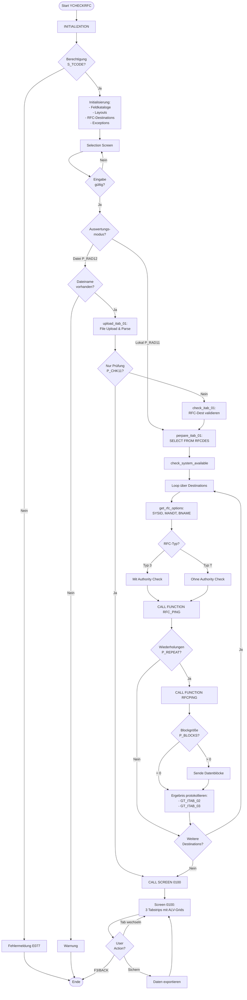

# GUI-Dokumentation: YCHECKRFC - Test RFC-Verbindung

**Transaktion:** YCHECKRFC  
**Programm:** YBCA1234_CHECK_RFCS  
**Komponente:** Compliance & Audit (adm)  
**Typ:** Report mit Dynpro-Screens  
**Erstellt am:** 2025-11-24

---

## Überblick

### Zweck

Das Programm YCHECKRFC dient zur systematischen Überprüfung von RFC-Verbindungen im SAP-System. Es testet die Erreichbarkeit und Funktionsfähigkeit von konfigurierten RFC-Destinations und dokumentiert die Ergebnisse in übersichtlichen ALV-Grids.

### Hauptfunktionen

- **RFC-Verbindungstest**: Prüfung der Erreichbarkeit von RFC-Destinations
- **Batch-Verarbeitung**: Massentest von RFC-Verbindungen über Eingabedatei
- **Berechtigungsprüfung**: Optionale Prüfung mit oder ohne Authority-Check
- **Performance-Messung**: Wiederholte Tests mit konfigurierbarer Block-Größe
- **Detailliertes Protokoll**: Dreistufige Ergebnisdarstellung (Übersicht, Ergebnisprotokoll, Verarbeitungsprotokoll)

### Verwendete Technologien

- **RFC-Funktionsbausteine**: `RFC_PING`, `RFCPING`, `RFC_SYSTEM_INFO`
- **ALV-Grid**: Dreifach-Tabstrip mit Custom Containern
- **File Upload**: Frontend-Datei-Upload für Batch-Verarbeitung
- **Custom Value Help**: Eigene F4-Hilfen für RFC-Destinations

---

## 1. Selection Screen (Einstiegsmaske)

### 1.1 Mockup Selection Screen

```
┌─────────────────────────────────────────────────────────────────────────┐
│ YCHECKRFC - Test RFC-Verbindung                                    ☰ □ × │
├─────────────────────────────────────────────────────────────────────────┤
│ System  Edit  Goto  Utilities  Environment  System  Help               │
├─────────────────────────────────────────────────────────────────────────┤
│ 📄 💾 🖨️ 🔧 ✂️ 📋 ↩️ ↪️ 🔍 🔧 ❓                                          │
├─────────────────────────────────────────────────────────────────────────┤
│                                                                         │
│  ┌─ Eingabeoptionen ─────────────────────────────────────────────┐    │
│  │                                                                 │    │
│  │  ◉ Lokale Auswertung                                           │    │
│  │     RFC-Destination  [__________] bis [__________]   [🔍]      │    │
│  │     Verbindungstyp   [3_______] bis [__________]   [🔍]        │    │
│  │                                                                 │    │
│  │  ○ Eingabedatei                                                │    │
│  │     ☑ Nur Eingabedatei prüfen (ohne RFC-Test)                  │    │
│  │     Dateiname        [________________________________]  [📁]   │    │
│  │                                                                 │    │
│  └─────────────────────────────────────────────────────────────────┘    │
│                                                                         │
│  ┌─ Verbindungen testen ──────────────────────────────────────────┐    │
│  │                                                                 │    │
│  │  Wiederholungen      [1_______]                                │    │
│  │  Blockgröße          [1_______]                                │    │
│  │                                                                 │    │
│  └─────────────────────────────────────────────────────────────────┘    │
│                                                                         │
│  ┌─ Ausgabeoptionen ──────────────────────────────────────────────┐    │
│  │  ┌─ Allgemein ───────────────────────────────────────────┐     │    │
│  │  │  ☑ Ergebnisprotokoll anzeigen                         │     │    │
│  │  └────────────────────────────────────────────────────────┘     │    │
│  │  ┌─ Verarbeitungsprotokoll ──────────────────────────────┐     │    │
│  │  │  ☑ Verarbeitungsprotokoll anzeigen                    │     │    │
│  │  └────────────────────────────────────────────────────────┘     │    │
│  └─────────────────────────────────────────────────────────────────┘    │
│                                                                         │
│                                                                         │
│  [  Ausführen (F8)  ]  [  Zurück (F3)  ]                               │
│                                                                         │
└─────────────────────────────────────────────────────────────────────────┘
```

### 1.2 Feldbeschreibung Selection Screen

#### Block A: Eingabeoptionen

| Feld | Typ | Bezeichnung | Beschreibung | Pflicht | Default |
|------|-----|-------------|--------------|---------|---------|
| `P_RAD11` | RADIOBUTTON | Lokale Auswertung | Auswertung basierend auf Selektionskriterien | - | X |
| `S_RFCDES` | SELECT-OPTIONS | RFC-Destination | Einschränkung der zu testenden RFC-Destinations | Nein | - |
| `S_RFCTYP` | SELECT-OPTIONS | Verbindungstyp | Typ der RFC-Verbindung (3=ABAP, T=TCP/IP) | Nein | 3 |
| `P_RAD12` | RADIOBUTTON | Eingabedatei | Massentest über Datei-Import | - | - |
| `P_CHK11` | CHECKBOX | Nur Prüfung | Prüft nur Dateiformat ohne RFC-Test | Nein | - |
| `P_FNAM11` | PARAMETER | Dateiname | Pfad zur Eingabedatei (Tab-getrennt) | Ja (bei P_RAD12) | - |

#### Block B: Verbindungen testen

| Feld | Typ | Bezeichnung | Beschreibung | Pflicht | Default |
|------|-----|-------------|--------------|---------|---------|
| `P_REPEAT` | PARAMETER | Wiederholungen | Anzahl der Test-Wiederholungen pro Destination | Nein | 1 |
| `P_BLOCKS` | PARAMETER | Blockgröße | Anzahl der Datenblöcke für Performance-Test | Nein | 1 |

#### Block C: Ausgabeoptionen

| Feld | Typ | Bezeichnung | Beschreibung | Pflicht | Default |
|------|-----|-------------|--------------|---------|---------|
| `P_CHK31` | CHECKBOX | Ergebnisprotokoll | Zeigt verdichtetes Ergebnisprotokoll | Nein | X |
| `P_CHK32` | CHECKBOX | Verarbeitungsprotokoll | Zeigt detailliertes Verarbeitungsprotokoll | Nein | X |

### 1.3 Validierungen

**AT SELECTION-SCREEN Prüfungen:**

1. **Dateiname-Validierung** (bei P_RAD12):
   - Prüfung: `P_FNAM11` darf nicht leer sein
   - Fehlermeldung: Warnung, wenn keine Datei angegeben

2. **Berechtigungsprüfung** (INITIALIZATION):
   - Objekt: `S_TCODE`
   - ID: `TCD`
   - Feld: `SY-TCODE` (YCHECKRFC)
   - Fehlermeldung: "Keine Berechtigung für Transaktion &"

3. **Screen-Modifikation**:
   - Bei P_RAD11 = X: Eingabedatei-Felder werden ausgeblendet
   - Bei P_RAD12 = X: Selektionsfelder werden ausgeblendet

### 1.4 Value Helps (F4-Hilfen)

#### F4 für RFC-Destination (S_RFCDES-LOW)

**Form-Routine:** `value_request`

**Quelle:** Tabelle `RFCDES` (WHERE rfctype = '3' OR rfctype = 'T')

**Anzeige:**
```
┌─ RFC-Destination auswählen ───────────────┐
│                                            │
│  RFC-Destination    Typ                   │
│  ────────────────────────────────────────  │
│  SAPBASIS           3                      │
│  SAPDEV100          3                      │
│  SAPPRD200          3                      │
│  TCP_RECEIVER       T                      │
│  WEBSERVICE_HTTP    T                      │
│  ...                                       │
│                                            │
│  [  OK  ]  [  Abbrechen  ]                 │
└────────────────────────────────────────────┘
```

#### F4 für Verbindungstyp (S_RFCTYP-LOW)

**Form-Routine:** `value_request_02`

**Werte:**
- `3` = ABAP Connection (mit Berechtigungsprüfung)
- `T` = TCP/IP Connection (ohne Berechtigungsprüfung)

#### F4 für Dateiname (P_FNAM11)

**Methode:** `cl_gui_frontend_services=>file_open_dialog`

**Filter:** `*.txt` (Tab-separated values)

---

## 2. Hauptbildschirm (Screen 0100) - Tabstrip-Container

### 2.1 Mockup Screen 0100

```
┌─────────────────────────────────────────────────────────────────────────┐
│ ✅ Übersicht (3/5)   │   Ergebnisprotokoll (1/5)   │   Verarbeitungsp... │
├─────────────────────────────────────────────────────────────────────────┤
│                                                                         │
│  [Subscreen Container - siehe detaillierte Ansichten unten]            │
│                                                                         │
│                                                                         │
│                                                                         │
│                                                                         │
│                                                                         │
│                                                                         │
│                                                                         │
│                                                                         │
│                                                                         │
│                                                                         │
│                                                                         │
│                                                                         │
│                                                                         │
│  [  Zurück (F3)  ]  [  Beenden  ]  [  Sichern (F2)  ]                  │
│                                                                         │
└─────────────────────────────────────────────────────────────────────────┘
```

### 2.2 Technische Details Screen 0100

**Screen-Nummer:** 0100  
**Screen-Typ:** Normal Screen mit Tabstrip-Control  
**Flow Logic:**

```abap
PROCESS BEFORE OUTPUT.
  MODULE status_0100.
  MODULE prepare_0100.

PROCESS AFTER INPUT.
  MODULE exit_0100 AT EXIT-COMMAND.
  MODULE navigate_0100.
  MODULE user_command_0100.
```

**Tabstrip-Control:** `TS_0100`

**Subscreens:**
- Screen 0110: Übersicht (Container: CONTAINER_0110_01)
- Screen 0120: Ergebnisprotokoll (Container: CONTAINER_0120_01)
- Screen 0130: Verarbeitungsprotokoll (Container: CONTAINER_0130_01)

---

## 3. Screen 0110 - Übersicht

### 3.1 Mockup Screen 0110

```
┌─────────────────────────────────────────────────────────────────────────┐
│ ✅ Übersicht (0/3)                                                      │
├─────────────────────────────────────────────────────────────────────────┤
│                                                                         │
│  Getestete RFC-Verbindungen                                            │
│                                                                         │
│  Icon │ Quellsystem          │ Zielsystem            │ Typ             │
│  ──────────────────────────────────────────────────────────────────────  │
│  🟢   │ P01                  │ SAPBASIS              │ 3               │
│  🟢   │ P01                  │ SAPDEV100             │ 3               │
│  🔴   │ P01                  │ SAPOLD_OFFLINE        │ 3               │
│                                                                         │
│                                                                         │
│                                                                         │
│                                                                         │
│                                                                         │
│                                                                         │
│                                                                         │
└─────────────────────────────────────────────────────────────────────────┘
```

### 3.2 Feldkatalog Screen 0110 (ALV_GRID_0110_01)

| Spalte | Feldname | Bezeichnung | Typ | Länge | Beschreibung |
|--------|----------|-------------|-----|-------|--------------|
| 1 | `ICON` | (Icon) | CHAR | 4 | Status-Icon (🟢 = OK, 🔴 = Fehler) |
| 2 | `SOURCE_NODE` | Quellsystem | CHAR | 32 | Name des aufrufenden Systems |
| 3 | `TARGET_NODE` | Zielsystem | CHAR | 32 | Name der RFC-Destination |
| 4 | `RFCTYPE` | Typ | CHAR | 1 | RFC-Verbindungstyp (3/T) |

### 3.3 Datenstruktur

**Interne Tabelle:** `GT_ITAB_01` (Typ: `TT_ITAB_01`)

**Struktur:** `TS_ITAB_01`

```abap
TYPES: BEGIN OF ts_itab_01,
         ct          TYPE lvc_t_scol,    "ALV Color Table
         icon(4)     TYPE c,             "Status Icon
         source_node TYPE rfcdes-rfcdest,"Source System
         target_node TYPE rfcdes-rfcdest,"Target Destination
         rfctype     TYPE rfcdes-rfctype."Connection Type
TYPES: END OF ts_itab_01.
```

### 3.4 Funktionalität

- **Automatische Farbkodierung**: 
  - Grün (🟢 / @01@): Verbindung erfolgreich
  - Rot (🔴 / @03@): Verbindung fehlgeschlagen
  
- **Tabstrip-Titel**: Zeigt Anzahl Fehler und Gesamt-Anzahl: "(0/3)"

- **Datenherkunft**:
  - Lokale Auswertung: SELECT aus `RFCDES` mit Einschränkungen
  - Datei-Import: Upload und Parsing der Tab-getrennten Datei

---

## 4. Screen 0120 - Ergebnisprotokoll

### 4.1 Mockup Screen 0120

```
┌─────────────────────────────────────────────────────────────────────────┐
│    Ergebnisprotokoll (1/5)                                              │
├─────────────────────────────────────────────────────────────────────────┤
│                                                                         │
│  Detaillierte RFC-Verbindungsergebnisse                                │
│                                                                         │
│  Icon│Status        │Q-Sys│Q-Mdt│Zielsystem      │Typ│Z-Sys│Z-Mdt│... │
│  ──────────────────────────────────────────────────────────────────────  │
│  🟢  │Anmeldung     │P01  │100  │SAPBASIS        │3  │D01 │100 │... │
│  🟢  │Anmeldung     │P01  │100  │SAPDEV100       │3  │D01 │100 │... │
│  🔴  │Verbindungs...│P01  │100  │SAPOLD_OFFLINE  │3  │    │    │... │
│  🟢  │Anmeldung     │P01  │100  │TCP_RECEIVER    │T  │Q02 │200 │... │
│  🟢  │RFC-Systemc...│P01  │100  │SAPBASIS        │3  │D01 │100 │... │
│                                                                         │
│                                                                         │
│  Doppelklick für Details                                               │
│                                                                         │
└─────────────────────────────────────────────────────────────────────────┘
```

### 4.2 Feldkatalog Screen 0120 (ALV_GRID_0120_01)

| Spalte | Feldname | Bezeichnung | Typ | Länge | Beschreibung |
|--------|----------|-------------|-----|-------|--------------|
| 1 | `ICON` | (Icon) | CHAR | 4 | Status-Icon |
| 2 | `STATUS` | Status | CHAR | 30 | Statustext (Anmeldung, Verbindungsfehler, Abbruch) |
| 3 | `SOURCE_SYSID` | Quell-System | CHAR | 3 | System-ID des Quellsystems |
| 4 | `SOURCE_MANDT` | Quell-Mandant | CHAR | 3 | Mandant des Quellsystems |
| 5 | `TARGET_NODE` | Logisches Zielsystem | CHAR | 32 | RFC-Destination |
| 6 | `TARGET_RFCTYPE` | Typ | CHAR | 3 | RFC-Typ (3/T) |
| 7 | `TARGET_SYSID` | Ziel-System | CHAR | 3 | System-ID des Zielsystems |
| 8 | `TARGET_MANDT` | Ziel-Mandant | CHAR | 3 | Mandant des Zielsystems |
| 9 | `BNAME` | Benutzerkennung | CHAR | 12 | Technischer RFC-Benutzer |
| 10 | `MSG_TEXT` | Meldung | CHAR | 80 | Detaillierte Fehlermeldung |

### 4.3 Datenstruktur

**Interne Tabelle:** `GT_ITAB_02` (Typ: `TT_ITAB_02`)

**Struktur:** `TS_ITAB_02`

```abap
TYPES: BEGIN OF ts_itab_02,
         icon(4)        TYPE c,
         status(30)     TYPE c,
         source_sysid   TYPE sy-sysid,
         source_mandt   TYPE sy-mandt,
         target_node    TYPE rfcdes-rfcdest,
         target_rfctype TYPE rfcdes-rfctype,
         target_sysid   TYPE sy-sysid,
         target_mandt   TYPE sy-mandt,
         bname          TYPE usr02-bname,
         agr_name       TYPE agr_define-agr_name,
         msg_text(80)   TYPE c.
TYPES: END OF ts_itab_02.
```

### 4.4 Status-Werte

| Status | Icon | Bedeutung | Ursache |
|--------|------|-----------|---------|
| **Anmeldung** | 🟢 @01@ | Erfolgreiche Verbindung | RFC_PING oder RFCPING erfolgreich |
| **RFC-Systemcall** | 🟢 @01@ | System-Call erfolgreich | RFC_PING bei Typ 3 erfolgreich |
| **Verbindungsfehler** | 🔴 @03@ | Keine Verbindung möglich | COMMUNICATION_FAILURE |
| **Abbruch** | 🔴 @03@ | Systemfehler | SYSTEM_FAILURE |

---

## 5. Screen 0130 - Verarbeitungsprotokoll

### 5.1 Mockup Screen 0130

```
┌─────────────────────────────────────────────────────────────────────────┐
│    Verarbeitungsprotokoll (0/8)                                         │
├─────────────────────────────────────────────────────────────────────────┤
│                                                                         │
│  Technisches Protokoll aller RFC-Calls                                 │
│                                                                         │
│  Icon│Status     │Zielsystem      │Typ│Name         │Exception    │...│
│  ──────────────────────────────────────────────────────────────────────  │
│  🟢  │Anmeldung  │SAPBASIS        │FB │RFC_PING     │OK           │   │
│  🟢  │Anmeldung  │SAPBASIS        │FB │RFCPING      │OK           │   │
│  🟢  │Anmeldung  │SAPDEV100       │FB │RFC_PING     │OK           │   │
│  🟢  │Anmeldung  │SAPDEV100       │FB │RFCPING      │OK           │   │
│  🔴  │Verbind... │SAPOLD_OFFLINE  │FB │RFC_PING     │COMM_FAILURE │...│
│  🔴  │Verbind... │SAPOLD_OFFLINE  │FB │RFCPING      │COMM_FAILURE │...│
│  🟢  │Anmeldung  │TCP_RECEIVER    │FB │RFC_PING     │OK           │   │
│  🟢  │RFC-Sys... │SAPBASIS        │FB │RFC_PING     │OK           │   │
│                                                                         │
│                                                                         │
└─────────────────────────────────────────────────────────────────────────┘
```

### 5.2 Feldkatalog Screen 0130 (ALV_GRID_0130_01)

| Spalte | Feldname | Bezeichnung | Typ | Länge | Beschreibung |
|--------|----------|-------------|-----|-------|--------------|
| 1 | `ICON` | (Icon) | CHAR | 4 | Status-Icon |
| 2 | `STATUS` | Status | CHAR | 30 | Statustext |
| 3 | `TARGET_NODE` | Logisches Zielsystem | CHAR | 32 | RFC-Destination |
| 4 | `TYPE` | Typ | CHAR | 2 | Objekttyp (FB = Function Module) |
| 5 | `NAME` | Name | CHAR | 50 | Name des Funktionsbausteins |
| 6 | `EXCEPTION` | Ausnahme | CHAR | 30 | RFC-Exception-Name |
| 7 | `MSG_TEXT` | Meldung | CHAR | 80 | System-Fehlermeldung |

### 5.3 Datenstruktur

**Interne Tabelle:** `GT_ITAB_03` (Typ: `TT_ITAB_03`)

**Struktur:** `TS_ITAB_03`

```abap
TYPES: BEGIN OF ts_itab_03,
         icon(4)      TYPE c,
         status(30)   TYPE c,
         target_node  TYPE rfcdes-rfcdest,
         type(2)      TYPE c,
         name(50)     TYPE c,
         exception    TYPE rsexc-exception,
         msg_text(80) TYPE c.
TYPES: END OF ts_itab_03.
```

### 5.4 Exception-Mapping

**Interne Tabelle:** `GT_ITAB_04` (Typ: `TT_ITAB_04`)

Enthält Mapping von SY-SUBRC zu Exception-Namen:

| FB-Name | SUBRC | Exception |
|---------|-------|-----------|
| RFC_PING | 0 | OK |
| RFC_PING | 1 | SYSTEM_FAILURE |
| RFC_PING | 2 | COMMUNICATION_FAILURE |
| RFC_PING | 3 | OTHERS |
| RFCPING | 0 | OK |
| RFCPING | 1 | SYSTEM_FAILURE |
| RFCPING | 2 | COMMUNICATION_FAILURE |
| RFCPING | 3 | OTHERS |

---

## 6. Ablaufdiagramm



---

## 7. Funktionsbeschreibungen

### 7.1 Hauptfunktionalitäten

#### 1. Lokale RFC-Auswertung

**Beschreibung:** Testet alle konfigurierten RFC-Destinations basierend auf Selektionskriterien.

**Auslöser:** Radiobutton P_RAD11 aktiviert, F8 (Ausführen)

**Ablauf:**
1. SELECT aus Tabelle `RFCDES` mit Einschränkungen (S_RFCDES, S_RFCTYP)
2. Für jede Destination:
   - Ermittlung von SYSID, MANDT, BNAME via `RFC_SYSTEM_INFO`
   - Test mit `RFC_PING` (ohne Auth) oder `RFCPING` (mit Auth)
   - Wiederholte Tests gemäß P_REPEAT und P_BLOCKS
3. Ergebnisse in 3 Tabellen (Übersicht, Ergebnis, Verarbeitung)
4. Anzeige in Screen 0100

**Ergebnis:** ALV-Grid mit Statusübersicht aller getesteten Verbindungen

#### 2. Datei-basierte Massenprüfung

**Beschreibung:** Import und Test von RFC-Destinations aus Tab-getrennter Datei.

**Auslöser:** Radiobutton P_RAD12 aktiviert, Datei ausgewählt, F8

**Dateiformat:**
```
SOURCE_NODE	TARGET_NODE	RFCTYPE
P01	SAPBASIS	3
P01	SAPDEV100	3
P01	TCP_RECEIVER	T
```

**Ablauf:**
1. Frontend-Upload via `cl_gui_frontend_services=>gui_upload`
2. Parsing: Tab-Trennung, Headerzeile entfernen
3. Optional: Nur Validierung (P_CHK11) ohne RFC-Test
4. Ansonsten: Wie lokale Auswertung

**Ergebnis:** Wie lokale Auswertung, inkl. Validierungsfehler (rot markiert)

#### 3. Performance-Test

**Beschreibung:** Wiederholte RFC-Calls mit konfigurierbarer Datenmenge.

**Parameter:**
- P_REPEAT: Anzahl Wiederholungen (Default: 1)
- P_BLOCKS: Anzahl Datenblöcke à 102 Bytes (Default: 1)

**Ablauf:**
- Füllung der Tabelle `RFCTAB40` mit Testdaten
- Wiederholte Calls mit Runtime-Messung (GET RUN TIME FIELD)
- Berechnung Min/Max/Durchschnitt (Code vorbereitet, aber nicht ausgegeben)

**Verwendung:** Netzwerk-Latenz und Durchsatz testen

#### 4. Berechtigungstest

**Beschreibung:** Unterscheidung zwischen System-Call (ohne User-Dialog) und Auth-Check.

**Typ 3 (ABAP Connection):**
- Erster Call: `RFC_PING` (System-Call, kein Login-Popup)
- Zweiter Call: `RFCPING` (mit Berechtigungsprüfung)

**Typ T (TCP/IP Connection):**
- Nur `RFC_PING` (keine Berechtigungsprüfung möglich)

**Protokollierung:** Beide Calls werden separat protokolliert

---

### 7.2 Hilfsfunktionen

#### get_destinations

**Zweck:** Lädt alle RFC-Destinations vom Typ 3 für F4-Hilfe.

**SQL:**
```abap
SELECT * FROM rfcdes WHERE rfctype = '3'.
```

#### get_rfc_options

**Zweck:** Ermittelt Zielsystem-Informationen einer RFC-Destination.

**Aufrufe:**
1. `RFC_SYSTEM_INFO` → SYSID
2. SELECT RFCDES → RFCOPTIONS (M=Mandant, U=User)

**Rückgabe:** SYSID, MANDT, BNAME

#### get_exceptions

**Zweck:** Lädt Exception-Definitionen aus Funktionsbaustein-Dokumentation.

**Calls:**
```abap
CALL FUNCTION 'FUNCTION_IMPORT_DOKU'
  EXPORTING funcname = 'RFC_PING' / 'RFCPING'
  TABLES exception_list = lt_rsexc
```

**Verwendung:** Mapping von SY-SUBRC zu Exception-Namen

#### perpare_tabstrip_01

**Zweck:** Aktualisiert Tabstrip-Titel mit Fehlerstatistik.

**Format:** "(Anzahl Fehler / Gesamt)" + Icon

**Beispiel:** "🔴 (2/5) Ergebnisprotokoll"

---

### 7.3 Tastenkombinationen / Shortcuts

| Taste | Funktion | Screen |
|-------|----------|--------|
| F3 | Zurück | Selection Screen, 0100 |
| F8 | Ausführen | Selection Screen |
| F2 | Sichern (Export) | 0100 |
| F4 | Suchhilfe | Selection Screen (Felder) |
| CANC | Abbrechen | 0100 |
| Doppelklick | Details (nicht implementiert) | ALV-Grids |

---

## 8. Berechtigungen

### 8.1 Erforderliche Berechtigungsobjekte

| Berechtigungsobjekt | ID | Feldwert | Prüfzeitpunkt | Beschreibung |
|---------------------|-----|----------|---------------|--------------|
| **S_TCODE** | TCD | YCHECKRFC | INITIALIZATION | Transaktion ausführen |
| **S_RFC** | RFC_TYPE | Function Module | Runtime | RFC-Calls durchführen (implizit) |
| **S_RFC** | RFC_NAME | RFC_PING, RFCPING | Runtime | Spezifische FB-Calls |
| **S_DATASET** | FILENAME | * | Optional | Datei-Upload (Frontend) |

### 8.2 Prüfungen im Code

**Explizite Authority-Checks:**

```abap
AUTHORITY-CHECK OBJECT 'S_TCODE'
                ID     'TCD'
                FIELD  SY-TCODE.

IF SY-SUBRC <> 0.
  MESSAGE E077(S#) WITH SY-TCODE.
ENDIF.
```

**Fehlermeldung:**
- Nachrichtenklasse: S#
- Nummer: 077
- Text: "Keine Berechtigung für Transaktion &"

**Implizite Prüfungen:**
- RFC-Calls prüfen automatisch S_RFC
- File-Upload prüft OS-Rechte

---

## 9. Technische Details

### 9.1 Datenbankzugriffe

#### Gelesene Tabellen

| Tabelle | SELECT | Zweck | Felder | Performance |
|---------|--------|-------|--------|-------------|
| **RFCDES** | ✓ | RFC-Destinations laden | RFCDEST, RFCTYPE, RFCOPTIONS | Index: RFCTYPE |
| **RFCDES** | ✓ | Einzelabfrage für Validation | * | Primärschlüssel |

**Kritische Queries:**

```abap
SELECT rfcdest rfctype
  INTO (ls_itab_01-target_node, ls_itab_01-rfctype)
  FROM rfcdes
  WHERE rfcdest IN s_rfcdes
    AND rfctype IN s_rfctyp.
ENDSELECT.
```

**Optimierung:** WHERE-Bedingung mit Index auf RFCTYPE

#### Schreibzugriffe

**Keine** – Programm ist rein lesend.

---

### 9.2 RFC-Calls / Function Modules

| Funktionsbaustein | Typ | Zweck | Exceptions |
|-------------------|-----|-------|------------|
| **RFC_PING** | RFC | Verbindungstest ohne Auth | SYSTEM_FAILURE, COMMUNICATION_FAILURE, OTHERS |
| **RFCPING** | RFC | Verbindungstest mit Auth | SYSTEM_FAILURE, COMMUNICATION_FAILURE, OTHERS |
| **RFC_SYSTEM_INFO** | RFC | Ermittlung SYSID, Release | SYSTEM_FAILURE, COMMUNICATION_FAILURE |
| **FUNCTION_IMPORT_DOKU** | Lokal | Exception-Dokumentation laden | ERROR_MESSAGE, FUNCTION_NOT_FOUND |
| **F4IF_INT_TABLE_VALUE_REQUEST** | Lokal | Value Help anzeigen | PARAMETER_ERROR, NO_VALUES_FOUND |
| **SAPGUI_PROGRESS_INDICATOR** | Lokal | Fortschrittsbalken | - |

**RFC-Call-Muster:**

```abap
CALL FUNCTION 'RFC_PING'
  DESTINATION f_target_node
  TABLES
    rfctab40              = lt_rfctab
  EXCEPTIONS
    system_failure        = 1  MESSAGE lv_msg_txt
    communication_failure = 2  MESSAGE lv_msg_txt
    others                = 3.
```

---

### 9.3 Performance-Aspekte

#### Kritische Bereiche

1. **Mehrfache RFC-Calls**
   - Bei 50 Destinations × 10 Wiederholungen = 500 RFC-Calls
   - Laufzeit: ca. 1-5 Sekunden pro Call
   - **Gesamt:** 8-40 Minuten

2. **Frontend-Upload**
   - Große Dateien (> 1 MB) können langsam sein
   - **Empfehlung:** Max. 1000 Zeilen pro Datei

3. **ALV-Grid-Rendering**
   - Bei > 10.000 Zeilen Performance-Einbruch
   - **Empfehlung:** Ergebnis-Verdichtung aktivieren

#### Optimierungspotenzial

**Aktuell:**
```abap
" Sequentielle Verarbeitung
LOOP AT gt_itab_01 INTO ls_itab_01.
  PERFORM send ... " RFC-Call
ENDLOOP.
```

**Verbesserung (nicht implementiert):**
- Parallele RFC-Calls via RFC-Gruppe
- Asynchrone Calls mit Callback
- Batch-Processing mit Background-Job

#### Laufzeitverhalten

| Szenario | Destinations | Wiederholungen | Geschätzte Laufzeit |
|----------|--------------|----------------|---------------------|
| Schnelltest | 5 | 1 | 10-30 Sekunden |
| Standard | 20 | 1 | 1-3 Minuten |
| Performance-Test | 10 | 100 | 10-50 Minuten |
| Massentest | 100 | 1 | 5-15 Minuten |

---

## 10. Fehlerzustände und Validierungen

### 10.1 Fehlermeldungen

| ID | Typ | Text | Ursache | Lösung |
|----|-----|------|---------|--------|
| E077 | Error | Keine Berechtigung für Transaktion & | S_TCODE fehlt | Berechtigung anfordern |
| W000 | Warning | Bitte Dateiname angeben | P_FNAM11 leer | Datei auswählen |
| - | Icon | Verbindungsfehler | COMMUNICATION_FAILURE | RFC-Destination prüfen, Netzwerk testen |
| - | Icon | Abbruch | SYSTEM_FAILURE | Zielsystem prüfen, Logs analysieren |
| - | Icon | Destination nicht gefunden | RFCDEST existiert nicht | SM59 prüfen |

### 10.2 Validierungszustände im ALV

**Farbkodierung:**

| Farbe | Icon | Status | Bedeutung |
|-------|------|--------|-----------|
| Grün | 🟢 @01@ | OK | RFC-Verbindung erfolgreich |
| Rot | 🔴 @03@ | Fehler | RFC-Verbindung fehlgeschlagen |
| Orange | 🟠 @03@ | Warnung | Destination ungültig (nur bei File-Check) |

**ALV Color Table:**

```abap
ls_lvc_s_scol-fname     = 'TARGET_NODE'.
ls_lvc_s_scol-color-col = 6.  " Rot
APPEND ls_lvc_s_scol TO lt_lvc_t_scol.
```

### 10.3 Exception-Handling

**RFC-Exceptions:**

```abap
CASE sy-subrc.
  WHEN 0.
    " Erfolg
    ls_itab_02-icon = '@01@'.
    ls_itab_02-status = 'Anmeldung'.
    
  WHEN 1.
    " System Failure
    ls_itab_02-icon = '@03@'.
    ls_itab_02-status = 'Abbruch'.
    ls_itab_02-msg_text = lv_msg_txt.
    
  WHEN 2.
    " Communication Failure
    ls_itab_02-icon = '@03@'.
    ls_itab_02-status = 'Verbindungsfehler'.
    ls_itab_02-msg_text = lv_msg_txt.
    
  WHEN 3.
    " Others
    ls_itab_02-icon = '@03@'.
    ls_itab_02-status = 'Sonstiger Fehler'.
ENDCASE.
```

---

## 11. Anwendungsbeispiele

### 11.1 Standard-Verwendung: Lokaler RFC-Test

**Szenario:** Admin möchte alle produktiven RFC-Destinations testen.

**Schritte:**
1. Transaktion YCHECKRFC aufrufen
2. ◉ "Lokale Auswertung" auswählen
3. RFC-Destination: `*PRD*` (alle produktiven)
4. Verbindungstyp: `3` (ABAP)
5. Wiederholungen: `1`
6. ☑ Ergebnisprotokoll anzeigen
7. F8 (Ausführen)

**Ergebnis:** ALV-Grid mit Status aller PRD-Destinations

### 11.2 Batch-Test via Datei

**Szenario:** Liste von 100 RFC-Destinations aus Excel prüfen.

**Excel-Vorbereitung:**
```
SOURCE_NODE	TARGET_NODE	RFCTYPE
P01	SAPBASIS	3
P01	SAPDEV100	3
...
```

Speichern als: `C:\Temp\rfc_test.txt` (Tab-getrennt)

**Schritte:**
1. YCHECKRFC aufrufen
2. ○ "Eingabedatei" auswählen
3. Dateiname: `C:\Temp\rfc_test.txt` [📁]
4. ☐ Nur Prüfung (nicht aktivieren)
5. F8 (Ausführen)

**Ergebnis:** Test aller 100 Destinations, Fehlerliste

### 11.3 Performance-Analyse

**Szenario:** Netzwerk-Latenz zwischen SAP-Systemen messen.

**Schritte:**
1. YCHECKRFC aufrufen
2. RFC-Destination: `SAPDEV100`
3. Wiederholungen: `100`
4. Blockgröße: `10` (= 1020 Bytes)
5. F8 (Ausführen)

**Ergebnis:** 100 × 2 RFC-Calls mit Laufzeitmessung (interne Berechnung)

### 11.4 Fehleranalyse

**Szenario:** RFC-Destination `SAPOLD` liefert Fehler, Details benötigt.

**Schritte:**
1. YCHECKRFC aufrufen
2. RFC-Destination: `SAPOLD`
3. ☑ Verarbeitungsprotokoll anzeigen
4. F8 (Ausführen)
5. In Screen 0100: Tab "Verarbeitungsprotokoll" öffnen
6. Spalte "Meldung" analysieren

**Typische Fehlermeldungen:**
- "Connection refused" → Zielsystem offline
- "Logon failed" → User/Passwort falsch
- "Timeout" → Netzwerk-/Firewall-Problem

---

## 12. Integration in Systemdokumentation

### 12.1 Verlinkung in Komponenten-Dokumentation

Die vollständige Beschreibung wurde in der Datei `2.06_AuditLoggingDocumentation.md` unter dem Abschnitt "GUI-Transaktionen" ergänzt:

```markdown
#### YCHECKRFC - Test RFC-Verbindung

**Typ:** Report mit Dynpro-Screens  
**Hauptprogramm:** `YBCA1234_CHECK_RFCS`

**Zweck:** Systematische Überprüfung von RFC-Verbindungen im SAP-System zur 
Sicherstellung der Konnektivität zwischen verteilten Systemlandschaften.

**Detaillierte Dokumentation:** [GUI-Mockup YCHECKRFC](../../.github/prompts/10_DepthDocumentation/11_GUI_Prompts/YCHECKRFC_Mockup.md)

**Hauptfunktionen:**

- Test einzelner oder multipler RFC-Destinations
- Batch-Verarbeitung via Datei-Import
- Performance-Analyse mit wiederholten Tests
- Unterscheidung zwischen System-Call und Berechtigungsprüfung
- Dreistufiges Reporting (Übersicht, Ergebnis, Verarbeitung)
```

### 12.2 Status-Update GUI-Übersicht

Status in `GUI_Overview.md` aktualisiert:

```markdown
| YCHECKRFC | YBCA1234_CHECK_RFCS | Test RFC-Verbindung | 0100, 0110, 0120, 0130 | Dynpro | ✅ |
```

---

## 13. Wartung und Erweiterungen

### 13.1 Bekannte Einschränkungen

1. **Keine asynchronen RFC-Calls**
   - Lange Laufzeiten bei vielen Destinations
   - Keine Parallel-Verarbeitung

2. **Performance-Messung nicht ausgegeben**
   - Code für Min/Max/Durchschnitt vorhanden
   - Aber keine Anzeige im GUI

3. **Keine Export-Funktion**
   - Ergebnisse können nicht als Datei gespeichert werden
   - Nur manueller Copy/Paste aus ALV

4. **Veralteter Code-Stil**
   - ENDSELECT statt INTO TABLE
   - Fehlende Exception-Behandlung bei File-Operations

### 13.2 Verbesserungsvorschläge

#### Kurzfristig (Low Hanging Fruits)

1. **Export-Button hinzufügen**
   ```abap
   " In PF-STATUS 0100
   + Button "EXPORT" mit Icon @2L@ (Download)
   " In USER_COMMAND_0100
   WHEN 'EXPORT'.
     PERFORM export_to_file USING gt_itab_02.
   ```

2. **Performance-Statistik anzeigen**
   ```abap
   " Neuer Tabstrip-Reiter "Performance"
   " Zeigt Min/Max/Avg Laufzeiten
   ```

3. **Fehlerlog-Export**
   ```abap
   " Button "EXPORT_ERRORS"
   " Exportiert nur Fehler-Zeilen
   ```

#### Mittelfristig (Refactoring)

1. **Modularisierung**
   - Aufteilung in Function Groups
   - OO-Redesign mit Klassen

2. **Async RFC-Calls**
   - Verwendung von RFC-Gruppen
   - Parallel-Verarbeitung

3. **Erweiterte Validierung**
   - Prüfung auf SM59-Konsistenz
   - Test von User-Berechtigungen

#### Langfristig (Features)

1. **Monitoring-Integration**
   - Automatische Checks via Batch-Job
   - Alerting bei Verbindungsausfällen
   - Integration mit SAP Solution Manager

2. **Web-GUI**
   - Fiori-App für RFC-Monitoring
   - Dashboard mit Echtzeit-Status

3. **KI-basierte Fehleranalyse**
   - Automatische Fehlerdiagnose
   - Lösungsvorschläge aus Knowledge Base

---

## 14. Related Documentation

### SAP-Standard-Transaktionen

| Transaktion | Beschreibung | Relation |
|-------------|--------------|----------|
| **SM59** | RFC-Destinations pflegen | YCHECKRFC testet hier konfigurierte Destinations |
| **RSRFCPIN** | SAP-Standard RFC-Ping | Basis für YCHECKRFC-Logik |
| **SM21** | System-Log | Zeigt RFC-Fehler |
| **ST22** | ABAP-Dumps | RFC-Exceptions analysieren |
| **AL08** | Angemeldete User | RFC-User-Sessions prüfen |

### Verwandte Custom-Programme

| Programm | Transaktion | Beschreibung |
|----------|-------------|--------------|
| YBCA1234_CHECK_AUDITLOG | YAUDCHECK | Audit-Log prüfen (ähnliche Reporting-Struktur) |
| YBCA1234_CHECK_XEPT | YCHECKXEPTC | Status XEPT-User (ähnlicher Zweck) |

### Dokumentation

- **SAP-Hilfe:** RFC/CPI-C Programming → RFC_PING, RFCPING
- **SAP Note 26831:** RFC Troubleshooting
- **SAP Note 500235:** Performance Tuning für RFC
- **Porsche-Intranet:** RFC-Best-Practices (intern)

---

## Anhang

### A.1 Eingabedatei-Format

**Dateiname:** beliebig.txt  
**Encoding:** UTF-8 oder ANSI  
**Trenner:** Tab (\t)  
**Header:** erforderlich

**Beispiel:**
```
SOURCE_NODE	TARGET_NODE	RFCTYPE
P01	SAPBASIS	3
P01	SAPDEV100	3
P01	SAPQAS100	3
P01	TCP_RECEIVER	T
Q02	SAPBASIS	3
```

**Hinweise:**
- Erste Zeile (Header) wird ignoriert
- Leere Zeilen werden ignoriert
- Ungültige RFC-Destinations werden rot markiert

### A.2 Screen-Flow

```
Selection Screen
      ↓
   [F8 Execute]
      ↓
   Screen 0100 (Tabstrip Container)
      ├─→ 0110 (Übersicht)
      ├─→ 0120 (Ergebnisprotokoll)
      └─→ 0130 (Verarbeitungsprotokoll)
      ↓
   [F3 Back]
      ↓
   Ende
```

### A.3 Programmstruktur

```
YBCA1234_CHECK_RFCS (Hauptprogramm, 2493 Zeilen)
├─ DATA DECLARATIONS (Zeilen 1-360)
├─ SELECTION-SCREEN (Zeilen 340-361)
├─ INITIALIZATION (Zeilen 363-414)
├─ AT SELECTION-SCREEN (Zeilen 417-466)
├─ START-OF-SELECTION (Zeilen 470-523)
├─ FORM-ROUTINES
│  ├─ create_basic_instances
│  ├─ get_selected_file
│  ├─ upload_itab_01
│  ├─ transform_input_data
│  ├─ get_exceptions
│  ├─ perpare_itab_01
│  ├─ check_itab_01
│  ├─ check_system_available
│  ├─ send (RFC-Calls)
│  ├─ get_rfc_options
│  ├─ value_request
│  ├─ value_request_02
│  ├─ create_fieldcat
│  ├─ create_layout
│  └─ perpare_tabstrip_01
└─ MODULES
   ├─ status_0100
   ├─ prepare_0100
   ├─ exit_0100
   ├─ navigate_0100
   └─ user_command_0100
```

---

**Dokumentation erstellt:** 2025-11-24  
**Autor:** SAP Copilot  
**Version:** 1.0  
**Status:** ✅ Vollständig  
**Nächste Review:** Bei Programmänderungen

