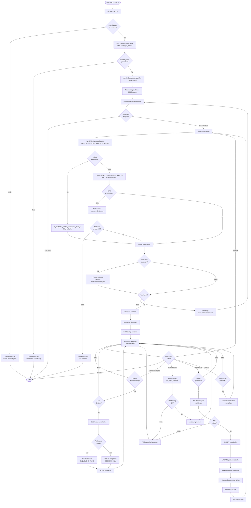

# GUI-Dokumentation: YROLEBK_01 - Referenz für alle Berechtigungskoordinatoren

**Transaktion:** YROLEBK_01  
**Programm:** YBCA1234_BK_REF_01  
**Komponente:** Integration Hub / Role Management (upd)  
**Typ:** Dynpro mit ALV Grid (Screen 0100)

---

## Überblick

Die Transaktion YROLEBK_01 ist eine erweiterte Version der Transaktion YROLEBK und dient der Anzeige, Pflege und Verwaltung von Berechtigungskreis-Referenzen (BK-Referenzen). Sie ermöglicht die Zuordnung von Rollenpräfixen zu Berechtigungskoordinatoren und bietet zusätzliche Filter- und Suchmöglichkeiten über eine Freitextsuche sowie erweiterte Selektionsoptionen für Rollen-Daten.

### Hauptfunktionen

- **Anzeige von BK-Referenzen**: Übersicht aller Berechtigungskreis-Zuordnungen
- **Freitextsuche**: Suche über alle relevanten Felder
- **Erweiterte Selektion**: Filterung nach BK-Referenz-Feldern und Rollen-Attributen
- **Bearbeitung (Admin)**: Pflege von BK-Referenzen für berechtigte Benutzer
- **Rollenanzeige**: Option zur Anzeige mit zugeordneten Rollen
- **RFC-basierte Datenabfrage**: Abruf von Daten aus Lead-System oder lokal
- **ALV Grid mit Editierfunktion**: Inline-Bearbeitung bei Admin-Berechtigung

---

## 1. Selection-Screen (Hauptbildschirm)

### 1.1 Mockup des Selection-Screens

```
┌─────────────────────────────────────────────────────────────────────────────┐
│ Referenz für alle Berechtigungskoordinationen                               │
│                                                                              │
│ ┌─ Freitextsuche ────────────────────────────────────────────────────────┐ │
│ │                                                                          │ │
│ │  Freitext        [____________________________]  bis [______________]   │ │
│ │                                                                          │ │
│ └──────────────────────────────────────────────────────────────────────────┘ │
│                                                                              │
│ ┌─ Selektion BK-Ref. ────────────────────────────────────────────────────┐ │
│ │                                                                          │ │
│ │  Rollenpräfix    [____]  bis [____]  [ ] [ ] [ ] (weitere Werte)       │ │
│ │  Beschreibung    [____________________________]  bis [______________]   │ │
│ │  BPA             [____]  bis [____]                                     │ │
│ │  BPO             [____]  bis [____]                                     │ │
│ │  BKA             [____]  bis [____]                                     │ │
│ │  BKN             [____]  bis [____]                                     │ │
│ │  AMA             [____]  bis [____]                                     │ │
│ │  AMN             [____]  bis [____]                                     │ │
│ │  Bemerkung       [____________________________]  bis [______________]   │ │
│ │  Kritikalität    [____]  bis [____]                                     │ │
│ │  Attribute       [____]  bis [____]                                     │ │
│ │  Active          [____]  bis [____]                                     │ │
│ │  Löschkz         [____]  bis [____]                                     │ │
│ │  Erstelldatum    [__________]  bis [__________]                         │ │
│ │  Ersteller       [____________]  bis [____________]                     │ │
│ │  Änderungsdatum  [__________]  bis [__________]                         │ │
│ │  Änderer         [____________]  bis [____________]                     │ │
│ │                                                                          │ │
│ └──────────────────────────────────────────────────────────────────────────┘ │
│                                                                              │
│ ┌─ Selektion Rollen ─────────────────────────────────────────────────────┐ │
│ │                                                                          │ │
│ │  Rolle           [____________________________]  bis [______________]   │ │
│ │  Bezeichnung     [____________________________]  bis [______________]   │ │
│ │  Ursprung        [____________________________]  bis [______________]   │ │
│ │  Verwendung      [____________________________]  bis [______________]   │ │
│ │  Anwender        [____________________________]  bis [______________]   │ │
│ │                                                                          │ │
│ └──────────────────────────────────────────────────────────────────────────┘ │
│                                                                              │
│ ┌─ Optionen ─────────────────────────────────────────────────────────────┐ │
│ │                                                                          │ │
│ │  [✓] Mit Rollen anzeigen                                                │ │
│ │  [ ] Inaktive anzeigen         (nur für Admin-Benutzer sichtbar)       │ │
│ │                                                                          │ │
│ │  [ ] lokale Ausführung                                                  │ │
│ │                                                                          │ │
│ └──────────────────────────────────────────────────────────────────────────┘ │
│                                                                              │
│  [Ausführen (F8)]  [Zurück (F3)]                                            │
│                                                                              │
└──────────────────────────────────────────────────────────────────────────────┘
```

### 1.2 Feldbeschreibungen

#### Freitextsuche

| Feld | Typ | Beschreibung | Pflicht |
|------|-----|--------------|---------|
| Freitext | SELECT-OPTION | Freitextsuche über alle relevanten Felder | Nein |

**Hinweis**: Die Freitextsuche durchsucht alle Felder der BK-Referenz- und Rollen-Tabellen.

#### Selektion BK-Ref. (Tabelle YBCA1234_BK_REF)

| Feld | Technischer Name | Typ | Beschreibung |
|------|------------------|-----|--------------|
| Rollenpräfix | S_ROL | SELECT-OPTION | Präfix der Rolle (z.B. "ZBK_*") |
| Beschreibung | S_BES | SELECT-OPTION | Beschreibung des Berechtigungskreises |
| BPA | S_BPA | SELECT-OPTION | Berechtigungspartner (Admin) |
| BPO | S_BPO | SELECT-OPTION | Berechtigungspartner (Org) |
| BKA | S_BKA | SELECT-OPTION | Berechtigungskoordinator (Admin) |
| BKN | S_BKN | SELECT-OPTION | Berechtigungskoordinator (Name) |
| AMA | S_AMA | SELECT-OPTION | Ansprechpartner (Admin) |
| AMN | S_AMN | SELECT-OPTION | Ansprechpartner (Name) |
| Bemerkung | S_BEM | SELECT-OPTION | Bemerkungsfeld |
| Kritikalität | S_KRI | SELECT-OPTION | Kritikalitätsstufe |
| Attribute | S_ATT | SELECT-OPTION | Zusätzliche Attribute |
| Active | S_ACT | SELECT-OPTION | Aktiv-Status |
| Löschkz | S_LOE | SELECT-OPTION | Löschkennzeichen |
| Erstelldatum | S_ERD | SELECT-OPTION | Erstellungsdatum |
| Ersteller | S_ERN | SELECT-OPTION | Ersteller-Benutzername |
| Änderungsdatum | S_AED | SELECT-OPTION | Änderungsdatum |
| Änderer | S_AEN | SELECT-OPTION | Änderer-Benutzername |

#### Selektion Rollen (Tabelle YBCA1234_ROLEREF)

| Feld | Technischer Name | Typ | Beschreibung |
|------|------------------|-----|--------------|
| Rolle | S_RO1 | SELECT-OPTION | Vollständiger Rollenname |
| Bezeichnung | S_BE1 | SELECT-OPTION | Rollenbezeichnung |
| Ursprung | S_UR1 | SELECT-OPTION | Ursprung der Rolle |
| Verwendung | S_VE1 | SELECT-OPTION | Verwendungszweck |
| Anwender | S_AN1 | SELECT-OPTION | Anwenderkreis |

#### Optionen

| Option | Technischer Name | Typ | Beschreibung |
|--------|------------------|-----|--------------|
| Mit Rollen anzeigen | PA_ROLE | CHECKBOX | Zeigt zu jedem Rollenpräfix die Rolle mit den meisten übereinstimmenden Zeichen |
| Inaktive anzeigen | PA_INAC | CHECKBOX | Zeigt auch inaktive/gelöschte Einträge (nur für Admin) |
| lokale Ausführung | P_LOCAL | CHECKBOX | Erzwingt lokale Ausführung statt RFC-Aufruf |

---

## 2. ALV Grid Ausgabe (Screen 0100)

### 2.1 Mockup ALV Grid

```
┌─────────────────────────────────────────────────────────────────────────────────────────────────────────┐
│ Referenz für alle Berechtigungskoordinationen                                     153 Treffer           │
├─────────────────────────────────────────────────────────────────────────────────────────────────────────┤
│ [Zurück] [Beenden] [Abbrechen] [Refresh] [Ändern→Anzeigen] [Speichern] [Löschen] [Layout] [Filter]    │
├─────────────────────────────────────────────────────────────────────────────────────────────────────────┤
│                                                                                                          │
│ Rollenpräf│Beschreibung               │Rolle               │Rollentext          │BPA   │BPO   │BKA   │ │
│ ══════════╪═══════════════════════════╪════════════════════╪════════════════════╪══════╪══════╪══════╪ │
│ ZBK_ADM   │Berechtigungsadmin         │ZBK_ADM_ADMIN       │BK Admin Full       │X11111│X22222│X33333│ │
│ ZBK_AUD   │Audit & Logging            │ZBK_AUD_VIEWER      │Audit Viewer        │X11111│      │X33333│ │
│ ZBK_HR    │HR Integration             │ZBK_HR_EDIT         │HR Editor           │X44444│X55555│X66666│ │
│ ZBK_REP   │Reporting                  │ZBK_REP_STANDARD    │Standard Reporter   │X11111│X22222│X77777│ │
│ ZBK_SEC   │Security Management        │ZBK_SEC_ADMIN       │Security Admin      │X88888│X99999│X00000│ │
│ ZBK_USR   │Benutzerverwaltung         │ZBK_USR_MAINT       │User Maintenance    │X11111│X22222│X33333│ │
│ ZBK_WL    │Workload Monitoring        │ZBK_WL_ANALYST      │Workload Analyst    │X44444│      │X66666│ │
│           │                           │                    │                    │      │      │      │ │
│                                                                                                          │
│ ←─────────────────────────────────────────────────────────────────────────────────────────────→         │
│                                                                                                          │
└─────────────────────────────────────────────────────────────────────────────────────────────────────────┘
```

### 2.2 ALV Feldkatalog

Die ALV-Anzeige enthält folgende Spalten (basierend auf Struktur YBCA1234_S_ROLEBK):

#### Hauptfelder

| Spalte | Feldname | Typ | Beschreibung | Editierbar |
|--------|----------|-----|--------------|------------|
| Rollenpräfix | ROLE_PREF | CHAR(30) | Rollenpräfix (Schlüsselfeld) | Ja (bei neuen Zeilen) |
| Beschreibung | BESCHREIBUNG | CHAR(60) | Beschreibung des BK | Ja |
| Rolle | ROLE | CHAR(30) | Zugeordnete Rolle (wenn PA_ROLE aktiv) | Nein (disabled) |
| Rollentext | ROLE_TEXT | CHAR(80) | Bezeichnung der Rolle | Nein |

#### Berechtigungspartner

| Spalte | Feldname | Typ | Beschreibung | Editierbar |
|--------|----------|-----|--------------|------------|
| BPA | BPA | CHAR(12) | Berechtigungspartner Admin | Ja |
| BPO | BPO | CHAR(40) | Berechtigungspartner Org | Ja |

#### Berechtigungskoordinatoren

| Spalte | Feldname | Typ | Beschreibung | Editierbar |
|--------|----------|-----|--------------|------------|
| BKA | BKA | CHAR(12) | Berechtigungskoordinator Admin | Ja |
| BKN | BKN | CHAR(40) | Berechtigungskoordinator Name | Ja |

#### Ansprechpartner

| Spalte | Feldname | Typ | Beschreibung | Editierbar |
|--------|----------|-----|--------------|------------|
| AMA | AMA | CHAR(12) | Ansprechpartner Admin | Ja |
| AMN | AMN | CHAR(40) | Ansprechpartner Name | Ja |

#### Weitere Attribute

| Spalte | Feldname | Typ | Beschreibung | Editierbar |
|--------|----------|-----|--------------|------------|
| Bemerkung | BEMERKUNG | CHAR(255) | Bemerkungsfeld | Ja |
| Kritikalität | KRITIKALITAET | CHAR(10) | Kritikalitätsstufe | Ja |
| Attribute | ATTRIBUTE | CHAR(30) | Zusätzliche Attribute | Ja |
| Active | ACTIVE | CHAR(1) | Aktiv-Status | Ja |
| Löschkz | LOEVM | CHAR(1) | Löschkennzeichen | Ja |

#### Rollen-Zusatzfelder (aus YBCA1234_ROLEREF)

| Spalte | Feldname | Typ | Beschreibung | Editierbar |
|--------|----------|-----|--------------|------------|
| Bezeichnung | BEZEICHNUNG | CHAR(80) | Rollenbezeichnung | Nein |
| Ursprung | URSPRUNG | CHAR(40) | Ursprung der Rolle | Nein |
| Verwendung | VERWENDUNG | CHAR(40) | Verwendungszweck | Nein |
| Anwender | ANWENDER | CHAR(40) | Anwenderkreis | Nein |

#### Stammdatenfelder

| Spalte | Feldname | Typ | Beschreibung | Editierbar |
|--------|----------|-----|--------------|------------|
| Erstelldatum | ERDAT | DATS | Erstellungsdatum | Nein |
| Ersteller | ERNAM | CHAR(12) | Ersteller | Nein |
| Änderungsdatum | AEDAT | DATS | Änderungsdatum | Nein |
| Änderer | AENAM | CHAR(12) | Änderer | Nein |

### 2.3 ALV Layout-Eigenschaften

- **Zebra-Muster**: Aktiviert (alternierende Zeilenfarben)
- **Spaltenoptimierung**: Automatische Spaltenbreite
- **Varianten**: Benutzerspezifische Layouts speicherbar
- **Cell Styles**: Editierbare Felder werden hervorgehoben
- **Selektion**: Einzelzeilenselektion
- **Sortierung**: Alle Spalten sortierbar
- **Filter**: Spaltenfilter aktiviert

---

## 3. Funktionalitäten

### 3.1 Hauptfunktionen

#### 3.1.1 Daten anzeigen (Standard)

**Auslöser**: F8 auf Selection-Screen oder automatisch beim Start

**Ablauf**:
1. Selektionskriterien vom Selection-Screen lesen
2. WHERE-Clause für Datenbank-Selektion aufbauen
3. RFC-Funktionsbaustein `Y_BCA1234_READ_ROLEREF_RFC_01` aufrufen:
   - Bei lokalem System oder `P_LOCAL = 'X'`: Lokaler Aufruf
   - Sonst: RFC-Aufruf zum Lead-System (definiert in YBCA1234_BK_CUST)
   - Fallback auf alternative RFC-Verbindungen bei Fehler
4. Daten in internen Tabellen `GT_DATA` speichern
5. Bei `PA_ROLE = 'X'`: Filtern auf Rolle mit meisten übereinstimmenden Zeichen zum Präfix
6. ALV Grid mit Daten befüllen
7. Screen 0100 aufrufen

**Ergebnis**: ALV Grid zeigt gefilterte BK-Referenzen an

#### 3.1.2 Refresh (Daten neu laden)

**Auslöser**: Button "Refresh" in ALV-Toolbar oder User Command 'REFRESH'

**Ablauf**:
1. Aktuelle Selektion beibehalten
2. Daten erneut vom System abrufen (siehe 3.1.1)
3. ALV Grid aktualisieren
4. Meldung: "X Treffer"

**Ergebnis**: Aktuelle Daten werden angezeigt

#### 3.1.3 Ändern → Anzeigen / Anzeigen → Ändern (Toggle Edit Mode)

**Voraussetzung**: Admin-Berechtigung (YBCA1234US mit ACTVT '*')

**Auslöser**: Button "Ändern → Anzeigen" oder "Anzeigen → Ändern"

**Ablauf**:
1. Prüfung: Benutzer hat Admin-Berechtigung
2. Prüfung: System ist Lead-System (definiert in YBCA1234_BK_CUST)
3. Toggle `GV_EDIT_MODE`-Flag
4. Bei Aktivierung Änderungsmodus:
   - Tabelle YBCA1234_BK_REF sperren (ENQUEUE_E_TABLE)
   - ALV in Editier-Modus setzen
   - Button-Text ändern zu "Ändern → Anzeigen"
5. Bei Deaktivierung:
   - Tabellensperre aufheben (DEQUEUE_ALL)
   - ALV in Anzeigemodus setzen
   - Button-Text ändern zu "Anzeigen → Ändern"

**Ergebnis**: ALV Grid wechselt zwischen Anzeige- und Bearbeitungsmodus

#### 3.1.4 Daten speichern

**Voraussetzung**: Admin-Berechtigung, Änderungsmodus aktiv, Daten wurden modifiziert

**Auslöser**: Button "Speichern" oder User Command 'SAVE'

**Ablauf**:
1. Validierung aller geänderten Zellen:
   - Rollenpräfix muss ausgefüllt sein
   - Duplikatsprüfung (bereits in Tabelle vorhanden)
   - Semantische Prüfungen (siehe 3.2)
2. Bei Fehlern: Protokoll anzeigen, Abbruch
3. Neue Zeilen: INSERT in YBCA1234_BK_REF
4. Geänderte Zeilen: UPDATE in YBCA1234_BK_REF
5. Gelöschte Zeilen: DELETE aus YBCA1234_BK_REF
6. Change Document erstellen (YBCA1234_ROLEBK)
7. COMMIT WORK
8. Erfolgsmeldung: "Daten gespeichert"
9. Daten neu laden

**Ergebnis**: Änderungen werden in Datenbank geschrieben

#### 3.1.5 Daten löschen

**Voraussetzung**: Admin-Berechtigung, Änderungsmodus aktiv, Zeilen markiert

**Auslöser**: Button "Löschen" oder User Command 'DELETE'

**Ablauf**:
1. Sicherheitsabfrage: "Daten löschen?"
2. Bei Bestätigung:
   - Markierte Zeilen in Lösch-Tabelle aufnehmen
   - ALV aktualisieren (Zeilen entfernen)
   - `GV_DATA_MODIFIED` Flag setzen
3. Tatsächliches Löschen erfolgt erst bei "Speichern"

**Ergebnis**: Markierte Zeilen werden zur Löschung vorgemerkt

### 3.2 Validierungen

Die Transaktion führt umfangreiche Validierungen durch (implementiert in `lcl_event_handler`):

#### 3.2.1 Pflichtfeld-Prüfung

- **Rollenpräfix**: Muss ausgefüllt sein
- **Fehlermeldung**: "Bitte Wert eingeben"

#### 3.2.2 Duplikatsprüfung

**Prüfungen**:
1. Doppelte Eingabe in gleicher Sitzung
2. Bereits in GT_DATA vorhanden (nicht gelöscht)
3. Bereits in Datenbank YBCA1234_BK_REF vorhanden

**Fehlermeldung**: "Rollenpräfix [WERT] schon vorhanden!"

#### 3.2.3 Wiederherstellung gelöschter Einträge

- Wenn ein Eintrag gelöscht und dann neu eingegeben wird, wird er aus der Lösch-Liste entfernt
- Kein Fehler, sondern stille Wiederherstellung

### 3.3 Event Handler

Die Klasse `lcl_event_handler` behandelt folgende Events:

#### HANDLE_DATA_CHANGED
- Wird bei Zellenänderung ausgelöst
- Führt Validierungen durch
- Aktualisiert Delta-Tabellen (neue/geänderte/gelöschte Zeilen)
- Zeigt Fehlerprotokoll bei Problemen

#### HANDLE_USER_COMMAND
- Verarbeitet Button-Clicks und Toolbar-Aktionen
- Routing zu entsprechenden Funktionen (Speichern, Löschen, etc.)

#### HANDLE_TOOLBAR
- Dynamische Toolbar-Anpassung basierend auf Berechtigungen und Modus

### 3.4 Tastenkombinationen

| Taste/Kombination | Funktion |
|-------------------|----------|
| F3 | Zurück zum Selection-Screen |
| F8 | Ausführen (auf Selection-Screen) |
| Ctrl+S | Speichern (im Änderungsmodus) |
| Ctrl+F | Suchen im ALV Grid |
| Ctrl+Shift+F12 | Layout speichern |

---

## 4. Berechtigungen

### 4.1 Erforderliche Berechtigungsobjekte

#### S_TCODE
- **Feld TCD**: 'YROLEBK'
- **Prüfung**: Bei Programmstart (INITIALIZATION)
- **Fehlermeldung**: "Keine Berechtigung für Transaktion YROLEBK"

#### YBCA1234US (Custom-Berechtigungsobjekt)
- **Feld ACTVT**: '*' (alle Aktivitäten)
- **Prüfung**: Bei Aktivierung Änderungsmodus
- **Effekt**: Nur mit dieser Berechtigung ist Bearbeitung möglich

### 4.2 Berechtigungsprüfungen im Code

```abap
*----------------------------------------------------------------------*
* FORM authority_check
*----------------------------------------------------------------------*
FORM authority_check.
  
  "Berechtigung auf Transaktion prüfen
  AUTHORITY-CHECK OBJECT 'S_TCODE'
                  ID     'TCD'
                  FIELD  'YROLEBK'.
  
  IF sy-subrc <> 0.
    "Keine Berechtigung für Transaktion &
    MESSAGE e077(s#) WITH 'YROLEBK'.
  ENDIF.

ENDFORM.

*----------------------------------------------------------------------*
* FORM check_admin
*----------------------------------------------------------------------*
FORM check_admin USING is_selcrit TYPE ybca1234_s_bk_ref_selcrit.

  IF sy-sysid = gs_conn_lead-syst_sysid 
  AND sy-mandt = gs_conn_lead-syst_mandt.
    "Berechtigung auf Berechtigungs-Administration prüfen
    AUTHORITY-CHECK OBJECT 'YBCA1234US'
             ID 'ACTVT' FIELD '*'.
    IF sy-subrc = 0.
      "Benutzer darf Änderungen vornehmen
      gv_admin = 'X'.
      CLEAR: gv_edit_mode.
    ELSE.
      "Benutzer darf keine Änderungen vornehmen - nur Anzeige
      CLEAR: gv_admin.
    ENDIF.
  ELSE.
    CLEAR: gv_admin.
  ENDIF.

ENDFORM.
```

### 4.3 Berechtigungsabhängige UI-Elemente

- **"Inaktive anzeigen" Checkbox**: Nur sichtbar wenn `gv_admin = 'X'`
- **Buttons "Ändern/Anzeigen", "Speichern", "Löschen"**: Nur verfügbar mit Admin-Berechtigung
- **ALV Editiermodus**: Nur aktivierbar mit Admin-Berechtigung

---

## 5. Technische Details

### 5.1 Datenbankzugriffe

#### Gelesene Tabellen

| Tabelle | Zugriff | Zweck |
|---------|---------|-------|
| YBCA1234_BK_CUST | SELECT | RFC-Verbindungen und Lead-System ermitteln |
| YBCA1234_BK_REF | SELECT via RFC | BK-Referenzen lesen (über RFC-Baustein) |
| YBCA1234_ROLEREF | SELECT via RFC | Rollen-Zuordnungen lesen (über RFC-Baustein) |
| DD03L | SELECT | Feldkatalog für freie Selektion aufbauen |

#### Schreibzugriffe (nur bei Admin-Berechtigung)

| Tabelle | Operation | Wann |
|---------|-----------|------|
| YBCA1234_BK_REF | INSERT | Neue BK-Referenzen anlegen |
| YBCA1234_BK_REF | UPDATE | Bestehende BK-Referenzen ändern |
| YBCA1234_BK_REF | DELETE | BK-Referenzen löschen |

### 5.2 RFC-Calls / Function Modules

#### Y_BCA1234_READ_ROLEREF_RFC_01 (Remote-Enabled)

**Zweck**: Lesen von BK-Referenzen und Rollen-Zuordnungen aus Lead-System

**Import-Parameter**:
- `IS_SELCRIT`: Selektionskriterien (Struktur YBCA1234_S_BK_REF_SELCRIT)

**Export-Parameter**:
- `EV_BK_REF`: Flag ob BK-Referenz gefunden

**Tables-Parameter**:
- `IT_WHERE_BK_REF`: WHERE-Clause für YBCA1234_BK_REF
- `IT_WHERE_ROLEREF`: WHERE-Clause für YBCA1234_ROLEREF
- `ET_DATA`: Ergebnistabelle (Typ YBCA1234_S_ROLEBK)

**Exceptions**:
- `COMMUNICATION_FAILURE`
- `SYSTEM_FAILURE`

**Verwendung**:
```abap
CALL FUNCTION 'Y_BCA1234_READ_ROLEREF_RFC_01'
  DESTINATION gs_conn_lead-rfcdest
  EXPORTING
    is_selcrit            = is_selcrit
  IMPORTING
    ev_bk_ref             = gv_bk_ref
  TABLES
    it_where_bk_ref       = gs_where_clause-where_tab
    it_where_roleref      = gs_where_clause_01-where_tab
    et_data               = lt_data
  EXCEPTIONS
    communication_failure = 1
    system_failure        = 2
    OTHERS                = 3.
```

#### FREE_SELECTIONS_RANGE_2_WHERE

**Zweck**: Konvertierung von Selektionsoptionen in WHERE-Clause

**Import-Parameter**:
- `FIELD_RANGES`: Feldbereichstabelle

**Export-Parameter**:
- `WHERE_CLAUSES`: WHERE-Bedingungen

#### ENQUEUE_E_TABLE / DEQUEUE_ALL

**Zweck**: Sperrverwaltung für Tabelle YBCA1234_BK_REF

**Verwendung**: Verhindert parallele Änderungen durch mehrere Benutzer

### 5.3 Performance-Aspekte

#### Kritische Queries

1. **Freitextsuche über alle Felder**:
   - Potenziell langsam bei großen Datenmengen
   - Verwendet LIKE '%...%' Suche
   - **Empfehlung**: Spezifischere Selektionskriterien verwenden

2. **RFC-Aufruf zum Lead-System**:
   - Netzwerk-Latenz
   - **Optimierung**: Lokaler Modus bei Ausführung im Lead-System

3. **JOIN über BK_REF und ROLEREF**:
   - Wird im RFC-Baustein durchgeführt
   - Bei `PA_ROLE = 'X'`: Zusätzliche Sortierung und Filterung

#### Optimierungspotenzial

- **Caching**: RFC-Ergebnisse könnten zwischengespeichert werden
- **Indizes**: Sicherstellen dass YBCA1234_BK_REF und YBCA1234_ROLEREF optimale Indizes haben
- **Paging**: Bei sehr großen Ergebnismengen ALV-Paging aktivieren

#### Laufzeitverhalten

- **Typische Ausführungszeit**: 1-5 Sekunden (abhängig von Datenmenge und RFC-Latenz)
- **Best Case**: < 1 Sekunde bei lokaler Ausführung mit wenigen Treffern
- **Worst Case**: > 10 Sekunden bei RFC-Aufruf mit Freitextsuche über große Datenmengen

### 5.4 Customizing-Tabellen

#### YBCA1234_BK_CUST (Systemverbindungen)

**Struktur**:
- `SYSID`: System-ID
- `MANDT`: Mandant
- `RFCDEST`: RFC-Destination
- `LEAD`: Kennzeichen Lead-System
- `SORDER`: Sortierreihenfolge (für Fallback)

**Pflege**: Transaktion YROLEBKCUST

**Bedeutung**: 
- Definiert welches System als Lead-System fungiert
- Fallback-Reihenfolge bei RFC-Fehlern
- Muss genau ein Lead-System enthalten

---

## 6. Ablaufdiagramm



### Ablaufbeschreibung

#### Phase 1: Initialisierung und Berechtigungsprüfung
1. **Start**: Transaktion YROLEBK_01 wird aufgerufen
2. **INITIALIZATION**: Erste Initialisierungsroutinen
3. **Berechtigungsprüfung S_TCODE**: Prüfung ob Benutzer die Transaktion ausführen darf
4. **RFC-Verbindungen lesen**: Customizing aus YBCA1234_BK_CUST laden
5. **Lead-System validieren**: Prüfung ob genau ein Lead-System definiert ist
6. **Admin-Berechtigung**: Prüfung YBCA1234US für Änderungsberechtigung
7. **Feldkatalog aufbauen**: Felder für freie Selektion aus DD03L ermitteln

#### Phase 2: Selektion und Datenabfrage
8. **Selection-Screen anzeigen**: Benutzer gibt Selektionskriterien ein
9. **Selektionen lesen**: Input-Parameter in interne Strukturen übernehmen
10. **WHERE-Clause aufbauen**: Konvertierung der Selektionsoptionen in SQL WHERE-Bedingungen
11. **Datenabfrage**: 
    - Lokal: Direkter Funktionsbaustein-Aufruf
    - Remote: RFC-Aufruf zum Lead-System mit Fallback-Mechanismus
12. **Datenverarbeitung**: 
    - Optional: Filterung auf Rollen mit meisten Zeichenübereinstimmungen
    - Prüfung ob Treffer vorhanden

#### Phase 3: ALV-Anzeige und Interaktion
13. **ALV Grid erstellen**: Container, Grid, Event Handler initialisieren
14. **ALV konfigurieren**: Layout, Feldkatalog, Toolbar
15. **Screen 0100 aufrufen**: ALV-Dynpro anzeigen
16. **Benutzerinteraktion**: 
    - **Zurück**: Programm beenden
    - **Refresh**: Daten neu laden (zurück zu Phase 2)
    - **Ändern/Anzeigen**: Edit-Modus toggle (nur Admin)
    - **Daten ändern**: Inline-Editing mit Validierung
    - **Speichern**: Persistierung in Datenbank
    - **Löschen**: Zeilen zum Löschen vormerken

#### Phase 4: Daten speichern
17. **Validierung**: Alle Änderungen prüfen (Pflichtfelder, Duplikate, Semantik)
18. **Datenbank-Operationen**: INSERT, UPDATE, DELETE auf YBCA1234_BK_REF
19. **Change Document**: Änderungsprotokoll erstellen
20. **COMMIT**: Transaktion abschließen
21. **Refresh**: Daten neu laden zur Bestätigung

---

## 7. Fehlerzustände und Meldungen

### 7.1 Fehlermeldungen

| Fehler-ID | Typ | Text | Ursache | Lösung |
|-----------|-----|------|---------|--------|
| e077(s#) | E | Keine Berechtigung für Transaktion YROLEBK | Fehlende S_TCODE Berechtigung | Berechtigung durch Admin vergeben lassen |
| text-009 | E | Fehler im Customizing! | Lead-System nicht oder mehrfach definiert in YBCA1234_BK_CUST | Customizing über YROLEBKCUST prüfen/korrigieren |
| text-002 | E | Fehler beim RFC-Aufruf | RFC-Verbindung fehlgeschlagen | RFC-Destination prüfen (SM59), Netzwerk prüfen |
| text-e01 | I | Fehler beim Löschen | Inkonsistenz bei Löschoperation | Daten neu laden und erneut versuchen |
| 0K/000 | E | Bitte Wert eingeben | Rollenpräfix nicht ausgefüllt | Rollenpräfix eingeben |
| 0K/000 | E | Rollenpräfix [WERT] schon vorhanden! | Duplikat in Datenbank oder Session | Anderen Rollenpräfix wählen oder bestehenden Eintrag bearbeiten |

### 7.2 Informationsmeldungen

| Meldung | Typ | Bedeutung |
|---------|-----|-----------|
| "X Treffer" | S | Anzahl gefundener Datensätze |
| "Es wurden keine Objekte selektiert" | S (display like E) | Keine Daten entsprechen den Selektionskriterien |
| "Daten gespeichert" | S | Speicherung erfolgreich |

### 7.3 Validierungsfehler

Bei Validierungsfehlern wird ein **Fehlerprotokoll** angezeigt mit:
- Betroffene Zeile (Row-ID)
- Betroffenes Feld
- Fehlerbeschreibung
- Fehlertyp (Error/Warning/Information)

**Beispiel-Protokoll**:
```
┌──────────────────────────────────────────────────────────────┐
│ Fehlerprotokoll                                              │
├────────┬──────────────┬──────────────────────────────────────┤
│ Zeile  │ Feld         │ Meldung                              │
├────────┼──────────────┼──────────────────────────────────────┤
│    5   │ ROLE_PREF    │ Bitte Wert eingeben                  │
│    7   │ ROLE_PREF    │ Rollenpräfix ZBK_TEST schon vorhanden│
└────────┴──────────────┴──────────────────────────────────────┘
```

---

## 8. Besonderheiten und Hinweise

### 8.1 Unterschiede zu YROLEBK

YROLEBK_01 ist eine erweiterte Version von YROLEBK mit folgenden Unterschieden:

1. **Freitextsuche**: Zusätzlicher Selektionsblock für übergreifende Suche
2. **Rollen-Selektion**: Erweiterte Filteroptionen für YBCA1234_ROLEREF-Felder
3. **WHERE-Clause-Generierung**: Dynamische WHERE-Bedingungen statt feste Parameter
4. **Verbessertes RFC-Handling**: Fallback-Mechanismus bei RFC-Fehlern
5. **Erweiterte Validierung**: Umfangreichere Prüfungen in Event Handler

### 8.2 System-Voraussetzungen

- **Lead-System**: Muss in YBCA1234_BK_CUST definiert sein
- **RFC-Verbindungen**: Trusted RFC-Verbindungen müssen konfiguriert sein (SM59)
- **Berechtigungen**: 
  - S_TCODE für YROLEBK (alle Benutzer)
  - YBCA1234US mit ACTVT '*' (nur Administratoren)

### 8.3 Best Practices

1. **Selektionseinschränkung**: Immer möglichst spezifische Selektionskriterien verwenden
2. **Freitextsuche**: Nur bei Bedarf nutzen (performance-intensiv)
3. **Layout-Varianten**: Benutzerspezifische Layouts für häufige Ansichten speichern
4. **Änderungsmodus**: 
   - Nur aktivieren wenn tatsächlich Änderungen vorgenommen werden
   - Nach Änderungen direkt speichern oder verwerfen
5. **Refresh**: Nach längerer Anzeigezeit Daten aktualisieren vor Bearbeitung

### 8.4 Troubleshooting

#### Problem: "Fehler im Customizing"
- **Prüfen**: Transaktion YROLEBKCUST öffnen
- **Validieren**: Genau ein Eintrag mit LEAD = 'X' vorhanden
- **Lösung**: Ggf. Lead-System definieren oder doppelte Einträge entfernen

#### Problem: "Fehler beim RFC-Aufruf"
- **Prüfen**: SM59 - RFC-Destination testen
- **Validieren**: Verbindung zum Lead-System, Berechtigungen
- **Lösung**: RFC-Verbindung reparieren oder lokale Ausführung (P_LOCAL)

#### Problem: Keine Änderungen möglich
- **Prüfen**: Admin-Berechtigung vorhanden (YBCA1234US)?
- **Prüfen**: Ausführung im Lead-System?
- **Lösung**: Berechtigung anfordern oder im richtigen System arbeiten

#### Problem: Duplikatsfehler trotz neuem Präfix
- **Ursache**: Eintrag existiert bereits (ggf. gelöscht mit LOEVM = 'X')
- **Lösung**: 
  - Mit "Inaktive anzeigen" prüfen
  - Bestehenden Eintrag reaktivieren statt neu anlegen

---

## 9. Verlinkungen

### Verwandte Transaktionen

- **YROLEBK**: Basisversion ohne erweiterte Selektion
- **YROLEBKREF**: Customizing-Pflege für YBCA1234_BK_REF
- **YROLEBKREF2**: Alternative Customizing-Transaktion (YBCA1234_CUSTOMIZING_BK_REF)
- **YROLEBKREFIMP**: Daten-Import für YBCA1234_BK_REF
- **YROLEBKCUST**: Pflege der Systemverbindungen (YBCA1234_BK_CUST)
- **YROLEBKSYNC**: Synchronisation zwischen Systemen
- **YROLEBKUPD**: Update der Rolle-BK-Datenbank
- **YROLEBK_DISP**: Anzeige-Transaktion für Berechtigungskoordinatoren

### Dokumentation

- **Komponenten-Dokumentation**: [5.01 Synchronization Documentation](./../../../../docs/03_ComponentDocumentation/5.01_SynchronizationDocumentation.md)
- **GUI-Übersicht**: [GUI Overview](./../../../../docs/03_ComponentDocumentation/GUI_Overview.md)
- **System-Dokumentation**: [System Summary](./../../../../docs/01_SystemSummary.md)

### Tabellen

- **YBCA1234_BK_REF**: Haupttabelle für BK-Referenzen
- **YBCA1234_ROLEREF**: Rollen-Zuordnungstabelle
- **YBCA1234_BK_CUST**: Customizing für Systemverbindungen

---

**Dokumentation erstellt am**: 24. November 2025  
**Basis**: Source-Code-Analyse YBCA1234_BK_REF_01  
**Version**: 1.0  
**Status**: ✅ Vollständig
