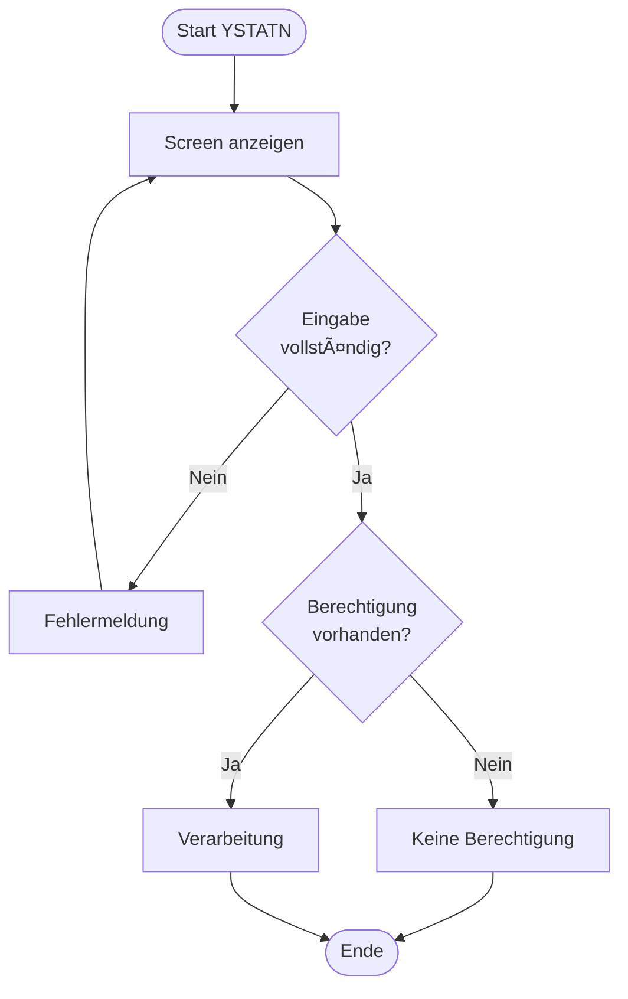

# GUI-Dokumentation: YSTATN - Download Speicherauslastungsstat.

**Transaktion:** YSTATN  
**Programm:** /IBBJ/RO_DOWNLOAD  
**Komponente:** Compliance & Audit (adm)  
**Typ:** Report (SAP Standard)

---

## Ziel

Erstelle eine vollständige GUI-Dokumentation für die Transaktion **YSTATN** mit detaillierten UI-Mockups, Funktionsbeschreibungen und Ablaufdiagrammen.

---

## 1. Analyseaufgaben

### 1.1 Source-Code-Analyse

**Zu analysierende Dateien:**

- SAP Standard-Programm: $program (kein Source verfügbar)

**Analysiere:**

1. **Selection-Screen Definitionen**

   - PARAMETERS
   - SELECT-OPTIONS
   - RADIOBUTTON GROUPS
   - Checkboxen
   - Pflichtfelder (OBLIGATORY)

2. **Screen-Felder** (aus screen\_\*.abap, falls vorhanden)

   - Feldnamen
   - Feldtypen (INPUT, OUTPUT, CHECKBOX, RADIOBUTTON)
   - Labels/Texte
   - Gruppierungen (FRAME)

3. **Ablauflogik**

   - AT SELECTION-SCREEN Ereignisse
   - Validierungen
   - Berechtigungsprüfungen
   - Datenabfragen

4. **Ausgabeformate**
   - ALV-Grids (Feldkatalog)
   - Listen (WRITE Statements)
   - Popup-Dialoge

---

## 2. Mockup-Erstellung

### 2.1 Hauptbildschirm (Selection-Screen oder Einstiegsmaske)

Erstelle ein detailliertes ASCII-Art Mockup nach diesem Muster:

```
┌─────────────────────────────────────────────────────────────────────────┐
│ YSTATN - Download Speicherauslastungsstat.                                         ⊠ □ ×  │
├─────────────────────────────────────────────────────────────────────────┤
│ System  Edit  Goto  Utilities  Environment  System  Help              │
├─────────────────────────────────────────────────────────────────────────┤
│ 📄 💾 🖨️ 📧 ✂️ 📋 ↩️ ↪️ 🔍 🔧 ❓                                          │
├─────────────────────────────────────────────────────────────────────────┤
│                                                                         │
│  [Beschreibe hier basierend auf der Analyse]                            │
│                                                                         │
└─────────────────────────────────────────────────────────────────────────┘
```

**Beschreibung des Hauptbildschirms:**

- **Zweck:** [Beschreibe den Zweck des Screens basierend auf Code-Analyse]
- **Eingabefelder:** [Liste aus Code extrahieren]
- **Optionen:** [Aus Code extrahieren]
- **Buttons:** [Aus Code extrahieren]

---

### 2.2 Detailansicht / Arbeitsoberfläche

[Nicht verfügbar - SAP Standard-Programm]

---

### 2.3 Ergebnisliste (ALV-Grid)

[Falls vorhanden, erstelle ALV-Grid Mockup basierend auf Feldkatalog im Code]

---

### 2.4 Fehlerzustände und Validierungen

[Dokumentiere Fehlermeldungen aus Code - suche nach MESSAGE]

---

## 3. Ablaufdiagramm

Erstelle ein Mermaid-Diagramm des Programmflusses:



**Ablaufbeschreibung:**

[Beschreibe basierend auf Code-Analyse]

---

## 4. Funktionsbeschreibung

### 4.1 Hauptfunktionalitäten

1. **[Funktion 1]**
   - **Beschreibung:** [Aus Code extrahieren]
   - **Auslöser:** [Aus Code extrahieren]
   - **Parameter:** [Aus Code extrahieren]
   - **Ergebnis:** [Aus Code extrahieren]

### 4.2 Tastenkombinationen / Shortcuts

| Taste  | Funktion   |
| ------ | ---------- |
| F3     | Zurück    |
| F8     | Ausführen |
| Ctrl+S | Sichern    |
| Ctrl+F | Suchen     |

### 4.3 Berechtigungen

**Erforderliche Berechtigungsobjekte:**

[Aus Code extrahieren - suche nach AUTHORITY-CHECK]

**Prüfungen im Code:**

[Liste AUTHORITY-CHECK Statements]

---

## 5. Technische Details

### 5.1 Datenbankzugriffe

**Gelesene Tabellen:**

[Aus Code extrahieren - suche nach SELECT]

**Schreibzugriffe:**

[Aus Code extrahieren - suche nach INSERT/UPDATE/DELETE/MODIFY]

### 5.2 RFC-Calls / Function Modules

**Aufgerufene Funktionsbausteine:**

[Aus Code extrahieren - suche nach CALL FUNCTION]

### 5.3 Performance-Aspekte

- **Kritische Queries:** [Langsame SELECT-Statements identifizieren]
- **Optimierungspotenzial:** [Verbesserungsvorschläge]
- **Laufzeitverhalten:** [Typische Ausführungszeit schätzen]

---

## 6. Verlinkungen in Dokumentation

### 6.1 Update Komponenten-Dokumentation

Füge Verlinkung in `#file:../../../../docs/03_ComponentDocumentation/2.06_AuditLoggingDocumentation.md` ein:

Ergänze im Abschnitt "GUI-Transaktionen":

```markdown
#### YSTATN - Download Speicherauslastungsstat.

**Typ:** Report (SAP Standard)  
**Hauptprogramm:** `/IBBJ/RO_DOWNLOAD`

**Zweck:** [Kurzbeschreibung basierend auf Analyse]

**Detaillierte Dokumentation:** [GUI-Mockup YSTATN](./../../../.github/prompts/3_DepthDocumentation/11_GUI_Prompts/YSTATN_Mockup.md)

**Hauptfunktionen:**

- [Funktion 1]
- [Funktion 2]
- [Funktion 3]
```

### 6.2 Update GUI-Ãœbersicht

Aktualisiere `#file:../../../../docs/03_ComponentDocumentation/GUI_Overview.md`:

Ändere Status von ⏳ zu ✅ für YSTATN.

---

## 7. Output-Dateien

Erstelle folgende Dateien:

1. **GUI-Mockup-Dokumentation:**
   `#newfile:YSTATN_Mockup.md`

2. **Update GUI-Ãœbersicht:**
   `#file:../../../../docs/03_ComponentDocumentation/GUI_Overview.md`

3. **Update Komponenten-Dokumentation:**
   `#file:../../../../docs/03_ComponentDocumentation/2.06_AuditLoggingDocumentation.md`

---

## Qualitätskriterien

Stelle sicher, dass die Dokumentation folgende Kriterien erfüllt:

- ✅ **Vollständigkeit:** Alle Screens und Funktionen dokumentiert
- ✅ **Realitätsnähe:** Mockups sehen wie echtes SAP GUI aus
- ✅ **Beispieldaten:** Realistische Testdaten in Mockups
- ✅ **Lesbarkeit:** Klare Struktur und verständliche Beschreibungen
- ✅ **Verlinkungen:** Alle Cross-References korrekt gesetzt
- ✅ **Technische Tiefe:** Code-Analyse ausreichend detailliert
- ✅ **Ablauflogik:** Programmfluss nachvollziehbar dargestellt

---

## Hinweise

- Verwende die Mockup-Techniken aus `01.04_CreateMockups.prompt.md`
- Analysiere den ABAP-Code gründlich, um genaue Feldbeschreibungen zu erhalten
- Beachte Kommentare im Code für Kontextinformationen
- Prüfe auf mehrsprachige Textelemente
- Identifiziere alle Berechtigungsprüfungen
