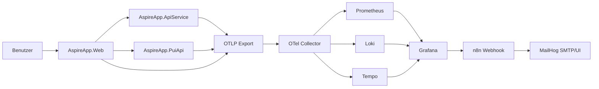

# AspireApp Gesamtübersicht

## Inhaltsverzeichnis
- [Zielbild](#zielbild)
- [Architektur](#architektur)
- [Funktionsübersicht pro Projekt](#funktionsübersicht-pro-projekt)
- [Endpunkte und technische Funktionen](#endpunkte-und-technische-funktionen)
- [Vollständiger Dateikatalog (AspireApp)](#vollständiger-dateikatalog-aspireapp)
- [Observability- und Alerting-Pipeline](#observability--und-alerting-pipeline)
- [Konfiguration und Betrieb](#konfiguration-und-betrieb)
- [Troubleshooting](#troubleshooting)

## Zielbild
AspireApp ist eine verteilte .NET-8-Demo mit fünf Projekten:
- AspireApp.AppHost
- AspireApp.ServiceDefaults
- AspireApp.ApiService
- AspireApp.PuiApi
- AspireApp.Web

Der technische Zweck ist ein vollständiger lokaler Kreislauf aus:
1. Anwendungstraffic
2. Telemetrie-Erzeugung (Logs, Metriken, Traces)
3. Verarbeitung im OTel-Collector
4. Visualisierung in Grafana (Prometheus/Loki/Tempo)
5. Alerting und Automatisierung via n8n

## Architektur

## Funktionsübersicht pro Projekt

### AspireApp.AppHost
Zentrale Orchestrierung aller Container und Projekte in Program.cs.

Wesentliche Funktionen:
- Startet Observability-Container: Prometheus, Loki, Tempo, OTel-Collector, Grafana.
- Startet Hilfsdienste: MailHog und n8n.
- Setzt feste Host-Ports (isProxied: false) für reproduzierbare lokale Zugriffe.
- Startet Projekt-Workloads apiservice, puiapi, webfrontend.
- Setzt OTLP-Umgebungsvariablen für alle Workloads.
- Bindet n8n-Workflows und MailHog-Credential als ReadOnly-Mounts ein.
- Führt n8n-Import/Activation beim Containerstart aus:
  - n8n import:credentials
  - n8n import:workflow --separate
  - n8n update:workflow --all --active=true

### AspireApp.ServiceDefaults
Gemeinsame Infrastrukturkonfiguration in Extensions.cs.

Wesentliche Funktionen:
- AddServiceDefaults(...): aktiviert OpenTelemetry, Health Checks, Service Discovery, HTTP-Resilience.
- ConfigureOpenTelemetry(...):
  - Logging per OpenTelemetry
  - Metriken: ASP.NET Core, HttpClient, Runtime
  - Tracing: ASP.NET Core, HttpClient
- AddOpenTelemetryExporters(...): OTLP-Exporter nur bei gesetztem OTEL_EXPORTER_OTLP_ENDPOINT.
- AddDefaultHealthChecks(...): registriert self-Check (Tag live).
- MapDefaultEndpoints(...): mappt /health und /alive im Development-Umfeld.

### AspireApp.ApiService
Minimal API für Wetterdaten in Program.cs.

Wesentliche Funktionen:
- AddServiceDefaults() und AddProblemDetails().
- GET /weatherforecast:
  - erzeugt 5 zufällige Forecast-Einträge
  - Rückgabe als Array von WeatherForecast.
- MapDefaultEndpoints() und app.Run().

### AspireApp.PuiApi
Domänenspezifische Test- und Simulations-API in Program.cs.

Wesentliche Funktionen:
- AddServiceDefaults(), AddProblemDetails().
- Registriert HttpClient pui-remote (Pui:BaseUrl/PUI_BASE_URL/Fallback postman-echo).
- Registriert Singleton Observability und zusätzliche OTel-Registrierung (Source/Meter AspireApp.PuiApi).
- GET /: einfacher Service-Status.
- API-Gruppe /api/pui mit Endpunkten:
  - POST /actions/{name}
  - GET /report
  - POST /simulations/{scenario}
  - POST /reset
  - GET /simulations/state
- Simulationszustand über SimulationState:
  - IsDown
  - SlowMode
  - ErrorBurstRemaining
- Metriken über Observability:
  - pui.requests.total
  - pui.requests.failed
  - pui.actions.success
  - pui.request.duration
- Tracing über ActivitySource AspireApp.PuiApi.

### AspireApp.Web
Blazor Server Frontend mit Razor Components.

Wesentliche Funktionen:
- Program.cs:
  - AddServiceDefaults()
  - AddRazorComponents().AddInteractiveServerComponents()
  - AddOutputCache()
  - HttpClient für apiservice und puiapi via Service Discovery (https+http://...)
  - Pipeline: HTTPS, StaticFiles, Antiforgery, OutputCache
  - MapRazorComponents<App>().AddInteractiveServerRenderMode()
  - MapDefaultEndpoints()
- PuiApiClient:
  - RunActionAsync(actionName)
  - SetScenarioAsync(scenario)
- WeatherApiClient:
  - GetWeatherAsync(maxItems)
- Razor-Seiten:
  - Home
  - Counter
  - Weather
  - Pui
  - Error

## Endpunkte und technische Funktionen

### ApiService
- GET /weatherforecast
- /health und /alive (nur Development über MapDefaultEndpoints)

### PuiApi
- GET /
- POST /api/pui/actions/{name}
- GET /api/pui/report
- POST /api/pui/simulations/{scenario}
- POST /api/pui/reset
- GET /api/pui/simulations/state
- /health und /alive (nur Development)

### Web
- UI-Routen: /, /counter, /weather, /pui, /Error
- /health und /alive (nur Development)

### n8n (Workflows)
- Alert-Workflow Webhook-Knotenpfad: grafana-alert
- Incident-Workflow Webhook-Knotenpfad: pui-incident
- Mailversand über SMTP-Credential mailhog-smtp

## Vollständiger Dateikatalog (AspireApp)

Hinweis: Der Katalog umfasst alle nicht-generierten Dateien unter AspireApp (bin/obj ausgenommen).

| Datei | Typ | Zweck / Inhalt |
| --- | --- | --- |
| AspireApp/AspireApp.sln | Solution | Enthält fünf Projekte und Build-Konfigurationen (Debug/Release, AnyCPU/x64/x86). |
| AspireApp/AspireApp.ApiService/AspireApp.ApiService.csproj | Projektdatei | net8.0 Web SDK, Referenz auf ServiceDefaults. |
| AspireApp/AspireApp.ApiService/Program.cs | C# | Minimal-API /weatherforecast, ProblemDetails, ServiceDefaults, Health-Mapping. |
| AspireApp/AspireApp.ApiService/appsettings.json | JSON | Logging-Level + AllowedHosts. |
| AspireApp/AspireApp.ApiService/appsettings.Development.json | JSON | Development-Logging-Level. |
| AspireApp/AspireApp.ApiService/Properties/launchSettings.json | JSON | Lokale Startprofile (http 5324, https 7301). |
| AspireApp/AspireApp.AppHost/AspireApp.AppHost.csproj | Projektdatei | net8.0 Exe, IsAspireHost=true, Package Aspire.Hosting.AppHost 8.2.2, Referenzen auf Web/API/PuiApi. |
| AspireApp/AspireApp.AppHost/Program.cs | C# | Orchestriert Container und Projekte, Portmapping, n8n-Startup-Importlogik, OTLP-Env. |
| AspireApp/AspireApp.AppHost/appsettings.json | JSON | Logging inkl. Aspire.Hosting.Dcp auf Warning. |
| AspireApp/AspireApp.AppHost/appsettings.Development.json | JSON | Development-Logging-Level. |
| AspireApp/AspireApp.AppHost/Properties/launchSettings.json | JSON | AppHost-Startprofile, Dashboard-/Resource-Service-Umgebungsvariablen. |
| AspireApp/AspireApp.AppHost/observability/prometheus.yml | YAML | Prometheus-Scrape-Intervall + Self-Scrape. |
| AspireApp/AspireApp.AppHost/observability/prometheus-enable-remote-write.txt | TXT | Erläutert notwendiges Prometheus-Flag für remote_write. |
| AspireApp/AspireApp.AppHost/observability/loki-config.yaml | YAML | Loki Single-Node-Konfiguration (tsdb, Retention, Limits). |
| AspireApp/AspireApp.AppHost/observability/tempo-config.yaml | YAML | Tempo OTLP-Receiver, Metrics Generator, local storage, remote_write zu Prometheus. |
| AspireApp/AspireApp.AppHost/observability/otel-collector-config.yaml | YAML | Receiver OTLP, Processor batch/resource, Exporter zu Prometheus/Loki/Tempo + debug. |
| AspireApp/AspireApp.AppHost/observability/grafana/provisioning/datasources/datasources.yaml | YAML | Datasources Prometheus/Loki/Tempo inkl. Trace-Korrelation. |
| AspireApp/AspireApp.AppHost/observability/grafana/provisioning/dashboards/dashboards.yaml | YAML | Dashboard-Provider PUI Observability, Dateipfad /var/lib/grafana/dashboards. |
| AspireApp/AspireApp.AppHost/observability/grafana/provisioning/alerting/contact-points.yaml | YAML | Contact Point n8n-webhook auf host.docker.internal:35678/... |
| AspireApp/AspireApp.AppHost/observability/grafana/provisioning/alerting/notification-policies.yaml | YAML | Gruppierung und Wiederholungsintervalle für Alerts. |
| AspireApp/AspireApp.AppHost/observability/grafana/provisioning/alerting/rules.yaml | YAML | Regeln HighErrorRate, SlowResponse, ServiceDown, ExceptionSpike, FailedRequestsBurst. |
| AspireApp/AspireApp.AppHost/observability/grafana/dashboards/pui-system-health.json | JSON | Dashboard PUI - System Health; Panels: Monitoring Stack Up, Request Rate, API p95 Latency, Error Rate. |
| AspireApp/AspireApp.AppHost/observability/grafana/dashboards/pui-business-metrics.json | JSON | Dashboard PUI - Business Metrics; Panels: PUI Requests Total, Successful Actions, Failed Requests, P95 Action Duration by Action, Requests per Action. |
| AspireApp/AspireApp.AppHost/observability/grafana/dashboards/pui-logs.json | JSON | Dashboard PUI - Logs; Panels: Application Logs, Error Logs by Service (5m), Log Volume by Service (5m). |
| AspireApp/AspireApp.AppHost/observability/grafana/dashboards/pui-traces.json | JSON | Dashboard PUI - Traces; Panels: Trace Search, Trace Volume by Service. |
| AspireApp/AspireApp.AppHost/observability/n8n/mailhog-credential.json | JSON | n8n SMTP-Credential für MailHog (host.docker.internal:32525). |
| AspireApp/AspireApp.AppHost/observability/n8n/workflows/pui-alert-router.workflow.json | JSON | Workflow-Definition: Alert normalisieren, Teams/Email/Slack senden, Webhook-Antwort. |
| AspireApp/AspireApp.AppHost/observability/n8n/workflows/pui-alert-router.import.json | JSON | Import-Wrapper (Array-Format) für pui-alert-router.workflow.json. |
| AspireApp/AspireApp.AppHost/observability/n8n/workflows/pui-incident-automation.workflow.json | JSON | Workflow-Definition: Incident aufbauen, Critical-Branch, GitHub-Issue/Teams, Response. |
| AspireApp/AspireApp.AppHost/observability/n8n/workflows/pui-incident-automation.import.json | JSON | Import-Wrapper (Array-Format) für pui-incident-automation.workflow.json. |
| AspireApp/AspireApp.AppHost/observability/n8n/database.sqlite | SQLite | Laufzeitzustand von n8n (lokaler State/Execution-Historie). Kein Quellcode-Artefakt. |
| AspireApp/AspireApp.PuiApi/AspireApp.PuiApi.csproj | Projektdatei | net8.0 Web SDK, Referenz auf ServiceDefaults. |
| AspireApp/AspireApp.PuiApi/Program.cs | C# | PUI-Endpunkte, Simulationslogik, Metriken/Tracing, Remote-Call-Verhalten. |
| AspireApp/AspireApp.PuiApi/appsettings.json | JSON | Pui:BaseUrl + Logging + AllowedHosts. |
| AspireApp/AspireApp.PuiApi/appsettings.Development.json | JSON | Development-Config für Pui:BaseUrl und Logging. |
| AspireApp/AspireApp.PuiApi/Properties/launchSettings.json | JSON | Lokale Startprofile (http 5190, https 7102). |
| AspireApp/AspireApp.ServiceDefaults/AspireApp.ServiceDefaults.csproj | Projektdatei | Shared-Infrastrukturpakete (Service Discovery, Resilience, OTel). |
| AspireApp/AspireApp.ServiceDefaults/Extensions.cs | C# | Zentraler Infrastruktur-Baukasten für alle Services. |
| AspireApp/AspireApp.Web/AspireApp.Web.csproj | Projektdatei | net8.0 Web SDK, Referenz auf ServiceDefaults. |
| AspireApp/AspireApp.Web/Program.cs | C# | Frontend-Bootstrap, HttpClients, Middleware, Razor-Komponenten-Mapping. |
| AspireApp/AspireApp.Web/PuiApiClient.cs | C# | Client für PUI-Endpunkte (Action/Scenario). |
| AspireApp/AspireApp.Web/WeatherApiClient.cs | C# | Client für /weatherforecast mit Streaming-Deserialisierung. |
| AspireApp/AspireApp.Web/appsettings.json | JSON | Logging + AllowedHosts. |
| AspireApp/AspireApp.Web/appsettings.Development.json | JSON | Development-Logging-Level. |
| AspireApp/AspireApp.Web/Properties/launchSettings.json | JSON | Lokale Startprofile (http 5101, https 7215). |
| AspireApp/AspireApp.Web/Components/_Imports.razor | Razor | Globale using-Direktiven für Komponenten. |
| AspireApp/AspireApp.Web/Components/App.razor | Razor | HTML-Shell, CSS/Script-Referenzen, Host für Routes-Komponente. |
| AspireApp/AspireApp.Web/Components/Routes.razor | Razor | Router-Konfiguration inkl. DefaultLayout und FocusOnNavigate. |
| AspireApp/AspireApp.Web/Components/Layout/MainLayout.razor | Razor | Hauptlayout mit Sidebar, Top-Bar und Error-UI. |
| AspireApp/AspireApp.Web/Components/Layout/MainLayout.razor.css | CSS | Layout-Styling inkl. Responsive Sidebar und Error-UI-Stile. |
| AspireApp/AspireApp.Web/Components/Layout/NavMenu.razor | Razor | Navigationsmenü für Home/Counter/Weather/PUI Demo. |
| AspireApp/AspireApp.Web/Components/Layout/NavMenu.razor.css | CSS | Styling für Navbar, Toggler, Icons und Nav-Zustände. |
| AspireApp/AspireApp.Web/Components/Pages/Home.razor | Razor | Startseite (Hello world). |
| AspireApp/AspireApp.Web/Components/Pages/Counter.razor | Razor | Interaktiver Zähler mit IncrementCount-Funktion. |
| AspireApp/AspireApp.Web/Components/Pages/Weather.razor | Razor | Wettertabelle über WeatherApiClient, StreamRendering + OutputCache(5s). |
| AspireApp/AspireApp.Web/Components/Pages/Pui.razor | Razor | UI für PUI-Aktionen und Szenarien, Ergebnisanzeige mit Status/Payload. |
| AspireApp/AspireApp.Web/Components/Pages/Error.razor | Razor | Fehlerseite mit Request-ID-Auflösung über Activity/HttpContext. |
| AspireApp/AspireApp.Web/wwwroot/app.css | CSS | Globale Basisstyles und Blazor-Error-Boundary-Styling. |
| AspireApp/AspireApp.Web/wwwroot/favicon.png | Asset | Favicon der Web-App. |
| AspireApp/AspireApp.Web/wwwroot/bootstrap/bootstrap.min.css | Asset | Bootstrap-Minified-CSS. |
| AspireApp/AspireApp.Web/wwwroot/bootstrap/bootstrap.min.css.map | Asset | Source-Map für bootstrap.min.css. |

## Observability- und Alerting-Pipeline

1. Die Services exportieren OTLP-Daten an den Collector (Endpoint via OTEL_EXPORTER_OTLP_ENDPOINT).
2. Der Collector schreibt:
   - Metriken per prometheusremotewrite nach Prometheus
   - Logs per otlphttp/loki nach Loki
   - Traces per otlp/tempo nach Tempo
3. Grafana nutzt provisionierte Datasources und Dashboards.
4. Alert-Regeln werden in rules.yaml ausgewertet.
5. Notification Policy routet auf Contact Point n8n-webhook.
6. n8n verarbeitet Webhook-Events in zwei Workflows und versendet u. a. E-Mail via MailHog.

## Konfiguration und Betrieb

### Relevante lokale Ports
- Aspire Dashboard: https://localhost:17290
- AppHost HTTP: http://localhost:15076
- Grafana: http://localhost:33000
- Prometheus: http://localhost:39090
- Loki: http://localhost:33100
- Tempo: http://localhost:33200
- OTel Collector OTLP gRPC: http://localhost:34317
- OTel Collector OTLP HTTP: http://localhost:34318
- OTel Collector Health: http://localhost:31333
- MailHog SMTP: localhost:32525
- MailHog UI: http://localhost:38025
- n8n: http://localhost:35678
- ApiService: http://localhost:5324 / https://localhost:7301
- PuiApi: http://localhost:5190 / https://localhost:7102
- Web: http://localhost:5101 / https://localhost:7215

### Startmodus-Hinweis
aspire start benötigt .NET SDK 10.0.100+.
Für diese Lösung mit installiertem SDK 9.0.306 wird AppHost per dotnet run auf AspireApp.AppHost.csproj gestartet.

## Troubleshooting

### aspire start meldet "No supported app hosts were found"
Ursache: SDK-Version < 10.0.100.
Lösung: AppHost mit dotnet run starten oder SDK aktualisieren.

### Grafana zeigt keine aktuellen Daten
Prüfen:
1. OTel-Collector läuft (Health 31333).
2. OTEL_EXPORTER_OTLP_ENDPOINT wird in allen drei Workloads gesetzt.
3. Prometheus Remote-Write Receiver aktiv (Flag in AppHost gesetzt).

### n8n-Workflow reagiert nicht
Prüfen:
1. Workflows wurden im Array-Importformat (*.import.json) importiert.
2. update:workflow --all --active=true wurde ausgeführt.
3. n8n wurde danach neu gestartet.

### Teams/Slack-Nodes melden JSON-Validierungsfehler
Für n8n HTTP Request mit specifyBody=json muss jsonBody als Objekt-Expression gesetzt sein, z. B.:
={{ {"text": "..."} }}

### Mailversand funktioniert nicht
Prüfen:
1. Credential mailhog-smtp existiert.
2. Host ist host.docker.internal, Port 32525.
3. MailHog UI auf 38025 zeigt eingehende Nachrichten.

## Weiterführende Detaildokumente
- [03_AspireApp_AppHost.md](03_AspireApp_AppHost.md)
- [03_AspireApp_PuiApi.md](03_AspireApp_PuiApi.md)
- [03_AspireApp_Observability.md](03_AspireApp_Observability.md)
