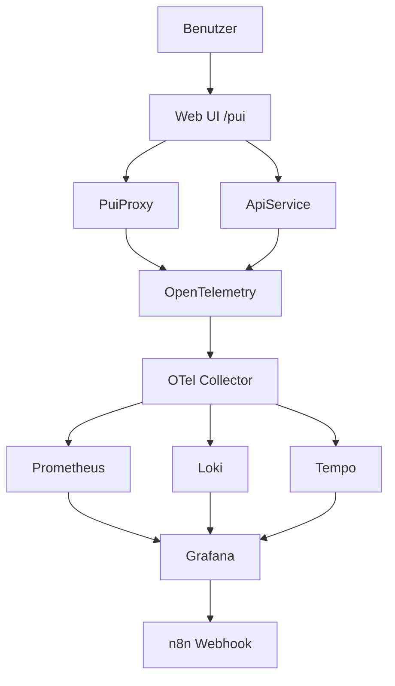

# AspireApp Gesamtübersicht

## Inhaltsverzeichnis
- [Überblick](#überblick)
- [Best-of-Umsetzungsplan (WP1-WP5)](#best-of-umsetzungsplan-wp1-wp5)
- [Projektstruktur](#projektstruktur)
- [Komponenten](#komponenten)
- [End-to-End-Pipeline](#end-to-end-pipeline)
- [Kompakter Demo-Flow](#kompakter-demo-flow)
- [Konfiguration und Laufzeit](#konfiguration-und-laufzeit)
- [Wichtige URLs](#wichtige-urls)
- [Troubleshooting](#troubleshooting)

## Überblick
AspireApp ist eine kleine verteilte Demo-Anwendung auf Basis von .NET Aspire. Die Lösung verbindet eine Web-Oberfläche, eine API, einen Simulationsdienst und eine zentrale Orchestrierung mit Observability-Stack, damit Logs, Metriken, Traces und Alerts gemeinsam sichtbar werden.

Die Lösung enthält genau diese Projekte in [AspireApp.sln](../AspireApp/AspireApp.sln#L6):
- [AspireApp.AppHost](../AspireApp/AspireApp.sln#L6)
- [AspireApp.ServiceDefaults](../AspireApp/AspireApp.sln#L8)
- [AspireApp.ApiService](../AspireApp/AspireApp.sln#L10)
- [AspireApp.Web](../AspireApp/AspireApp.sln#L12)
- [AspireApp.PuiProxy](../AspireApp/AspireApp.sln#L14)

## Best-of-Umsetzungsplan (WP1-WP5)

### WP1 - Architektur und Setup
**Was konkret:**
- Der AppHost orchestriert sieben Container-Ressourcen: `otel-collector`, `prometheus`, `loki`, `tempo`, `grafana`, `mailhog`, `n8n`.
- Alle Observability-Dienste werden per Bind-Mount aus `observability/` konfiguriert.
- `apiservice`, `puiproxy` und `webfrontend` sind über `OTEL_EXPORTER_OTLP_ENDPOINT=http://localhost:34317` an den Collector angebunden.

**Warum:**
Ohne diesen Stack gibt es kein gemeinsames Ziel für Metriken, Logs und Traces. Der AppHost liefert zusätzlich das Aspire-Dashboard als Dev-Ansicht, während Grafana die Demo-Ansicht bereitstellt.

**Skippable:** Nein. Das ist die Basisinfrastruktur.

### WP2 - Telemetry Integration
**Was konkret:**
- Die Service Defaults aktivieren OpenTelemetry-Basistelemetrie für ASP.NET Core, HTTP-Clients und Runtime.
- Fachliche Trigger und Metriken liegen im `PuiProxy` (nicht im `ApiService`), inklusive Simulationen `error-burst`, `slow`, `down`, `reset`.
- Der Collector verarbeitet drei Pipelines (`metrics`, `logs`, `traces`) und exportiert nach Prometheus, Loki und Tempo.

**Warum:**
Die Kombination aus technischer Basistelemetrie und PUI-spezifischen Triggern macht die Demo reproduzierbar und fachlich aussagekräftig.

**Skippable:** Nein. Reduzierbar nur mit deutlichem Verlust an Demo-Wirkung.

### WP3 - Grafana Dashboard
**Was konkret:**
- Dashboards sind per Provisioning automatisch geladen.
- Der aktuelle Ist-Stand nutzt vier spezialisierte Dashboards statt eines Monolithen:
    - `pui-system-health`
    - `pui-business-metrics`
    - `pui-logs`
    - `pui-traces`

**Warum:**
So bleibt die Demo klar lesbar: Health, Business, Logs und Traces sind getrennt und schnell navigierbar.

**Skippable:** Nein. Ohne kuratierte Grafana-Sicht fehlt die zentrale Demo-Oberfläche.

### WP4 - Alerting und Notification
**Was konkret:**
- Grafana-Regeln sind provisioniert (u. a. Error Rate, Slow Response, Service Down, Exception Spike, Failed Requests Burst).
- Der Contact Point zeigt auf `n8n-webhook` (Webhook), nicht direkt auf SMTP.
- n8n übernimmt das Routing und kann Benachrichtigungen u. a. Richtung MailHog/SMTP, Teams oder Slack weitergeben.

**Warum:**
Der Mehrwert ist nicht nur Alarmierung, sondern automatisierbare Weiterverarbeitung des Alerts.

**Skippable:** Für einen Pitch nur eingeschränkt. Mindestens eine aktiv nutzbare Regel sollte gezeigt werden.

### WP5 - Demo und Pitch
**Was konkret:**
- Kompakte Storyline mit klaren Triggern aus der PUI.
- Fallback-Screenshots aus Grafana und n8n für den Notfall.
- Fokus auf Nutzenbotschaft: Probleme sichtbar machen, priorisieren und automatisiert weiterleiten.

**Warum:**
Die technische Tiefe wird erst mit einer klaren Story als Mehrwert wahrgenommen.

**Skippable:** Nein. Kürzbar ja, aber nicht streichen.

## Projektstruktur
Das System ist in fünf funktionale Schichten aufgeteilt:

1. **AppHost** startet und verknüpft alle Dienste.
2. **ServiceDefaults** liefert gemeinsame Infrastruktur wie Service Discovery, Health Checks und OpenTelemetry.
3. **ApiService** stellt eine einfache Beispiel-API bereit.
4. **Web** ist die Benutzeroberfläche und ruft die anderen Dienste auf.
5. **PuiProxy** simuliert Fachaktionen, Fehler und Betriebszustände für Observability-Tests.

Die Architektur ist absichtlich klein, aber vollständig genug, um einen echten Observability-Datenfluss zu zeigen.

## Komponenten

### AspireApp.AppHost
[AppHost](../AspireApp/AspireApp.AppHost/Program.cs#L1) ist der Orchestrator. Er startet die Container für Prometheus, Loki, Tempo, OTel Collector, MailHog, n8n und Grafana. Zusätzlich registriert er die lokalen Projekt-Workloads und verbindet sie mit den passenden Umgebungsvariablen und Endpunkten.

Wichtige Stellen im Code:
- Grafana-Container: [Program.cs](../AspireApp/AspireApp.AppHost/Program.cs#L45)
- PuiProxy-Projekt: [Program.cs](../AspireApp/AspireApp.AppHost/Program.cs#L62)
- Web-Projekt: [Program.cs](../AspireApp/AspireApp.AppHost/Program.cs#L67)

Kurz gesagt: AppHost ist der Startpunkt, der aus mehreren Einzelteilen ein lauffähiges Gesamtsystem macht.

### AspireApp.ServiceDefaults
[ServiceDefaults](../AspireApp/AspireApp.ServiceDefaults/Extensions.cs#L17) ist die gemeinsame Basis für alle Services. Die Erweiterung `AddServiceDefaults()` aktiviert:
- OpenTelemetry für Logs, Metriken und Traces
- Service Discovery
- Standard-Resilience für HTTP-Clients
- Default Health Checks

Die relevanten Stellen sind:
- Service Discovery: [Extensions.cs](../AspireApp/AspireApp.ServiceDefaults/Extensions.cs#L23)
- HTTP-Client-Defaults und Resilience: [Extensions.cs](../AspireApp/AspireApp.ServiceDefaults/Extensions.cs#L25)
- OpenTelemetry-Logging und Tracing: [Extensions.cs](../AspireApp/AspireApp.ServiceDefaults/Extensions.cs#L39)

Diese Bibliothek verhindert, dass jede Anwendung dieselbe Infrastruktur-Konfiguration doppelt implementieren muss.

### AspireApp.ApiService
[ApiService](../AspireApp/AspireApp.ApiService/Program.cs#L1) ist die einfache Beispiel-API. Sie stellt den Weather-Endpoint bereit und verwendet ebenfalls die gemeinsamen Service Defaults.

Zentrale Punkte:
- `AddServiceDefaults()` wird direkt aktiviert: [Program.cs](../AspireApp/AspireApp.ApiService/Program.cs#L4)
- Der Beispiel-Endpoint ist `/weatherforecast`: [Program.cs](../AspireApp/AspireApp.ApiService/Program.cs#L19)
- Health-Endpunkte werden über `MapDefaultEndpoints()` bereitgestellt: [Program.cs](../AspireApp/AspireApp.ApiService/Program.cs#L32)

Funktional ist das ein simples Backend, das zeigt, wie eine typische Service-API in Aspire eingebunden wird.

### AspireApp.Web
[Web](../AspireApp/AspireApp.Web/Program.cs#L1) ist die Frontend-Anwendung. Sie rendert die Benutzeroberfläche und ruft Backend-Dienste per HTTP-Client auf.

Wichtige Aufgaben:
- Aktiviert Service Defaults: [Program.cs](../AspireApp/AspireApp.Web/Program.cs#L7)
- Bindet `WeatherApiClient` an `apiservice`: [Program.cs](../AspireApp/AspireApp.Web/Program.cs#L16)
- Bindet `PuiApiClient` an `puiproxy`: [Program.cs](../AspireApp/AspireApp.Web/Program.cs#L22)
- Registriert die Standard-Endpunkte: [Program.cs](../AspireApp/AspireApp.Web/Program.cs#L46)

Die PUI-Seite selbst befindet sich in [Pui.razor](../AspireApp/AspireApp.Web/Components/Pages/Pui.razor#L1). Dort gibt es Buttons zum Auslösen von Fachaktionen und Simulationsszenarien.

### AspireApp.PuiProxy
[PuiProxy](../AspireApp/AspireApp.PuiProxy/Program.cs#L1) ist der Simulations- und Observability-Dienst. Er ist dafür da, echte Betriebszustände nachzustellen und daraus Telemetrie zu erzeugen.

Die wichtigsten Endpunkte sind:
- `POST /pui/action/{name}`: [Program.cs](../AspireApp/AspireApp.PuiProxy/Program.cs#L28)
- `GET /pui/report`: [Program.cs](../AspireApp/AspireApp.PuiProxy/Program.cs#L112)
- `POST /pui/simulate/{scenario}`: [Program.cs](../AspireApp/AspireApp.PuiProxy/Program.cs#L130)

Was der Dienst intern macht:
- Er protokolliert jede Aktion mit Trace-ID und Benutzerkontext.
- Er zählt Requests, Fehler und Erfolgsraten über Metriken.
- Er erzeugt Traces über `ActivitySource`.
- Er simuliert Störungen wie `error-burst`, `slow`, `down` und `reset`.

Damit ist PuiProxy der Teil, der absichtlich Fehler produziert, damit das Observability-Setup sichtbar wird.

## End-to-End-Pipeline
Die komplette Kette läuft so:

1. Der Benutzer öffnet die Web-Oberfläche.
2. Die Web-App ruft PuiProxy oder ApiService per HTTP auf.
3. PuiProxy verarbeitet die Fachaktion oder Simulation.
4. Dabei entstehen Logs, Metriken und Traces.
5. Das OpenTelemetry-Setup exportiert Telemetrie an den Collector.
6. Der Collector leitet Daten an Prometheus, Loki und Tempo weiter.
7. Grafana visualisiert die Daten und bewertet Alert-Regeln.
8. Wenn ein Alert auslöst, sendet Grafana einen Webhook an n8n.
9. n8n nimmt den Alert entgegen und antwortet mit einem Workflow-Resultat.

Die technische Grundlage dafür liegt in:
- [AppHost](../AspireApp/AspireApp.AppHost/Program.cs#L1)
- [ServiceDefaults](../AspireApp/AspireApp.ServiceDefaults/Extensions.cs#L17)
- [Web](../AspireApp/AspireApp.Web/Program.cs#L1)
- [PuiProxy](../AspireApp/AspireApp.PuiProxy/Program.cs#L1)

### Beispielhafter Ablauf für `error-burst`
1. In der Web-App wird `Simulate error-burst` ausgelöst.
2. Die Web-App sendet den Szenario-Request an PuiProxy.
3. PuiProxy setzt die Fehler-Simulation intern auf einen Fehlerzähler.
4. Die nächste Fachaktion liefert einen HTTP-500-Fehler.
5. Die Fehler-Metrik steigt.
6. Grafana erkennt die Regelverletzung.
7. Der Alert wird an n8n weitergereicht.
8. n8n beantwortet den Webhook und dokumentiert die Ausführung.

## Kompakter Demo-Flow

1. **Normalzustand zeigen:** PUI-Aktion auslösen, in Grafana normale Werte und grüne Lage zeigen.
2. **Langsamkeit zeigen:** `slow` aktivieren, erneut Aktion auslösen, steigende Latenz im Health-Dashboard demonstrieren.
3. **Fehlerphase zeigen:** `error-burst` aktivieren, Aktionen auslösen, Error-Rate und Fehlermetriken sichtbar machen.
4. **Alert-Kette zeigen:** In Grafana den ausgelösten Alert öffnen, dann n8n-Webhook-Verarbeitung und Ergebnis anzeigen.
5. **Recovery zeigen:** `reset` auslösen und Stabilisierung der Signale in Grafana verifizieren.

## Konfiguration und Laufzeit
Die gemeinsame Telemetrie-Konfiguration ist in [ServiceDefaults](../AspireApp/AspireApp.ServiceDefaults/Extensions.cs#L17) implementiert. Dort wird OpenTelemetry nur dann mit einem OTLP-Exporter aktiviert, wenn ein Endpoint in der Konfiguration vorhanden ist.

Im AppHost werden die Container mit festen Host-Ports und ohne Proxied-Endpoint gestartet. Das macht die lokale Laufzeit stabiler und einfacher zu erreichen.

Wichtige Ressourcen im aktuellen Setup:
- Grafana: `http://localhost:33000`
- n8n: `http://localhost:35678`
- Prometheus: `http://localhost:39090`
- Loki: `http://localhost:33100`
- Tempo: `http://localhost:33200`

## Wichtige URLs
- Aspire Dashboard: `https://localhost:17290/`
- Grafana: `http://localhost:33000/`
- n8n: `http://localhost:35678/`
- PUI-Seite: im Web-Frontend unter `/pui`
- ApiService-Health: über die Standard-Endpunkte des Dienstes
- PuiProxy-Report: `/pui/report`

## Troubleshooting

### Ich sehe den Aspire Dashboard-Zugriff nicht
Der Dashboard-Host läuft lokal über HTTPS. Wenn das Zertifikat nicht vertraut ist, zeigt der Browser eine Warnung. Das ist bei einer lokalen Development-Umgebung normal.

### Die Web-Oberfläche zeigt keine Daten
Prüfe zuerst, ob AppHost läuft und ob der Web-Dienst die Service Defaults geladen hat. Ohne `AddServiceDefaults()` fehlen häufig Discovery, Telemetrie und Health Checks.

### Alerts kommen nicht in n8n an
Prüfe diese Punkte:
- Grafana ist erreichbar.
- Der n8n-Container läuft.
- Der Contact Point zeigt auf den korrekten Webhook.
- Der Workflow in n8n ist aktiv.

**Fast-Click-Pfad in Grafana:**
`Grafana -> Alerting -> Contact points -> n8n-webhook`

Für das aktuelle Setup ist in der Provisionierung diese URL hinterlegt:
`http://host.docker.internal:35678/webhook/pui-alert-router/grafana-webhook/grafana-alert`

Referenz:
- Contact Point: [contact-points.yaml](../AspireApp/AspireApp.AppHost/observability/grafana/provisioning/alerting/contact-points.yaml#L4)
- n8n Webhook-Node: [pui-alert-router.workflow.json](../AspireApp/AspireApp.AppHost/observability/n8n/workflows/pui-alert-router.workflow.json#L6)

### Der PUI-Test liefert Fehler
Das ist je nach Szenario absichtlich so. `error-burst`, `slow` und `down` sind bewusst eingebaute Simulationen, um Observability und Alerting zu testen.

### Brauche ich einen Token für Aspire?
Für dieses lokale Setup nicht. Die Lösung läuft lokal über AppHost, Docker und die lokalen Dienste. Ein separater Aspire-Token ist für das Starten dieser Demo nicht erforderlich.

## Fazit
AspireApp ist eine lokale, verteilte Demo, die zeigt, wie eine Web-App, ein API-Service und ein Simulationsdienst mit zentraler Orchestrierung, Observability und Alerting zusammenarbeiten. AppHost startet alles, ServiceDefaults standardisiert die Infrastruktur, ApiService liefert ein Backend, Web ist die Oberfläche und PuiProxy erzeugt die Test- und Störfälle für das Monitoring.
