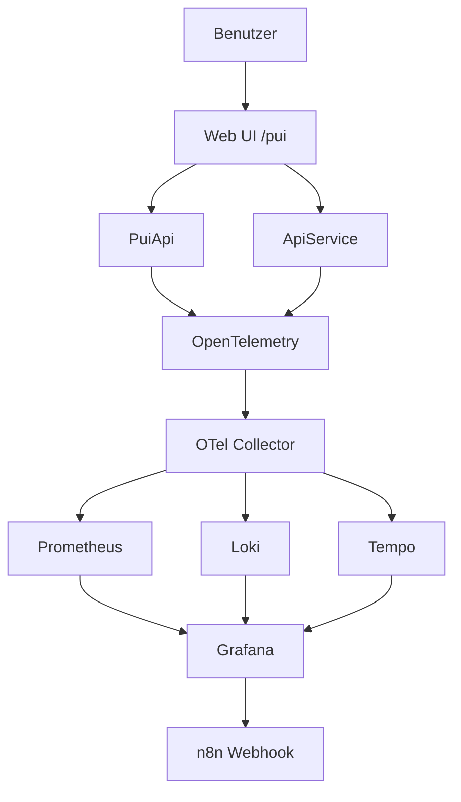

# AspireApp Gesamtübersicht

## Inhaltsverzeichnis
- [Überblick](#überblick)
- [Best-of-Umsetzungsplan für den Hackathon (WP1-WP5)](#best-of-umsetzungsplan-für-den-hackathon-wp1-wp5)
- [Projektstruktur](#projektstruktur)
- [Komponenten](#komponenten)
- [End-to-End-Pipeline](#end-to-end-pipeline)
- [Kompakter Demo-Flow](#kompakter-demo-flow)
- [Konfiguration und Laufzeit](#konfiguration-und-laufzeit)
- [Wichtige URLs](#wichtige-urls)
- [Troubleshooting](#troubleshooting)

## Überblick
AspireApp ist eine kleine verteilte Demo-Anwendung auf Basis von .NET Aspire. Die Lösung verbindet eine Web-Oberfläche, eine API, einen Simulationsdienst und eine zentrale Orchestrierung mit Observability-Stack, damit Logs, Metriken, Traces und Alerts gemeinsam sichtbar werden.

Die Lösung enthält genau diese Projekte in [AspireApp.sln](../AspireApp/AspireApp.sln#L6):
- [AspireApp.AppHost](../AspireApp/AspireApp.sln#L6)
- [AspireApp.ServiceDefaults](../AspireApp/AspireApp.sln#L8)
- [AspireApp.ApiService](../AspireApp/AspireApp.sln#L10)
- [AspireApp.Web](../AspireApp/AspireApp.sln#L12)
- [AspireApp.PuiApi](../AspireApp/AspireApp.sln#L14)

## Best-of-Umsetzungsplan für den Hackathon (WP1-WP5)

### Ziel und Erfolgskriterien
**Ziel:** In einer lokalen .NET-Aspire-Demo einen vollständigen Observability-Kreislauf zeigen: Eine PUI-Fachaktion erzeugt technische und fachliche Telemetrie, der LGTM-Stack macht sie sichtbar, Grafana bewertet Alert-Regeln und n8n verarbeitet den Alert automatisiert weiter.

**Erfolgskriterien (messbar und demotauglich):**
- Eine PUI-Aktion ist in unter 60 Sekunden in Grafana als Metrik, Log und Trace nachvollziehbar.
- Mindestens ein Alert wird live ausgelöst und endet sichtbar als n8n-Workflow-Resultat (z. B. MailHog-Mail).
- Die fünf Demo-Schritte (Normal -> Slow -> Error -> Alert -> Recovery) laufen reproduzierbar durch.

### Leitidee
> AppHost, LGTM-Stack und n8n bleiben stabil. Optimiert wird vor allem die Schicht zwischen Web UI und PUI-Service.

Der bisherige `PuiProxy` wird konzeptionell zu einer klar benannten **PuiApi** weiterentwickelt: keine reine Weiterleitungsschicht mehr, sondern eine PUI-Observability-API, die Fachaktionen und Fehlerszenarien bereitstellt und daraus technische und fachliche Telemetrie erzeugt. Diese Evolution ist in [WP2](#wp2---pui-api-und-telemetry-integration) beschrieben und für den Pitch empfohlen, aber nicht zwingend (Fallback siehe dort).

### Priorisierung (MoSCoW)
Bei begrenzter Hackathon-Zeit gilt diese Reihenfolge:

| Priorität | Inhalt | Begründung |
| --- | --- | --- |
| **Must** | WP1 Setup, WP2 Telemetrie (technisch), WP3 Health-Dashboard, ein funktionierender Alert (WP4), WP5 Story | Ohne diese Kette gibt es keine vorzeigbare End-to-End-Demo. |
| **Should** | Fachliche PUI-Metriken, getrennte Dashboards (Business/Logs/Traces), n8n-Routing nach Severity | Hebt die Demo von einer reinen Tool-Schau zu einer fachlichen Story. |
| **Could** | Umbenennung `PuiProxy` -> `PuiApi`, REST-Struktur `/api/pui`, Collector-Processors, Business-Alerts | Hohe Wirkung im Pitch, aber bei Zeitmangel verschiebbar. |
| **Won't (heute)** | Auth, Persistenz, echte externe Notification-Ziele (Teams/Slack/Jira produktiv) | Nicht demo-relevant, erhöht nur Risiko. |

### Zeitplan (Time-Boxing für einen Tag)
| Slot | Fokus | Ergebnis am Ende des Slots |
| --- | --- | --- |
| Block 1 | WP1 + WP2 Basis | Stack läuft, eine PUI-Aktion erzeugt Metrik/Log/Trace |
| Block 2 | WP2 fachlich + WP3 | Health- und Business-Dashboard zeigen reale Werte |
| Block 3 | WP4 | Ein Alert löst aus und erreicht n8n |
| Block 4 | WP5 + Puffer | Story sitzt, Fallback-Screenshots vorhanden, Probelauf erfolgreich |

---

### WP1 - Architektur und Setup
**Ziel:** Eine stabile, reproduzierbare Basisinfrastruktur, auf der alle weiteren Pakete aufsetzen.

**Was konkret:**
- Der AppHost orchestriert sieben Container-Ressourcen: `otel-collector`, `prometheus`, `loki`, `tempo`, `grafana`, `mailhog`, `n8n`.
- Alle Observability-Dienste werden per Bind-Mount aus `observability/` konfiguriert.
- `apiservice`, `puiapi` und `webfrontend` sind über `OTEL_EXPORTER_OTLP_ENDPOINT=http://localhost:34317` an den Collector angebunden.
- Feste Host-Ports und `isProxied: false` halten die lokale Laufzeit einfach erreichbar.

**Definition of Done:**
- [ ] AppHost startet alle Container ohne Fehler.
- [ ] Aspire-Dashboard und Grafana sind erreichbar.
- [ ] Der Collector-Health-Endpoint antwortet.

**Priorität:** Must. **Fallback:** Keiner. Ohne diese Basis gibt es keine Demo.

### WP2 - PUI API und Telemetry Integration
**Ziel:** Eine klar abgegrenzte PUI-Schicht, die reale Fachaktionen und Fehlerszenarien simuliert und daraus technische sowie fachliche Telemetrie erzeugt.

**Was konkret:**
- Die Service Defaults aktivieren OpenTelemetry-Basistelemetrie für ASP.NET Core, HTTP-Clients und Runtime.
- Fachliche Trigger und Metriken liegen in der PUI-Schicht (nicht im `ApiService`), inklusive Simulationen `error-burst`, `slow`, `down`, `reset`.
- **Technische Telemetrie** entsteht automatisch über die Instrumentierung (Requests, Latenz, Exceptions).
- **Fachliche Telemetrie** entsteht über eigene Meter/ActivitySources, z. B. Zähler für Aktionen je Outcome und ein Histogramm für die Aktionsdauer.
- Der Collector verarbeitet drei Pipelines (`metrics`, `logs`, `traces`) und exportiert nach Prometheus, Loki und Tempo. Empfohlen sind die Processors `memory_limiter`, `batch` und `resource` (einheitliche Attribute wie `service.name`, `deployment.environment=local-demo`).

**Empfohlene Evolution `PuiProxy` -> `PuiApi` (Could, hohe Pitch-Wirkung):**
- Den Dienst von `AspireApp.PuiProxy` zu `AspireApp.PuiApi` weiterentwickeln und im AppHost/Web als `puiapi` referenzieren (einheitlicher `service_name="puiapi"` in Grafana).
- Endpunkte in eine klarere REST-Struktur überführen:

| Heute (Ist) | Empfohlen (Ziel) | Zweck |
| --- | --- | --- |
| `POST /pui/action/{name}` | `POST /api/pui/actions/{name}` | Fachaktion auslösen (z. B. `generate-report`, `export-excel`, `send-warning`) |
| `POST /pui/simulate/{scenario}` | `POST /api/pui/simulations/{scenario}` | Szenario aktivieren (`slow`, `error-burst`, `down`) |
| (Teil von simulate) | `POST /api/pui/reset` | Normalzustand wiederherstellen |
| `GET /pui/report` | `GET /api/pui/report` | Aktuellen Zustand anzeigen |

**Warum:**
Die Kombination aus technischer Basistelemetrie und PUI-spezifischen, fachlich benannten Triggern macht die Demo reproduzierbar und aussagekräftig. Ein klar benannter `puiapi`-Service vereinfacht Dashboards, Queries und Alerts.

**Definition of Done:**
- [ ] Eine ausgelöste PUI-Aktion erscheint als Metrik, Log und Trace in der Pipeline.
- [ ] Die Szenarien `slow`, `error-burst`, `down`, `reset` verändern das beobachtbare Verhalten sichtbar.
- [ ] Mindestens eine fachliche Metrik (Aktionen/Outcome oder Aktionsdauer) ist vorhanden.

**Priorität:** Must (Basis-Telemetrie + Szenarien), Should (fachliche Metriken), Could (Umbenennung + REST-Struktur).
**Fallback:** Bei Zeitmangel beim aktuellen `PuiProxy` mit den bestehenden `/pui/...`-Endpunkten bleiben; nur die Beschreibung/Story auf "PuiApi" ausrichten.

### WP3 - Grafana Dashboard
**Ziel:** Eine an der PUI-Service-Grenze ausgerichtete, klar lesbare Demo-Oberfläche.

**Was konkret:**
- Dashboards sind per Provisioning automatisch geladen.
- Vier spezialisierte Dashboards statt eines Monolithen:
    - `pui-system-health` (Requests, Latenz P95, Error Rate)
    - `pui-business-metrics` (Aktionen je Outcome, Aktionsdauer)
    - `pui-logs` (gefilterte Logs des PUI-Service)
    - `pui-traces` (Request-Pfade für die Ursachenanalyse)

**Warum:**
So bleibt die Demo klar lesbar und folgt einem realistischen Troubleshooting-Pfad: vom Symptom (Health) über die fachliche Auswirkung (Business) bis zur Ursache (Logs/Traces).

**Definition of Done:**
- [ ] Alle vier Dashboards laden automatisch und zeigen Live-Daten.
- [ ] Im Health-Dashboard ist der Latenzanstieg bei `slow` sichtbar.
- [ ] Im Business-Dashboard sind Erfolg/Fehler je Aktion erkennbar.

**Priorität:** Must (Health), Should (Business/Logs/Traces).
**Fallback:** Notfalls nur `pui-system-health` live zeigen, restliche per Screenshot.

### WP4 - Alerting und Notification
**Ziel:** Aus einem sichtbaren Problem wird automatisiert eine weiterverarbeitbare Benachrichtigung.

**Was konkret:**
- Grafana-Regeln sind provisioniert. Empfohlene Zweiteilung:
    - **Technische Alerts:** `HighErrorRate`, `SlowResponse` (P95), `ServiceDown`, `ExceptionSpike`.
    - **Business-Alerts (Could):** `ReportGenerationFailed`, `WarningSendingFailed`, `ExcelExportFailed`, `ActionFailureBurst`.
- Der Contact Point zeigt auf `n8n-webhook` (Webhook), nicht direkt auf SMTP.
- n8n übernimmt das Routing: Payload normalisieren, Severity klassifizieren, Grafana-/Loki-/Tempo-Links anreichern und nach Schweregrad routen (critical -> Teams/Jira, warning -> MailHog/E-Mail, info -> nur protokollieren).

**Warum:**
Der Mehrwert ist nicht nur Alarmierung, sondern Klassifikation, Anreicherung und automatisierte Weiterverarbeitung des Alerts.

**Definition of Done:**
- [ ] Mindestens eine Regel löst im Szenario `error-burst` live aus.
- [ ] Der Alert erreicht n8n und erzeugt ein sichtbares Resultat (z. B. MailHog-Mail).
- [ ] Die Benachrichtigung enthält Service, Szenario und einen Grafana-Link.

**Priorität:** Must (ein funktionierender technischer Alert), Should (n8n-Routing), Could (Business-Alerts).
**Fallback:** Eine einzige robuste Regel (`HighErrorRate`) live zeigen, restliches Routing per Screenshot.

### WP5 - Demo und Pitch
**Ziel:** Eine klare Story, die den technischen Aufbau als Nutzen erlebbar macht.

**Was konkret:**
- Roter Faden: Fachaktion -> Systemstörung -> Observability-Signale -> Alert -> automatisierte Reaktion -> Recovery (Detailablauf siehe [Kompakter Demo-Flow](#kompakter-demo-flow)).
- Nutzenbotschaft: Wir überwachen nicht nur, ob das System technisch gesund ist, sondern auch, ob wichtige PUI-Fachaktionen erfolgreich sind.
- Fallback-Screenshots aus Grafana und n8n für den Notfall.

**Definition of Done:**
- [ ] Ein vollständiger Probelauf der fünf Schritte ist ohne Eingriff durchgelaufen.
- [ ] Fallback-Screenshots liegen bereit.
- [ ] Der Pitch endet mit einer klaren Nutzenaussage.

**Priorität:** Must. **Fallback:** Kürzbar (Slow- oder Recovery-Schritt überspringen), aber nicht streichen.

## Projektstruktur
Das System ist in fünf funktionale Schichten aufgeteilt:

1. **AppHost** startet und verknüpft alle Dienste.
2. **ServiceDefaults** liefert gemeinsame Infrastruktur wie Service Discovery, Health Checks und OpenTelemetry.
3. **ApiService** stellt eine einfache Beispiel-API bereit.
4. **Web** ist die Benutzeroberfläche und ruft die anderen Dienste auf.
5. **PuiApi** simuliert Fachaktionen, Fehler und Betriebszustände für Observability-Tests.

Die Architektur ist absichtlich klein, aber vollständig genug, um einen echten Observability-Datenfluss zu zeigen.

## Komponenten

### AspireApp.AppHost
[AppHost](../AspireApp/AspireApp.AppHost/Program.cs#L1) ist der Orchestrator. Er startet die Container für Prometheus, Loki, Tempo, OTel Collector, MailHog, n8n und Grafana. Zusätzlich registriert er die lokalen Projekt-Workloads und verbindet sie mit den passenden Umgebungsvariablen und Endpunkten.

Wichtige Stellen im Code:
- Grafana-Container: [Program.cs](../AspireApp/AspireApp.AppHost/Program.cs#L45)
- PuiApi-Projekt: [Program.cs](../AspireApp/AspireApp.AppHost/Program.cs#L62)
- Web-Projekt: [Program.cs](../AspireApp/AspireApp.AppHost/Program.cs#L67)

Kurz gesagt: AppHost ist der Startpunkt, der aus mehreren Einzelteilen ein lauffähiges Gesamtsystem macht.

### AspireApp.ServiceDefaults
[ServiceDefaults](../AspireApp/AspireApp.ServiceDefaults/Extensions.cs#L17) ist die gemeinsame Basis für alle Services. Die Erweiterung `AddServiceDefaults()` aktiviert:
- OpenTelemetry für Logs, Metriken und Traces
- Service Discovery
- Standard-Resilience für HTTP-Clients
- Default Health Checks

Die relevanten Stellen sind:
- Service Discovery: [Extensions.cs](../AspireApp/AspireApp.ServiceDefaults/Extensions.cs#L23)
- HTTP-Client-Defaults und Resilience: [Extensions.cs](../AspireApp/AspireApp.ServiceDefaults/Extensions.cs#L25)
- OpenTelemetry-Logging und Tracing: [Extensions.cs](../AspireApp/AspireApp.ServiceDefaults/Extensions.cs#L39)

Diese Bibliothek verhindert, dass jede Anwendung dieselbe Infrastruktur-Konfiguration doppelt implementieren muss.

### AspireApp.ApiService
[ApiService](../AspireApp/AspireApp.ApiService/Program.cs#L1) ist die einfache Beispiel-API. Sie stellt den Weather-Endpoint bereit und verwendet ebenfalls die gemeinsamen Service Defaults.

Zentrale Punkte:
- `AddServiceDefaults()` wird direkt aktiviert: [Program.cs](../AspireApp/AspireApp.ApiService/Program.cs#L4)
- Der Beispiel-Endpoint ist `/weatherforecast`: [Program.cs](../AspireApp/AspireApp.ApiService/Program.cs#L19)
- Health-Endpunkte werden über `MapDefaultEndpoints()` bereitgestellt: [Program.cs](../AspireApp/AspireApp.ApiService/Program.cs#L32)

Funktional ist das ein simples Backend, das zeigt, wie eine typische Service-API in Aspire eingebunden wird.

### AspireApp.Web
[Web](../AspireApp/AspireApp.Web/Program.cs#L1) ist die Frontend-Anwendung. Sie rendert die Benutzeroberfläche und ruft Backend-Dienste per HTTP-Client auf.

Wichtige Aufgaben:
- Aktiviert Service Defaults: [Program.cs](../AspireApp/AspireApp.Web/Program.cs#L7)
- Bindet `WeatherApiClient` an `apiservice`: [Program.cs](../AspireApp/AspireApp.Web/Program.cs#L16)
- Bindet `PuiApiClient` an `puiapi`: [Program.cs](../AspireApp/AspireApp.Web/Program.cs#L22)
- Registriert die Standard-Endpunkte: [Program.cs](../AspireApp/AspireApp.Web/Program.cs#L46)

Die PUI-Seite selbst befindet sich in [Pui.razor](../AspireApp/AspireApp.Web/Components/Pages/Pui.razor#L1). Dort gibt es Buttons zum Auslösen von Fachaktionen und Simulationsszenarien.

### AspireApp.PuiApi
[PuiApi](../AspireApp/AspireApp.PuiApi/Program.cs#L1) ist der Simulations- und Observability-Dienst. Er ist dafür da, echte Betriebszustände nachzustellen und daraus Telemetrie zu erzeugen.

Die wichtigsten Endpunkte sind:
- `POST /api/pui/actions/{name}`: [Program.cs](../AspireApp/AspireApp.PuiApi/Program.cs#L28)
- `GET /api/pui/report`: [Program.cs](../AspireApp/AspireApp.PuiApi/Program.cs#L112)
- `POST /api/pui/simulations/{scenario}`: [Program.cs](../AspireApp/AspireApp.PuiApi/Program.cs#L130)
- `POST /api/pui/reset`: [Program.cs](../AspireApp/AspireApp.PuiApi/Program.cs#L130)

Was der Dienst intern macht:
- Er protokolliert jede Aktion mit Trace-ID und Benutzerkontext.
- Er zählt Requests, Fehler und Erfolgsraten über Metriken.
- Er erzeugt Traces über `ActivitySource`.
- Er simuliert Störungen wie `error-burst`, `slow`, `down` und `reset`.

Damit ist PuiApi der Teil, der absichtlich Fehler produziert, damit das Observability-Setup sichtbar wird.

## End-to-End-Pipeline
Die komplette Kette läuft so:

1. Der Benutzer öffnet die Web-Oberfläche.
2. Die Web-App ruft PuiApi oder ApiService per HTTP auf.
3. PuiApi verarbeitet die Fachaktion oder Simulation.
4. Dabei entstehen Logs, Metriken und Traces.
5. Das OpenTelemetry-Setup exportiert Telemetrie an den Collector.
6. Der Collector leitet Daten an Prometheus, Loki und Tempo weiter.
7. Grafana visualisiert die Daten und bewertet Alert-Regeln.
8. Wenn ein Alert auslöst, sendet Grafana einen Webhook an n8n.
9. n8n nimmt den Alert entgegen und antwortet mit einem Workflow-Resultat.

Die technische Grundlage dafür liegt in:
- [AppHost](../AspireApp/AspireApp.AppHost/Program.cs#L1)
- [ServiceDefaults](../AspireApp/AspireApp.ServiceDefaults/Extensions.cs#L17)
- [Web](../AspireApp/AspireApp.Web/Program.cs#L1)
- [PuiApi](../AspireApp/AspireApp.PuiApi/Program.cs#L1)

### Beispielhafter Ablauf für `error-burst`
1. In der Web-App wird `Simulate error-burst` ausgelöst.
2. Die Web-App sendet den Szenario-Request an PuiApi.
3. PuiApi setzt die Fehler-Simulation intern auf einen Fehlerzähler.
4. Die nächste Fachaktion liefert einen HTTP-500-Fehler.
5. Die Fehler-Metrik steigt.
6. Grafana erkennt die Regelverletzung.
7. Der Alert wird an n8n weitergereicht.
8. n8n beantwortet den Webhook und dokumentiert die Ausführung.

## Kompakter Demo-Flow

1. **Normalzustand zeigen:** PUI-Aktion auslösen, in Grafana normale Werte und grüne Lage zeigen.
2. **Langsamkeit zeigen:** `slow` aktivieren, erneut Aktion auslösen, steigende Latenz im Health-Dashboard demonstrieren.
3. **Fehlerphase zeigen:** `error-burst` aktivieren, Aktionen auslösen, Error-Rate und Fehlermetriken sichtbar machen.
4. **Alert-Kette zeigen:** In Grafana den ausgelösten Alert öffnen, dann n8n-Webhook-Verarbeitung und Ergebnis anzeigen.
5. **Recovery zeigen:** `reset` auslösen und Stabilisierung der Signale in Grafana verifizieren.

## Konfiguration und Laufzeit
Die gemeinsame Telemetrie-Konfiguration ist in [ServiceDefaults](../AspireApp/AspireApp.ServiceDefaults/Extensions.cs#L17) implementiert. Dort wird OpenTelemetry nur dann mit einem OTLP-Exporter aktiviert, wenn ein Endpoint in der Konfiguration vorhanden ist.

Im AppHost werden die Container mit festen Host-Ports und ohne Proxied-Endpoint gestartet. Das macht die lokale Laufzeit stabiler und einfacher zu erreichen.

Wichtige Ressourcen im aktuellen Setup:
- Grafana: `http://localhost:33000`
- n8n: `http://localhost:35678`
- Prometheus: `http://localhost:39090`
- Loki: `http://localhost:33100`
- Tempo: `http://localhost:33200`

## Wichtige URLs
- Aspire Dashboard: `https://localhost:17290/`
- Grafana: `http://localhost:33000/`
- n8n: `http://localhost:35678/`
- PUI-Seite: im Web-Frontend unter `/pui`
- ApiService-Health: über die Standard-Endpunkte des Dienstes
- PuiApi-Report: `/api/pui/report`

## Troubleshooting

### Ich sehe den Aspire Dashboard-Zugriff nicht
Der Dashboard-Host läuft lokal über HTTPS. Wenn das Zertifikat nicht vertraut ist, zeigt der Browser eine Warnung. Das ist bei einer lokalen Development-Umgebung normal.

### Die Web-Oberfläche zeigt keine Daten
Prüfe zuerst, ob AppHost läuft und ob der Web-Dienst die Service Defaults geladen hat. Ohne `AddServiceDefaults()` fehlen häufig Discovery, Telemetrie und Health Checks.

### Alerts kommen nicht in n8n an
Prüfe diese Punkte:
- Grafana ist erreichbar.
- Der n8n-Container läuft.
- Der Contact Point zeigt auf den korrekten Webhook.
- Der Workflow in n8n ist aktiv.

**Fast-Click-Pfad in Grafana:**
`Grafana -> Alerting -> Contact points -> n8n-webhook`

Für das aktuelle Setup ist in der Provisionierung diese URL hinterlegt:
`http://host.docker.internal:35678/webhook/pui-alert-router/grafana-webhook/grafana-alert`

Referenz:
- Contact Point: [contact-points.yaml](../AspireApp/AspireApp.AppHost/observability/grafana/provisioning/alerting/contact-points.yaml#L4)
- n8n Webhook-Node: [pui-alert-router.workflow.json](../AspireApp/AspireApp.AppHost/observability/n8n/workflows/pui-alert-router.workflow.json#L6)

### Der PUI-Test liefert Fehler
Das ist je nach Szenario absichtlich so. `error-burst`, `slow` und `down` sind bewusst eingebaute Simulationen, um Observability und Alerting zu testen.

### Brauche ich einen Token für Aspire?
Für dieses lokale Setup nicht. Die Lösung läuft lokal über AppHost, Docker und die lokalen Dienste. Ein separater Aspire-Token ist für das Starten dieser Demo nicht erforderlich.

## Fazit
AspireApp ist eine lokale, verteilte Demo, die zeigt, wie eine Web-App, ein API-Service und ein Simulationsdienst mit zentraler Orchestrierung, Observability und Alerting zusammenarbeiten. AppHost startet alles, ServiceDefaults standardisiert die Infrastruktur, ApiService liefert ein Backend, Web ist die Oberfläche und PuiApi erzeugt die Test- und Störfälle für das Monitoring.
