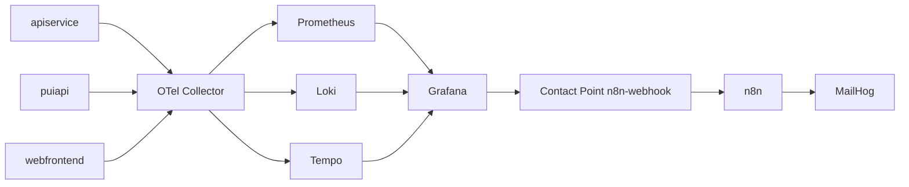

# AspireApp Observability Detaildokumentation

## Inhaltsverzeichnis
- [Überblick](#überblick)
- [Datenfluss](#datenfluss)
- [OTel Collector](#otel-collector)
- [Prometheus, Loki, Tempo](#prometheus-loki-tempo)
- [Grafana Provisioning](#grafana-provisioning)
- [Alerting](#alerting)
- [n8n Workflow-Automatisierung](#n8n-workflow-automatisierung)
- [Dashboards im Detail](#dashboards-im-detail)
- [Troubleshooting](#troubleshooting)

## Überblick
Die Observability-Konfiguration liegt unter:
- [AspireApp/AspireApp.AppHost/observability](AspireApp/AspireApp.AppHost/observability)

Ziel:
1. Einheitliche Erfassung von Metriken, Logs, Traces.
2. Visualisierung in Grafana.
3. Alerting mit automatisierter Verarbeitung durch n8n.

## Datenfluss

## OTel Collector
Konfiguration in [AspireApp/AspireApp.AppHost/observability/otel-collector-config.yaml](AspireApp/AspireApp.AppHost/observability/otel-collector-config.yaml).

### Receiver
- OTLP gRPC auf 4317
- OTLP HTTP auf 4318

### Processor
- batch
- resource (stellt service.name sicher)

### Exporter
- prometheusremotewrite zu host.docker.internal:39090/api/v1/write
- otlphttp/loki zu host.docker.internal:33100/otlp
- otlp/tempo
- debug

### Extensions
- health_check auf 13133

## Prometheus, Loki, Tempo

### Prometheus
Datei: [AspireApp/AspireApp.AppHost/observability/prometheus.yml](AspireApp/AspireApp.AppHost/observability/prometheus.yml)

Funktion:
- Metrik-Backend.
- Self-Scrape und Remote-Write-Empfang.

Hinweisdatei:
- [AspireApp/AspireApp.AppHost/observability/prometheus-enable-remote-write.txt](AspireApp/AspireApp.AppHost/observability/prometheus-enable-remote-write.txt)

### Loki
Datei: [AspireApp/AspireApp.AppHost/observability/loki-config.yaml](AspireApp/AspireApp.AppHost/observability/loki-config.yaml)

Funktion:
- Speicherung und Abfrage von Logs.
- Retention-Konfiguration und TSDB-Schema.

### Tempo
Datei: [AspireApp/AspireApp.AppHost/observability/tempo-config.yaml](AspireApp/AspireApp.AppHost/observability/tempo-config.yaml)

Funktion:
- Speicherung von Traces.
- metrics_generator für service graphs/span metrics.

## Grafana Provisioning

### Datasources
Datei: [AspireApp/AspireApp.AppHost/observability/grafana/provisioning/datasources/datasources.yaml](AspireApp/AspireApp.AppHost/observability/grafana/provisioning/datasources/datasources.yaml)

Enthält:
- Prometheus (default)
- Loki
- Tempo

Zusätzlich sind Trace-Korrelationen zwischen den Quellen konfiguriert.

### Dashboard Provider
Datei: [AspireApp/AspireApp.AppHost/observability/grafana/provisioning/dashboards/dashboards.yaml](AspireApp/AspireApp.AppHost/observability/grafana/provisioning/dashboards/dashboards.yaml)

Funktion:
- Automatische Bereitstellung aller JSON-Dashboards aus /var/lib/grafana/dashboards.

## Alerting

### Contact Point
Datei: [AspireApp/AspireApp.AppHost/observability/grafana/provisioning/alerting/contact-points.yaml](AspireApp/AspireApp.AppHost/observability/grafana/provisioning/alerting/contact-points.yaml)

Funktion:
- Sendet Alert-Payload per Webhook an n8n.

### Notification Policy
Datei: [AspireApp/AspireApp.AppHost/observability/grafana/provisioning/alerting/notification-policies.yaml](AspireApp/AspireApp.AppHost/observability/grafana/provisioning/alerting/notification-policies.yaml)

Funktion:
- Gruppierung und Timing der Alert-Benachrichtigung.

### Regeln
Datei: [AspireApp/AspireApp.AppHost/observability/grafana/provisioning/alerting/rules.yaml](AspireApp/AspireApp.AppHost/observability/grafana/provisioning/alerting/rules.yaml)

Konfigurierte Regeln:
1. HighErrorRate
2. SlowResponse
3. ServiceDown
4. ExceptionSpike
5. FailedRequestsBurst

## n8n Workflow-Automatisierung

### SMTP-Credential
Datei: [AspireApp/AspireApp.AppHost/observability/n8n/mailhog-credential.json](AspireApp/AspireApp.AppHost/observability/n8n/mailhog-credential.json)

Funktion:
- SMTP-Versand über host.docker.internal:32525 (MailHog).

### Workflow 1: Alert Router
Datei: [AspireApp/AspireApp.AppHost/observability/n8n/workflows/pui-alert-router.workflow.json](AspireApp/AspireApp.AppHost/observability/n8n/workflows/pui-alert-router.workflow.json)

Funktionale Schritte:
1. Webhook empfängt Grafana-Alert.
2. Normalize Alert extrahiert title/severity/service/status/summary.
3. Paralleler Versand an Teams/Email/Slack.
4. Webhook Response liefert ok/handled.

### Workflow 2: Incident Automation
Datei: [AspireApp/AspireApp.AppHost/observability/n8n/workflows/pui-incident-automation.workflow.json](AspireApp/AspireApp.AppHost/observability/n8n/workflows/pui-incident-automation.workflow.json)

Funktionale Schritte:
1. incident-webhook empfängt Payload.
2. Build Issue Payload erzeugt strukturierte Incident-Daten.
3. Only Critical filtert auf severity=critical.
4. Critical-Zweig versucht GitHub-Issue und Teams-Benachrichtigung.
5. Incident Response liefert standardisierte Antwort.

### Import-Dateien
- [AspireApp/AspireApp.AppHost/observability/n8n/workflows/pui-alert-router.import.json](AspireApp/AspireApp.AppHost/observability/n8n/workflows/pui-alert-router.import.json)
- [AspireApp/AspireApp.AppHost/observability/n8n/workflows/pui-incident-automation.import.json](AspireApp/AspireApp.AppHost/observability/n8n/workflows/pui-incident-automation.import.json)

Zweck:
- Array-basiertes Importformat für n8n CLI.

## Dashboards im Detail

### PUI - System Health
Datei: [AspireApp/AspireApp.AppHost/observability/grafana/dashboards/pui-system-health.json](AspireApp/AspireApp.AppHost/observability/grafana/dashboards/pui-system-health.json)

Panels:
1. Monitoring Stack Up
2. Request Rate
3. API p95 Latency
4. Error Rate

### PUI - Business Metrics
Datei: [AspireApp/AspireApp.AppHost/observability/grafana/dashboards/pui-business-metrics.json](AspireApp/AspireApp.AppHost/observability/grafana/dashboards/pui-business-metrics.json)

Panels:
1. PUI Requests Total
2. Successful Actions
3. Failed Requests
4. P95 Action Duration by Action
5. Requests per Action

### PUI - Logs
Datei: [AspireApp/AspireApp.AppHost/observability/grafana/dashboards/pui-logs.json](AspireApp/AspireApp.AppHost/observability/grafana/dashboards/pui-logs.json)

Panels:
1. Application Logs
2. Error Logs by Service (5m)
3. Log Volume by Service (5m)

### PUI - Traces
Datei: [AspireApp/AspireApp.AppHost/observability/grafana/dashboards/pui-traces.json](AspireApp/AspireApp.AppHost/observability/grafana/dashboards/pui-traces.json)

Panels:
1. Trace Search
2. Trace Volume by Service

## Troubleshooting

### Keine Daten in Grafana
Prüfen:
1. OTel Collector Health Endpoint ist erreichbar.
2. Services exportieren an OTLP-Endpoint.
3. Datasource-URLs in datasources.yaml stimmen.

### Alert feuert, n8n reagiert nicht
Prüfen:
1. contact-points.yaml URL korrekt.
2. n8n läuft und Workflows sind aktiv.
3. Webhook-Pfade in Workflowdefinitionen stimmen.

### n8n-HTTP-Node meldet JSON-Fehler
Bei specifyBody=json muss jsonBody als Objekt-Expression vorliegen, z. B.:
={{ {"text": "..."} }}

### Keine Testmail in MailHog
Prüfen:
1. mailhog-credential.json wurde importiert.
2. SMTP Host/Port korrekt (host.docker.internal:32525).
3. MailHog UI erreichbar.
